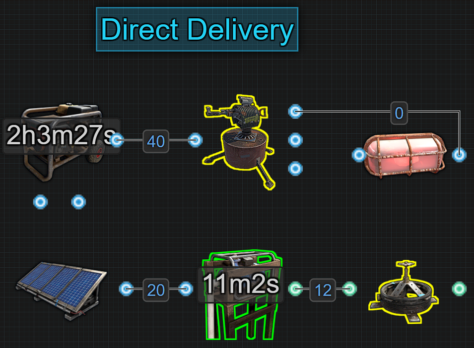
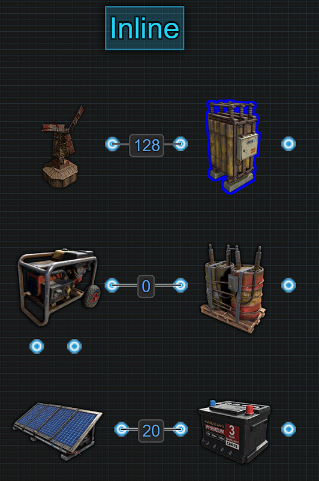
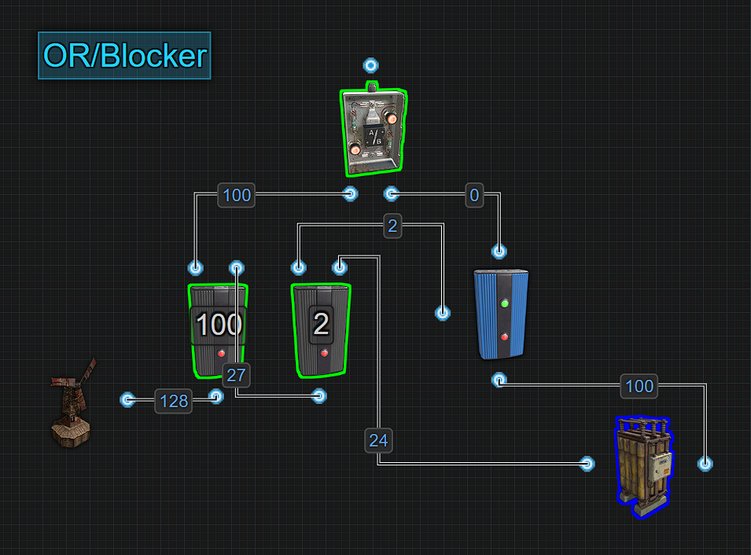
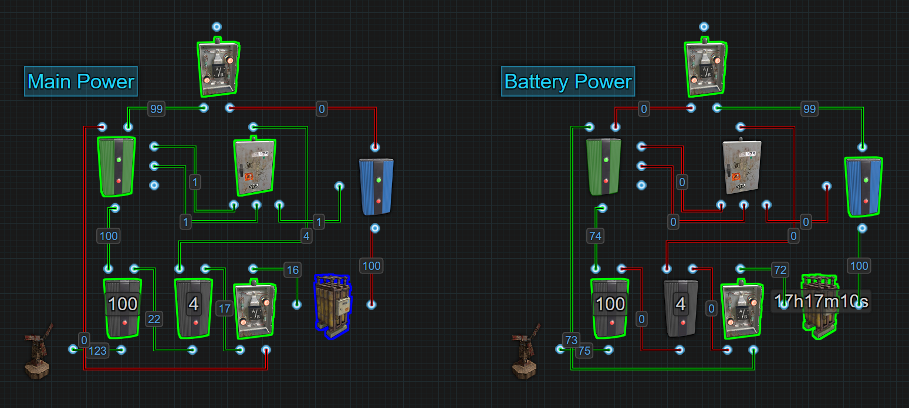
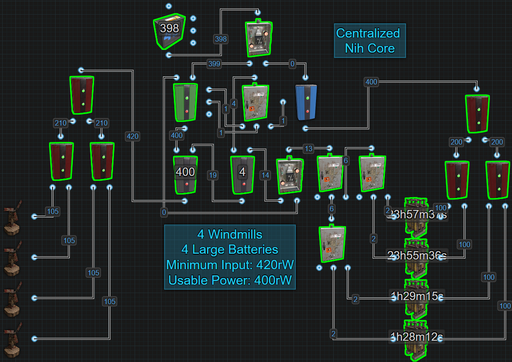
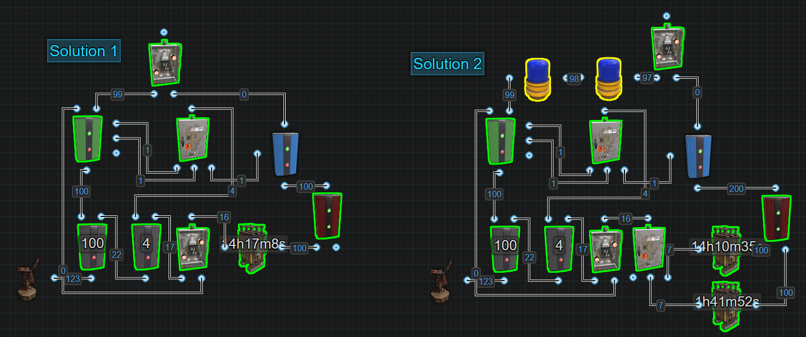

% Backup & Distribution Systems

# Battery Backup and Distribution Systems

There are 2 types of battery backup systems. There is the Inline and
there are bypass backups like the OR/Blocker and the Nih Core.  
When deciding which backup to choose,
there are a few factors you may want to consider.

There are 3 main types of distribution systems which we call a Power
Bus. These are the Fixed, Dynamic and Configure.

# Direct Delivery

This is when you directly connect what generates power to your circuits.
If your power source is destroyed or stops producing power for any
reason, your circuits will go offline. This method is a great solution
for short term uses like getting some auto turrets asap for your clan or
getting some water pumps online early for a berry farm. While this
method is good for a short time to get an early game advantage, it is
not recommended to rely on this method for any length of time. We can
introduce batteries to our circuits to create backup power more suited
for long term use.

Pros:

- Easy to wire
- Minimal components
- Early game advantage

Cons:

- If power source is destroyed the components turn off
- No backup power
- Short term use only

There are 3 main types of battery backups. Below we have the Inline,
OR/Blocker and Nih Core.

---

# Inline

This is called Inline because power must pass through the battery before
powering something. Inline is the easiest way to give yourself a battery
backup. This method is fast to make and wire. It is reliable assuming
you are producing enough power to keep the batteries charged and it is
an easy way to decentralize your circuits. When you connect your power
source directly to your battery, 100% of that power is used for the sole
purpose of charging your battery. When your battery is fully charged,
any power above what is needed to maintain your battery’s charge is not
being used, which we call wasted. For example, a large battery with an
Active Usage of 100, needs to be given 125 to prevent it from draining.
If you are giving your battery 150 so it charges, when it is fully
charged, there is 25 power that is not being used. When it needs to be
charged, that 25 power is better then 1 power because it will charge
faster. For 1 battery it doesn't seem like a lot, but when you get into
4 or more batteries, that is 100 power being wasted. When the power
source stops making enough electricity, the battery will continue to
supply power until they are depleted or destroyed. It is recommended to
let the battery charge to a minimum of 3000rWm before letting it power
anything.

Pros:

- Simple to make with minimal electrical components
- Perfect for decentralizing circuits

Cons:

- Inefficient use of power at large scale

---

# OR/Blocker 

Stop using this and stop calling it the ‘Infinite Power Loop’. This
method has been around for a long time and has been carried over from a
previous version of electricity when batteries could only charge or
discharge, not both at the same time. During this time batteries forced
a max power out causing the need to invent the ‘Infinite Power Loop’
which actually was something, but it was not this circuit. This is an
OR/Blocker battery backup. It is a ‘Bypass Battery Backup’ because your
main circuit runs off the main power produced, bypassing the
battery, while the excess power is used to charge the battery. While
considered out of date today for use as a primary battery backup system,
with some small modifications, it is useful as a secondary battery
backup which we talk about in its own section. The way this method works
is by sending power into the first Electrical Branch and branching out
enough power to meet your circuit's needs. That power is passed to an OR
Switch which sends power to your circuit. The extra electricity from the
first Electrical Branch is sent to another Electrical Branch. Power is
branched out to block the Blocker which prevents the battery from
draining. The extra power is then used to charge the battery. When there
is not enough power to keep the battery blocked, the battery sends power
out to the OR Switch to keep your circuits online. Based on the picture
above, if the windmill only produces 75 power, it is not enough power to
meet the demand of the first Electrical Branch or block the battery. The
battery takes over powering your circuit but the 75 power is still
coming out of the first electrical branch. The power is still there, it
is just not being used, it is wasted.

Pros:

- Easy to understand
- Simple to build

Cons:

- Wasteful when using battery power
- Ignores the battery update to allow charging and discharging at the
  same time

---

# Secondary Battery Backup

A secondary battery backup is a way to provide power to a circuit after
the main backup system goes offline. It's a backup of a backup so the
chance that it gets used on a typical day is near 0. Using the picture
below, we will break down how it works.

 

We are using a Test Generator to represent a static power source
meaning power levels won’t go up or down like wind and solar. The power
will either be there or it will not so we install the battery pre
charged. It should never be used so we don’t plan on recharging it. The
static amount of power from your main circuit, which already has a
built-in battery backup already, makes this battery a secondary backup.
So because the incoming power does not fluctuate, it is either present
or it is not, when the power is no longer present, this battery takes
over. The only reason this battery is ever used is because the main
power sources are no longer supplying enough power and the main battery
backup has also failed. The chance this battery is needed should be 0 so
we dont bother building in recharging.

Pros:

- Uses only a few components so it's easy to build and wire
- Efficient for redundant backup power
- Can be inserted into almost any circuit at any point

Cons:

- Wasteful when using a dynamic power source
- Requires a pre charged battery
- Added costs for redundancy  

---

# Nih Core 

The Nih Core is the modern version of and replacement for the
OR/Blocker. When using a battery to power your main circuit, like the
Inline battery backup, you lose 20% of the power it receives. Bypass
battery backups, like the Nih Core, are a way around this. Instead of
your main circuit being powered by the battery, it gets power directly
from the Wind Turbine while the battery gets charged with the excess.
The Nih Core will automatically switch over to battery backup when the
power source is not producing enough.

The Nih Core is meant to be used with 2 or more batteries but we only
have 1 in the picture because it's all we need to demonstrate how it
functions. The simple explanation is when there is not enough power to
meet your circuit's requirements, it redirects the insufficient amount
of power to the battery and activates it to take over powering the
circuit. The reason the Nih Core is meant for 2 or more batteries is
because when running off windmill power, we don’t care about the
battery’s Active Usage. We are bypassing the battery therefore removing
any restrictions or conditions caused by it. Check out the section
called ‘Battery Active Usage Vs Actual Power Consumed’ for an in depth
explanation.

Using the following picture, we can see where power exists and where it
doesn’t when the Nih Core is running off of Main Power vs Battery Power.
The green wires have power and the red wires do not.

To understand how this works, we need to understand the Memory Cell and
the Splitter. The inputs on the side of the Memory Cell are prioritized
from top to bottom and the Splitter when it receives power, it sends out
power from left to right. This also applies to when Splitters lose
power, they stop sending power out from left to right. The section
‘Circuit Delay and Power Flow’ helps explain in detail how rustricity
moves around a circuit.

Based on the picture above, if the windmill only produces 75 power, it
is not enough power to meet the demand of the first Electrical Branch
which is set to 100. That first Electrical Branch will still send that
75 power to the Memory Cell, but this means no power is going to the
second Electrical Branch therefore the Splitter loses power. When the
Splitter loses power, Output 1 first stops sending power to SET on the
Memory Cell. At that moment, power from Output 2 is still going to
RESET, so the Memory Cell flips outputs. RESET loses power followed by
Output 3 going to Block Passthrough on the Blocker. The battery takes
over powering your circuit and the 75 power that is still going through
the first Electrical Branch and Memory Cell is now sent to the battery
extending its life instead of being wasted. This will take a 4 hour
backup time and extend it.

Here is a look at a Nih Core with 4 batteries. Keep in mind Max Depth
when using large numbers of power sources and

batteries. 16 power sources and 16 batteries is the most you can connect
before hitting the Max Depth. Check out the section ‘Short Circuit / Max
Depth’ for an in depth explanation on that subject.

If you notice that power is flickering off/on when switching between
main power and battery power, it is because 1 of 2

issues. If using only 1 battery, Solution 1, add a Root Combiner between
the battery and blocker to keep the battery active. If using more than 1
battery,  Solution 2, add 1 or 2 components between the Memory Cells
`Power Out` and the OR Switch. This will give the circuit a chance to
provide battery power before the Memory Cell flips outputs.

Recommended reading:

- [ Battery Active Usage vs Actual Power Consumption ]()
- [ Short Circuit / Max Depth ]()
- [ Circuit Delay and Power Flow ]()

Pros:

- Less wasted electricity when on battery
- Utilizes the battery’s ability to charge and discharge at the same
  time

Cons:

- More components, more wiring.
- Added complexity
- Power flickers when changing states

---

