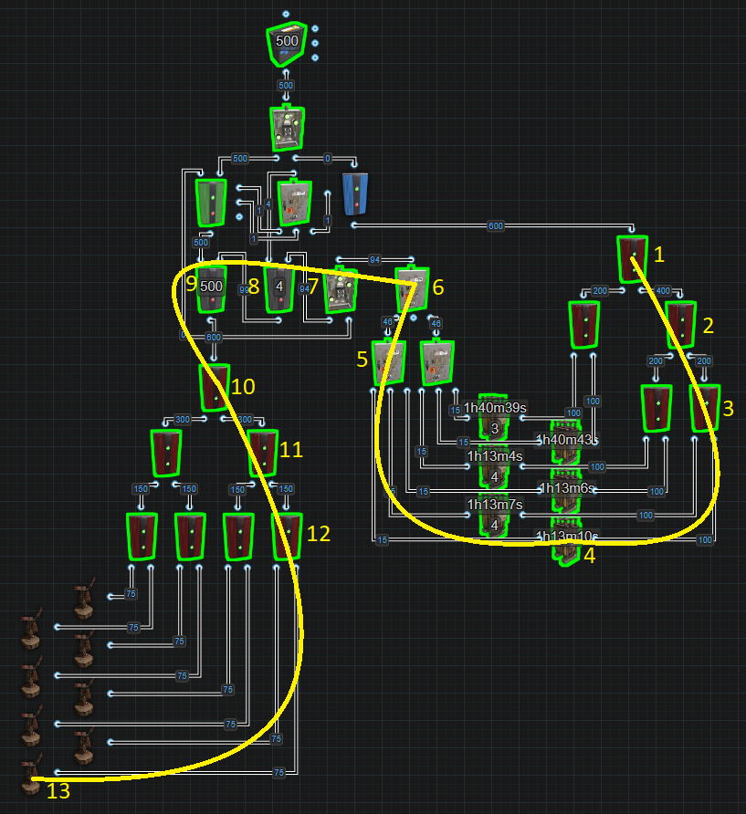
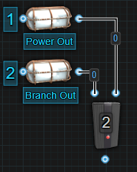

# The Structure of a Base Circuit

All circuits for a base follow the same basic structure.  
It doesn't matter if the base has 1 circuit or more,
they all contain 4 main parts with an optional 5th part
that does not have a static location.  
We have the Power Source, Battery Backup, Distribution, End Devices/Circuits and the 5th, Destruction Detection.  
Using the following flow chart we can help illustrate this.

Moving top to bottom, every circuit needs a power source. You have 3
choices, Windmills, Solar Panels or Small Generators.

We then take our source power and feed it to a Battery Backup. You have
2 choices, the Inline or Bypass(Nih Core). Either way, you must ensure
you are supplying enough power to keep your batteries charged.

From the battery backup, we will then need to distribute the power to
the different systems in the base. There are 3 options, a Fixed or
Dynamic Bus or a Configure Siphon.

If you are working with Inline Battery Backup, you want to minimize a
battery’s Active Usage. If you are working with a Bypass Battery Backup,
you want to maximize the use of Consumable Power.

The End Devices and Circuits are your turrets, lights, cameras, farms,
sensor grids, ect. The Destruction Detection system should be included
in most circuits and if limited to one, placing one after the battery
backup is probably the best option.

---

# Battery Active Usage Vs Actual Power Consumed

Simply put, active usage is what a battery uses to calculate its charge
and discharge rate. Power consumed is the amount of power a component
requires to operate. Active Usage doesn't always = Power Consumed. This
is also where the argument of Electrical Branch vs Splitter comes from.
Once you understand this section, you will know the answer to this
age-old argument.

When you look at the battery with a wire tool, you will see Active
Usage. Active Usage is the amount of power the battery is draining by.
This is the number you want to use when calculating how much power to
give a battery for it to remain charged based on the battery's 80%
efficiency. Active Usage divided by 0.8 = a battery's minimum power
input.

It is reasonable to think that the number you see is the amount of power
your circuit is currently consuming, but it’s not always the case. Even
when some components are turned off and not consuming power, they can
still add to a battery's Active Usage. In this next picture, even though
the Auto Turret is not consuming power, it is still adding to the
battery’s

Active Usage and in fact, it will actually consume 14 power. In this
case even though the AND Switch is not allowing power to pass through,
it does not have the ability to hide the Active Usage from inactive
components downstream or past it. In this next picture, if we use
different components to achieve the same outcome, we can hide

the Auto Turret’s Active Usage from the battery when it is not consuming
power. This setup reduces the Active Usage all the way to 6. When
active, we will get an Active Usage of 16
but it will actually consume 18.  
Components like Switches, the Blocker, Timer and RF Transmitter all
have the ability to hide a component's Active Usage from batteries when
not passing power through.

Every component will only register an Active Usage once and equal to the
amount of power it consumes with the exception of the Electrical Branch.
Only the Branch Out value will register Active Usage even though it does
consume 1 power for itself. An Electrical Branch set to 2 will register
an Active Usage of 2 but will consume 3. Branch Out is a FIXED value.
The thing to remember is that it is the Branch Out value that is
registering Active Usage, not the components connected to Branch Out.
This means that the components connected to Branch Out, even though it
is where they are getting their power from, their Active Usage is not
what is registering on the battery. If there is another path that lets
the battery see these components, it is possible for their Active Usage
to register on the battery along with the Branch Out value, effectively
doubling the power needed. This next picture is a quick example to show
how a Boom Box that is powered from Branch Out, but using a Switch to
Toggle Play on and off, is registering 10 Active Usage for the Branch
Out, 1 for the Switch and 10 for the Boom Box. If we do the same thing,
but with the Splitter, we dont have this issue because the Splitter
controls its power flow DYNAMICALLY.

This is helpful in situations where you have a few small  
circuits where you dont want to force an Active Usage when the circuits
are off. Now because the Electrical Branch only registers the Branch Out
value as Active Usage and 0 for itself, we can trick batteries into
thinking less power is being consumed. In the next picture, we have some
examples using Auto Turrets.

Above, we have 1 example using 8 Electrical Branches to power 9 Auto
Turrets. Every branch is outputting 10 power but also consuming 1 power
for itself. So in total we are consuming 98 power but the battery’s
Active Usage is only 90. The 2nd example we are using 4 Splitters to
power the same number of turrets only this time the Splitters are
consuming 1 and have an Active Usage of 1 each. This gives us an Active
Usage and Power Consumption of 94. The example with Electrical Branches
only has 2 extra power meaning there is enough power available to add a
single Ceiling Light while the 2nd example has 6 extra power, that’s
enough power for 3 Ceiling Lights.

In the situation where an Inline Battery is being used, you want to
minimize the battery's Active Usage to minimize the cost of power
production. Like in the single Auto Turret examples above, there is a
required input power difference of 9rW just to maintain the battery.
Batteries are 80% efficient. Take the Active Usage number and divide it
by 0.8. This will give you the minimum amount of power required to
maintain the battery and it will not drain. It wont charge either. The
more power above the minimum, the faster the battery will charge but the
more you will waste when the battery is full. 1rW will charge a large
battery but it will take 34 IRL days.

In a bypass system like the Nih Core, Active Usage doesn't matter
because you are not relying on the battery as a main power source. You
are bypassing the battery. This means that the amount of power consumed
is more important. If we look at the above picture again with the 9 Auto
Turrets, we can see that while both examples are accomplishing the same
goal, 1 is consuming less power then the other. If we look back at the
single Auto Turret examples, the 1st example with an Active Usage of 13
will actually consume 14 vs the 2nd with an Active Usage of 6 will
actually consume 18. So while the 1st example is bad on an Inline
system, it is better in a bypass system. The less power you can use to
do something, gives you more power to do other things.

You can use a bypass system with 1 Large Battery and only use 50 power
to double the life of the battery but, it is more common to see a bypass
system used for 2 or more batteries to get a larger output. If we are
using 2 or more batteries to get the higher output, a Root Combiner will
be used. The moment we combine batteries to power a circuit that uses
more than 100 power, both batteries will have an Active Usage of 100.
This is because load sharing is not a thing in Rustricity. If the
circuit only needs 50, both batteries will have an Active Usage of
50(plus 1 for the Root Combiner).

Due to this being the way it is, if you combine 2 batteries to get 200
power, try to use all 200 because no matter if the circuit needs 101 or
199, 2 large batteries will only last 4 hours. If they are only going to
last 4 hours regardless, try to use as much of that 200 as possible to
make it worth combining the batteries. Otherwise, split the circuit, run
Inlines and minimize the Active Usage.

Now, having said you want to consume as little power as possible to
achieve the desired outcome when using a bypass battery backup, there
are times when it is worth consuming more for a bit of added security.
In the next picture, Ive used medium batteries for the demonstration,
and they are root combined powering some Auto Turrets.

The top groups are using Electrical Branches. They are consuming more
power but in the event 1 battery is destroyed, top right, some turrets
stay active. The bottom groups use Splitters. While they do consume less
power, in the event a battery is lost, very bottom, all the turrets go
offline. You will need to weigh the pros and cons and decide what is
right to fit your needs. Read more in What is a Power Bus?  

---

# Short Circuit / Max Depth

This is a single message that is displayed for 2 different errors. At
the time of creating this section, XOR Switches did not consume any
power which is why you will see them used in the pictures. The pictures
might get remade in time but power consumption is not important when
discussing and understanding this error.

## Short Circuit

A short circuit happens when you have power feeding back into itself,
AKA, a loop.  

Why would you do this? You wouldn’t. In the past, batteries functioned
differently and there was a need to create the “Infinite Power Loop”.
Today, batteries have something called “Active Usage”. This breaks the
infinite loop and eliminates a need for it to exist.

You can circumvent a short circuit by increasing the number of
components in the loop to be 9 or greater.

In the next picture we show a battery feeding power back into
itself.

There is no reason to do this anymore. There was a time when batteries
could only exist in 1 state at a time. They were either charging or
discharging and when they were discharging, they were always doing it at
their max. Back then, people found a way to use the extra power and send
it back to the battery. For example, a large battery was always
outputting 100 power whereas today, they calculate an active usage and
only drain the amount of power a circuit needs, up to 100. Today, if the
circuit only needs 50, the battery only gives 50.

The other thing to note is batteries also cause an active usage. For a
large battery, it is 400, so in the above loop, you are forcing a max
drain on the battery. There is no advantage to this.

## Max Depth

Maximum Depth is referring to the number of components between your
power source and the  Root Combiner. A Max Depth error will occur when
we exceed 16 components.

It is important to understand this mechanic and how to calculate it.
This becomes important when combining multiple power sources including a
battery backup with multiple combined batteries. If you experience this
error, to calculate the depth of a circuit, we start with the last Root
Combiner or the combiner that is furthest away from the power source and
count the number of components power must pass through all the way back
to the power source. This limits where in a circuit you can use Root
Combiners.

The below images are 2 ways root combiners can be stacked. The group on
the left is known as pyramid stacking and the group on the right is
known as a daisy chain. While both groups are possible, you can see that
the group on the left is only 4 components deep whereas the right side
is 8 deep. This is important when working with a large amount of
centralized power because you can quickly use up the depth and then not
be able to have the number of batteries you want or need.

In this next image, we have 8 Windmills combined into a Nih Core with a
battery backup containing 6 Large Batteries. This circuit has a total
depth of 13 components. The trick to counting depth is counting the
components in the longest route from the last Root Combiner, \#1 back to
the Windmill, \#13.  

In the next example, we have 2 isolated power sources. The first source
is the cluster of Windmills. The second is the combined Solar Panels for
the Component Destruction Detector. This means that we have 2 paths we
must consider when calculating the depth. The first path to look at is
the one that goes from the Root Combiner \#1 back to the Windmill \#14.
This path is the main power path. The second path goes from Root
Combiner \#1 back to the Solar Panel \#16. If one of these paths exceed
the Max Depth limit of 16 components, you will start to see the error
message at Root Combiner \#1.

The next image shows a Max Depth using an equal number of Windmills and
Batteries with a Nih Core.

---

# Circuit Delay and Power Flow

NEEDS WORK

A simple explanation for now:

Circuit Delay at its most basic is the amount of time it takes power to
pass from one component to another. The reason there is circuit delay is
because we are dealing with lines of code. Specifically we are dealing
with lines of code for electricity in Rust, aka rustricity. Rustricity
is a single threaded system. This means that everything happens 1 line
of code at a time for the entire server. It doesn’t matter how many
circuits are running on a server at 1 time. The server will process
everything rustricity, every  activation, deactivation, action,
reaction, transfer etcetera, 1 at a time. Now this doesn't need to be
said but just to make sure we are all on the same page, the server you
login to to play on is running or hosted on a computer. That computer is
also referred to as a server. The faster the hardware of this server is
and the more dedicated this hardware is to running the game server, the
better rustricity will perform.

The best rustricity will perform on any server is when it is solely
hosting a vanilla game. The more programs running on the server or the
more plugins installed for the game, the slower the rustricity will
function therefore increasing circuit delay. The amount of time we are
talking about is incredibly small but a lot of small increases will
eventually become a large amount of time. One way to test how fast
rustricity is on any server is by stringing a bunch of lights together,
the more the better, and watch how long it takes for all of them to turn
on and off.

Power Flow is the path electricity takes through a circuit. Using the
picture below to help illustrate, when we flip the

Switch on, light 1 will power on followed by light 2 then light 3 and
finally light 4. When we flip the Switch off, light 1 will power off
followed by light 2 then light 3 and finally light 4. Power flow gets a
little more complicated when we introduce components with multiple
outputs. Starting with the Electrical Branch that has 2 outputs, power
is first sent

through Power Out then power gets sent through Branch Out.
When it is removed,
it will first be removed from Power Out then Branch Out.

The Splitter is similar but it has 3 outputs.

Power first goes through Power Out 1
followed by Power Out 2 then Power Out 3.
When power is removed,
it will be removed first from Power Out 1 followed by Power
Out 2 then Power Out 3. On the small scale, this is easy to follow but
as we start to build larger circuits it can be a little more complicated
but is absolutely crucial to understand when you start integrating logic
or having multiple circuits interacting with each other.

Lets dive a little deeper into this concept by analyzing the Nih Core.

---

# Useful Circuits

[Auto Smelter](https://www.rustrician.io/?circuit%3D7411c1893993574b24b6c9c911dbc0e3)

[Blocker Chain](https://www.rustrician.io/?circuit%3D773b599014deb161fc173f295727be77)

[Configure Siphon](https://www.rustrician.io/?circuit%3De7c8a8ccc9ce2da68095cca2560da002)

[Delay Timer](https://www.rustrician.io/?circuit%3Dfa8ba5c2e3974185c6f01273eab653f1)

[Destruction Detection](https://www.rustrician.io/?circuit%3Dbf38168f0834f7d84fb837ac41d1818e)

[Logic Gates](https://www.rustrician.io/?circuit%3D64810508602bc0cd1baa954d1a1da539)

[Memory Cell Explained](https://www.rustrician.io/?circuit%3Db64e3a0f6f9d6d456ead9821abf9d7d7)

[Nih Core](https://www.rustrician.io/?circuit%3Dd131cf1233742ebd0acb8ebaaf3b9d1a)

[Nih Core - 4 Large Batteries](https://www.rustrician.io/?circuit%3D60fc05f187614f131aa5565be42a6687)

[Nih Core - Decentralized](https://www.rustrician.io/?circuit%3D1d0b869c046f6d05ee75ab0f841fc150)

[Probability Master Class](https://www.rustrician.io/?circuit%3Dca9bdcbc87f0a13ca3a3ce0c8fe4146d)

#### Pulse Control (Configure)

[Basic set](https://www.rustrician.io/?circuit%3Dc0487dd792adbd543e8d234a3979bc38)

---
