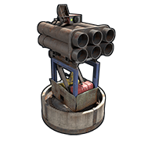
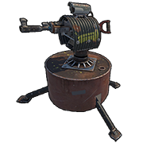

# Defense

---

# SAM Site

| | |  
|-|---|  
Identifier        | -1009359066
Description       | Defends against aerial threats
Recycles Into     | 25 HQM
Stack Size        | 1
Hit Points        | 1000
Where To Buy      | Outpost for 500 Scrap
Inputs/Outputs    | Power In / Has Target, Low Ammo, No Ammo, Passthrough
Active Usage      | 25
Power Consumption | 25rW
Power Output      | 1rw
Power Passthrough | Input power minus 25
Despawn Time      | 5 minutes
Decay Time        | 12 hours

Notes:

- You can enable and disable Defender Mode by looking at the SAM and
  pressing and holding E. In defender mode it will only target incoming
  MLRS rockets, else it will target all flying vehicles.
- 1rW will pulse out of Has Target if it takes damage and will release a
  constant 1rW if it locks a target.
- Low Ammo will start to output 1rW when there is 10 SAM Ammo or less.
  When it has no more ammo it will stop outputting power.
- No ammo will output 1rW constantly when there is no more ammo.
- If 100 power is given to the SAM, 75 will come out Passthrough.
- Must be placed on flat surfaces
- Try to place them in a way they cannot be baited and used to destroy
  your own stuff.

---

# Auto Turret

| | |  
|-|---|  
Identifier          | -2139580305
Description         | A automated sentry turret to neutralize targets
Crafting Recipe     | 10 HQM, 1 CCTV Camera, 1 Targeting Computer
Recycles Into       | 5 HQM, 50% 1 CCTV Camera, 50% 1 Targeting Computer
Stack Size          | 1
Workbench Required  | Level 2
Research Table Cost | 500 Scrap
Hit Points          | 1000
Where To Buy        | Outpost for 400 Scrap
Where To Find       | Arctic Scientist, Cargo Ship Scientist, Elite Tier Crate, Excavator Scientist, Heavy Scientist, Locked Crate, Military Base Scientist, Military Crate, Oil Rig Scientist, Patrol Scientist, Treasure Box, Underwater Lab Elite Crate, Underwater Lab Yellow Crate
Inputs/Outputs      | Power In / Has Target, Low Ammo, No ammo
Active Usage        | 10
Power Consumption   | 10rW +1 if outputs are used
Power Output        | 1rW
Despawn Time        | 60 minutes

Notes:

- There are 2 modes, Peacekeeper and Attack All.
- You can enable and disable Peacekeeper mode by looking at the turret
  and pressing and holding E. In peace keeper mode it will only attack
  someone if they become aggressive. In Attack All mode it will kill
  anyone not on its authorization list.
- 1rW will pulse out of Has Target if it takes damage and will release a
  constant 1rW if it locks a target.
- Low Ammo will start to output 1rW when there is 50 ammo or less. When
  it has no more ammo it will stop outputting power.
- No ammo will output 1rW constantly when there is no more ammo.
- Must be placed on flat surfaces
- Try to place them in a way they cannot be baited to be drained
- They contain their own authorization list
- The turret has just over a 180 degree detection arch
- They can shoot through 2 layers of Chainlink Fence.

---

# Tesla Coil

| | |  
|-|---|  
Identifier          | 1371909803
Description         | An electrical trap that zaps nearby players
Crafting Recipe     | 3 HQM, 1 Tech Trash
Recycles Into       | 2 HQM, 50% 1Tech Trash
Stack Size          | 3
Workbench Required  | Level 2
Research Table Cost | 20 Scrap
Hit Points          | 250
Where To Buy        | Outpost for 75 Scrap
Where To Find       | Arctic Scientist, Cargo Ship Scientist, Crate, Elite Tier Crate, Excavator Scientist, Heavy Scientist, Locked Crate, Military Base Scientist, Military Crate, Oil Rig Scientist, Patrol Scientist, Treasure Box, Underwater Lab Blue Crate, Underwater Lab Elite Crate, Underwater Lab Yellow Crate
Inputs/Outputs      | Power In
Active Usage        | 35
Power Consumption   | 1-35rW
Despawn Time        | 5 minutes

Notes:

- Tesla Coil damage is the amount of input power per second up to a max
  of 35. This means if you give a tesla coil 5rW, it will do 5 damage
  per second. Give it 35rW and it will do 35 damage a second.
- Their damage is stackable. 100 Tesla Coils given 1rW will kill a
  person in 1 second.
- The range is just over 1 foundation or 3.5 meters
- Can be placed on all surfaces including the ground
- With a building trick, a tesla coil can zap people through walls,
  floors and roofs.
- They damage themselves at a rate of 2hp/sec
- They will not turn on if their health is at or below 62

---

