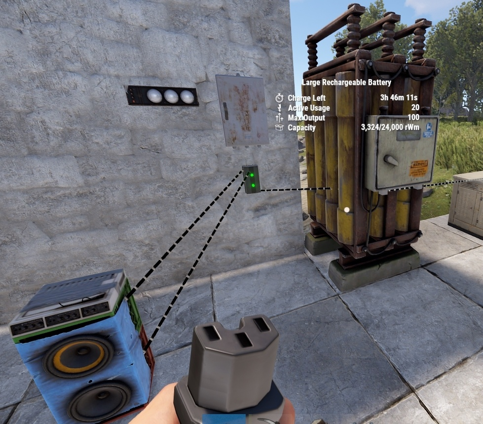

<!---
THIS FILE IS AUTOMATICALLY GENERATED FROM ALL OTHER PAGES AT EACH REBUILD,
SO DONT EDIT IT, YOUR CHANGES WILL BE LOST !
-->

# The RUST Electrical Handbook

*you are the []{#visitorcount}th visitor !*

---

This is a work in progress, everything is subject to change,
be reorganised or moved to some other sub pages,
but any info still valid in game wont be removed.

All of the information you find here is comming from a [Google Doc file by
@SwiftCoyote#2007](https://docs.google.com/document/d/19hr2dKtooN_YDF7TUsTdpLGadEEy9iyEFp12wbPnIas/edit?usp=sharing),
so thanks to him and all the people in the Rustricity Workshop
community that contribute to it!  

A massive Thank You to @3YE#6593 on Discord for creating the website and
teaching me (SwiftCoyote) how to update and maintain it. 

---

If you want to contribute to this project, there is multiple way you can do
it by:  

-  Finding a bug, spelling or grammaitical error, or making a suggestion,
please make them on the Google Document - [Google Document](https://docs.google.com/document/d/19hr2dKtooN_YDF7TUsTdpLGadEEy9iyEFp12wbPnIas/edit?usp=sharing)  
- You could contribute code that fix or add to the website,
- But the principal thing is the accuracy of the information.  

Its made in a way so someone could edit the website content without needing
to know html/css/javascript. All the content is writen in markdown format
(similar to discord messages: \**italic*\*, \*\***bold**\*\*, etc...)
For now, I havent written something that explains how to do it but you can
ask @3YE#6593 on Discord for more information.

---

# Tools

---

These tools take no damage, have a stack size of 1, are default BPs and
can only be crafted.

To change the colour of a wire/hose/pipe in place, with Wire/Hose/Pipe Tool in
hand, hold Reload `R` to select the colour then look at an IO connection
and press Reload `R`

Wire/Hose/Pipe length is limited to 30 meters with 16 anchor points using the left
mouse button.

If you miss click and attach a hose/wire/pipe to the wall in the wrong spot,
look away and right click once. It will remove the last anchor point.
Hold the right mouse button down to clear the hose/wire.

To remove a hose/wire from a component, look at the connection point and
hold down the right mouse button.

Holding ‘Left Shift’ allows you to place anchor points on deployed entities
like boxes or chairs (Only Pipes ATM)

When hoses or wires are placed on walls and the wall is destroyed, the
hoses and wires will remain in place.

But pipes will break ! they can also break when doing anything that change
the hitbox of the thing they are placed on, ie: upgrading walls can break pipe !

Wire Tracing: If you left click a pre wired connection, only that
connection will have the wire animation. The animation will return to
the rest of the wires after you take a couple steps or look at another
IO connection.

When trying to keep straight to get better hose/wire placement accuracy,
wear Diving Fins.

To increase or decrease the range of the auto snap when getting close to
an IO connection, in the F1 console, change `client.lookatradius` from `0.2`
to `0.05`. This lets you place anchor points closer to IO connections.

If the server has it enabled, turn on Wire Slack by holding your Use
key, default is `E`. Hold Sprint, shift, to increase and Duck, ctrl, to
decrease. This will give your wires some slack rather than being
straight between 2 points.

---

# Hammer

| | |  
|-|---|  
Item ID         |  200773292
Description     | Used to pick up or repair components
Crafting Recipe | 100 Wood
Despawn Time    | 5 minutes

Notes :

- For electrical, this is used to pick up and repair components
- Can be stored in a Tool Cupboard
- All components can be picked up with the exception of the Windmill
  and Modular Car Lift.
- To pick up components, with TC authorization and a hammer in hand,
  look at the component then press and hold Use `E`.
- Most components take no damage when picked up. Exceptions are the
  Laser Light, Sound Light, Door Controller, Igniter, Auto Turret and
  Tesla Coil. Batteries and Power Sources also take damage when picked
  up.

---

# Wire Tool

| | |  
|-|---|  
Item ID            | -144417939
Description        | Connecting electrical components
Crafting Recipe    | 2 HQM
Workbench Required | Level 1
Despawn Time       | 5 minutes

Notes:

- This tool's primary function is to establish connections between
  electrical components.
- To trace an existing wire, left-click the connection point. This
  action will prompt a wire animation for the selected connection only.
- It can be stored in a Tool Cupboard
- Wire colour can be changed by holding Reload `R`.  
	Colour options are :  
  *Yellow, Red, Light Blue, Blue, Green, Orange, Pink, Purple, White and
  Default(Black)*

---

# Hose Tool

| | |  
|-|---|  
Item ID            | 363163265
Description        | Connecting fluid components
Crafting Recipe    | 2 HQM
Workbench Required | Level 1
Despawn Time       | 5 minutes

Notes:

- This tool is specifically designed to connect fluid components.
- Can be stored in a Tool Cupboard
- Hose colour can be changed by holding Reload `R`.  
	Colour options are :  
  *Red, Blue, Yellow, Light Blue, Orange, Pink, Purple, White and
  Default(Green)*

---

# Pipe Tool 

| | |  
|-|---|  
Item ID            | -144513264
Description        | Connecting industrial components
Crafting Recipe    | 2 HQM
Workbench Required | Level 1
Despawn Time       | 5 minutes

Notes:

- This tool is specifically designed to connect industrial connections.  
- Can be stored in a Tool Cupboard  
- The color of the pipe can be customized by holding down the 'Reload' button `R`.  
    Colour options are :  
  *Red, green, Blue, Yellow and Default(Grey)*

---

# Garry's Mod Tool Gun 

| | |  
|-|---|  
Item ID            | 1803831286
Description        | An enhanced hammer to pick up or repair components
Crafting Recipe    | 100 Wood, 20 Metal Fragments
Despawn Time       | 5 minutes

Notes:

- This tool requires you to own and play Garry’s Mod for 30 minutes  
- It is an upgraded hammer. On the screen it will tell you what you are looking at. It also has a longer range up to about 2 meters.  
- For electrical, this is used to pick up and repair components.  
- With the F1 console command `toolgun.classiceffects true` or `toolgun.classiceffects false` you can change the color of the beam. False will give you the default orange color but True is the blue color like it is in Gmod.  
- Can be stored in a Tool Cupboard  
- All components can be picked up with the exception of the Windmill and Modular Car Lift.  
- To pick up components, with TC authorization and a hammer in hand, look at the component then press and hold Use `E`.  
- Most components take no damage when picked up. Exceptions are the Laser Light, Sound Light, Door Controller,  
Igniter, Auto Turret and Tesla Coil. Batteries and Power Sources also take damage when picked up.  
- Careful when wielding this powerful tool as it can create problems if you accidently start picking up items.  

# Power Sources

---

# Test Generator 

**(NOT CRAFTABLE)**

| | |
|-|--|
Item ID           |  -295829489
Description       | Providing a constant 100rW per Power Output
Crafting Recipe   | Cannot be crafted
Recycles Into     | 13 HQM/2 Gears/1 Metal Pipe/2 Fuse
Stack Size        | 1
Hit Points        | 1000
Outputs           | Power Output 1, Power Output 2, Power Output 3
Power Consumption | 0rW
Power Output      | 100rW per output
Despawn Time      | 20 minutes

Notes:

- This item can only be spawned in by an admin.
- It supplies a constant 100rW per output constantly for free.
- Excellent for testing.

---

# Wind Turbine

| | |
|-|--|
Item ID             | -1819763926
Description         | Generating electricity from the wind
Crafting Recipe     | 500 Wood/10 HQM/3 Gears/3 Sheet Metal
Recycles Into       | 250 Wood/5 HQM/2 Gears/2 Sheet Metal
Stack Size          | 1
Workbench Required  | Level 2
Research Table Cost | 125 Scrap
Hit Points          | 250
Where To Buy        | Bandit Camp for 500 Scrap
Where To Find       | Arctic Scientist, Cargo Ship Scientist, Elite Tier Crate, Excavator Scientist, Heavy Scientist, Locked Crate, Military Base Scientist, Military Crate, Oil Rig Scientist, Patrol Scientist, Treasure Box, Underwater Lab Elite Crate, Underwater Lab Yellow Crate
Outputs             | Power Out
Power Consumption   | 0rW
Power Output        | 0-150rW
Active Usage        | 0
Despawn Time        | 40 minutes
Decay Time          | 8 hours

Notes:

- Wind Turbines operate in both day and night
- The amount of power they output is heavily influenced by the number of
  floors above the ground they are, not sea level
- They will produce more power, more often the more floors above ground
  you place them
- Requires a 1x1 to be placed on and cannot be picked up with a hammer
- Requires a single square or 2 triangles to be placed on
  and cannot be picked up with a hammer.
- There is a small area at the base of the turbine, on some sheet metal
  where you can place components.
- A turbine made on an iceberg, will calculate its output based on sea
  level down to the ocean bottom. This means no additional height above
  sea level will increase its height calculation.
- There needs to be a minimum of 3 foundations distance between
  turbines. This will prevent 1 turbine blocking the wind for another.

---

# Large Solar Panel

| | |  
|-|---|  
Item ID             | 2090395347
Description         | Generating electricity from the Sun
Crafting Recipe     | 5 HQM/1 Tech Trash
Recycles Into       | 3 HQM/50% - 1 Tech Trash
Stack Size          | 3
Workbench Required  | Level 1
Research Table Cost | 75 Scrap
Hit Points          | 100
Where To Buy        | Outpost for 75 Scrap
Where To Find       | Arctic Scientist, Cargo Ship Scientist, Crate, Excavator Scientist, Military Base Scientist, Oil Rig Scientist, Patrol Scientist, Sunken Chest, Tunnel Dweller, Underwater Dweller, Underwater Lab Blue Crate
Outputs             | Power Out
Power Consumption   | 0rW
Power Output        | 0-20rW
Active Usage        | 0
Despawn Time        | 20 minutes
Decay Time          | 8 hours

Notes:

- Large Solar Panels output electricity only during the day.
- They will produce less power if they are damaged or the Sun is not
  making it to the entire front face.
- They can be placed on the ground or flat building structure.
- They can be picked up with a hammer but will lose 25% health.
- 24 hours in game is 1 irl hour

Depending on the time of year, the Sun will take a different path
through the sky. In June and July, the Sun reaches its most Northern
path. In December and January, the Sun reaches its most Southern path.
The picture above on the right shows how the Sun will traverse the sky
over 6 Rust months. A day in the game is an hour of real time. This
means it takes about 15 days for a full Rust Year. Wipe day is always
May 20th 2024 so depending how long or short your wipe is, and where on
the map you build, will determine the direction of your Solar Panels. If
you are only playing the first 3 days of a fresh wipe and you build in
the South, face the panels North and call it a day, but, if you are
playing a monthly wipe, placing them facing East and West is the
simplest option.

---

# Small Generator

| | |  
|-|---|  
Item ID             | 1849887541
Description         | Generating electricity from Low Grade Fuel
Crafting Recipe     | 5 HQM/2 Gears
Recycles Into       | 3 HQM/1 Gears
Stack Size          | 1
Workbench Required  | Level 2
Research Table Cost | 75 Scrap
Hit Points          | 100
Where To Buy        | Outpost for 125 Scrap
Where To Find       | Arctic Scientist, Cargo Ship Scientist, Crate, Elite Tier Crate, Excavator Scientist, Heavy Scientist, Locked Crate, Military Base Scientist, Military Crate, Oil Rig Scientist, Patrol Scientist, Treasure Box, Underwater Lab Blue Crate, Underwater Lab Elite Crate, Underwater Lab Yellow Crate
Inputs/Outputs      | Force Start, Force Stop / Power Out
Power Consumption   | 0rW
Fuel Consumption    | 500 Low Grade Fuel/2hr
Power Output        | 40rW
Active Usage        | 0
Despawn Time        | 20 minutes
Decay Time          |

Notes:

- Small Generators will output electricity when they are turned on
- You can Start and Stop them manually or use one of the electrical
  inputs.
- The last input to receive power is the function that is activated,
  even if power is still being applied to the opposite.
- They must be placed on floors, foundations or the ground
- They still produce max power when damaged
- They can be picked up with a hammer but lose 20% health
- If a battery is feeding power to either of the inputs, components
  connected to Power Out will register an active usage on the battery.

---

# Power Distribution

---

Power distribution is one of the most important things to know and
understand when it comes to electricity.  
There are many ways to produce, store and distribute power for your circuits.  
This section breaks down the components used for distribution and the different types of distribution circuits known as a power bus.  
It covers the different types of battery backup systems.  
It covers the difference between the amount of power a circuit consumes versus what a battery thinks it is consuming, aka active usage.  
This section also covers the theory behind circuit and location centralization, decentralization and hybridization.  
It covers the game mechanics behind circuit delay and power flow as well
as the error message, short circuit/max depth.

---

# Root Combiner

| | |  
|-|---|  
Item ID             | -458565393
Description         | Combining power from power sources
Crafting Recipe     | 75 Metal Fragments
Recycles Into       | 38 Metal Fragments
Stack Size          | 5
Workbench Required  | Level 1
Research Table Cost | 75 Scrap
Hit Points          | 200
Where To Find       | Arctic Scientist, Cargo Ship Scientist, Crate, Excavator Scientist, Military Base Scientist, Oil Rig Scientist, Patrol Scientist, Sunken Chest, Tunnel Dweller, Underwater Dweller, Underwater Lab Blue Crate
Inputs/Outputs      | Root Power 1, Root Power 2 / Combined Power Out
Active Usage        | 1
Power Consumption   | 0rW
Power Output        | Same as input
Despawn Time        | 20 minutes

Notes:

- These allow you to combine Power Sources and batteries to produce
  higher amounts of available power. Power Sources are Wind Turbines,
  Large Solar Panels and Small Generators
- It does not consume any power but it will register 1 active usage on a
  battery
- Can be placed on all building surfaces
- They have a shared error message, ‘Short Circuit/Max Depth’, and that
  has [its own section](concepts.html#short-circuit-max-depth) breaking it down.
- also see [Root combining batteries](storage.html#root-combining-batteries) as it have down side
  and isnt recommended in most cases,

---

# Electrical Branch

| | |  
|-|---|  
Item ID             |  -1448252298
Description         | Branching power off from the main line by a set amount
Crafting Recipe     | 75 Metal Fragments
Recycles Into       | 38 Metal Fragments
Stack Size          | 5
Workbench Required  | Level 1
Research Table Cost | 75 Scrap
Hit Points          | 200
Where To Find       | Arctic Scientist, Cargo Ship Scientist, Crate, Excavator Scientist, Military Base Scientist, Oil Rig Scientist, Patrol Scientist, Sunken Chest, Tunnel Dweller, Underwater Dweller, Underwater Lab Blue Crate
Inputs/Outputs      | Power In  / Branch Out, Power Out
Active Usage        | 0 + Branch Out
Power Consumption   | 1rW + Branch Out
Power Output        | Branch Out is the amount you configure it to. Power Out is the remaining power.
Despawn Time        | 5 minutes

Notes:

- These will consume 1 power that passes through it but not register on
  a battery's active usage for itself
- Can be configured by pressing `E` while looking directly at the
  Branch.
- 2rW is the minimum you can Branch Out
- What you set the Branch Out to will be the amount to register on a
  battery’s active usage and will always consume that much power even if
  the components past it are disabled. More explained in ‘link to
  battery active usage vs actual power usage’
- When an Electrical Branch sends power out, it will first send power
  through Power Out then send power through Branch Out. Check out the
  section on Circuit Delay and Power Flow.
- Can be placed on all angled surfaces.

---

# Splitter

| | |  
|-|---|  
Item ID             |  -563624462
Description         | Splitting power evenly between up to 3 outputs
Crafting Recipe     | 100 Metal Fragments
Recycles Into       | 50 Metal Fragments
Stack Size          | 5
Workbench Required  | Level 1
Research Table Cost | 20 Scrap
Hit Points          | 500
Where To Find       | Arctic Scientist, Cargo Ship Scientist, Crate, Excavator Scientist, Military Base Scientist, Oil Rig Scientist, Patrol Scientist, Sunken Chest, Tunnel Dweller, Underwater Dweller, Underwater Lab Blue Crate
Inputs/Outputs      | Power In  / Power Out 1, Power Out 2, Power Out 3
Active Usage        | 1
Power Consumption   | 1rW
Power Output        | Input amount divided by the number of used outputs, minus 1
Despawn Time        | 5 minutes

Notes:

- When the Splitter receives power it does not pass power through all
  connected outputs at the same time. Power outputs in the order of
  Output 1, Output 2 then Output 3. Check out the section on Circuit
  Delay and Power Flow.
- Can only be placed on vertical walls
- When an output is destroyed, it will redistribute power between the
  remaining outputs.
- Outputs can connect to the inputs of Root Combiners

---

# Power Storage

---

- Batteries can accept incoming power at the same time they are sending power out.  
- Charging rate is dependent on the amount of power coming in, with an efficiency of 80%.  

> *Example:* 20rW from a Solar Panel × 0.8 = 16rW usable through a battery.  

> *Example:* If your Medium Battery is supplying 16rW to a circuit, 16 ÷ 0.8 = 20rW is the minimum you want to give the battery so it doesn’t lose any charge.

- It is recommended to supply slightly more than you need if you want to charge the battery.  
- When you combine batteries with Root Combiners, they do not split the load as one would expect. They cannot see each other, so each battery tries to power the whole circuit.  

> For example, in a circuit with 2 root combined batteries supporting a load of 50, it would seem to make sense that 50 power divided by 2 batteries equals 25 per battery.  
Rustricity doesn't work like that and 50 power is taken from each battery and seen as Active Usage on both batteries. This means both batteries are draining at a rate of 50.  

This means when we get to circuits that need more than 100 power,
all the batteries combined will show a max Active Usage,
which is used to calculate how fast a battery drains.
So if we are forcing batteries to max drain,
then we might as well try to use as much as the combined power the batteries will provide.

When using a bypass battery backup like the [ Nih core ]( backup.html#nih-core ),
Active Usage does not matter because the circuits are power from the main power source most of the time.

- Rustricity has its own version of [Parallel and Series](concepts.html#parallel-vs-series) battery configurations.
- 1rw will charge a Large Battery in 34 IRL days.
- When a battery is depleted because it is not receiving enough power, no power is outputed until it charges up for a couple seconds before
outputting to the connected circuit. The battery still not receiving
enough power will deplete in a second and the process repeats.  
- If the circuit after a battery is turning on and off,
you do not have enough power charging your batteries.
- When they get picked up, they lose 25% HP but retain their current
capacity. This means if a large battery has a full charge, when you pick
it up and place it back down, it will still have a full charge.
- Batteries have something called Active Usage and components have
something called Power Consumption. Read about it in [Battery Active Usage vs Actual Power Consumed
](concepts.html#battery-active-usage-vs-actual-power-consumed).

---

# Small Rechargeable Battery

| | |  
|-|---|  
Item ID             | -692338819
Description         | Storing electricity
Crafting Recipe     | 5 HQM
Recycles Into       | 3 HQM
Stack Size          | 1
Workbench Required  | Level 1
Research Table Cost | 20 Scrap
Hit Points          | 100
Where To Find       | Arctic Scientist, Cargo Ship Scientist, Crate, Excavator Scientist, Military Base Scientist, Oil Rig Scientist, Patrol Scientist, Sunken Chest, Tunnel Dweller, Underwater Lab Blue Crate
Inputs/Outputs      | Power In / Power Output
Power Consumption   | 40rW
Power Capacity      | 150rW
Power Output/Time   | 10rW/15min
Active Usage        | 40
Despawn Time        | 5 minutes
Decay Time          |

Notes:

- Small Batteries are very compact and can be placed on some deployables
  like work/repair benches and boxes
- Maximum power input is 40rW
- Comes with a default charge of 20rWM

---

# Medium Rechargeable Battery

| | |  
|-|---|  
Item ID             | 2023888403
Description         | Storing electricity
Crafting Recipe     | 5 HQM/1 Tech Trash
Recycles Into       | 3 HQM
Stack Size          | 1
Workbench Required  | Level 2
Research Table Cost | 75 Scrap
Hit Points          | 100
Where To Buy        | Bandit Camp for 75 Scrap
Where To Find       | Arctic Scientist, Cargo Ship Scientist, Crate, Elite Tier Crate, Excavator Scientist, Heavy Scientist, Locked Crate, Military Base Scientist, Military Crate, Oil Rig Scientist, Patrol Scientist, Treasure Box, Underwater Lab Blue Crate, Underwater Lab Elite Crate, Underwater Lab Yellow Crate
Inputs/Outputs      | Power In / Power Output
Power Consumption   | 200rW
Power Capacity      | 9000rWM
Power Output/Time   | 50rW/3hrs
Active Usage        | 200
Despawn Time        | 20 minutes
Decay Time          |

Notes:

- These batteries are significantly larger than the small battery and
  take up 2sq meters or 2 squares on a stone foundation
- Maximum power input is 200rW
- Comes with a default charge of 100rWM

---

# Large Battery

| | |  
|-|---|  
Item ID             | 553270375
Description         | Storing electricity
Crafting Recipe     | 10 HQM/2 Tech Trash
Recycles Into       | 5 HQM/1 Tech Trash
Stack Size          | 1
Workbench Required  | Level 2
Research Table Cost | 75 Scrap
Hit Points          | 100
Where To Find       | Arctic Scientist, Cargo Ship Scientist, Crate, Elite Tier Crate, Excavator Scientist, Heavy Scientist, Locked Crate, Military Base Scientist, Military Crate, Oil Rig Scientist, Patrol Scientist, Treasure Box, Underwater Lab Blue Crate, Underwater Lab Elite Crate, Underwater Lab Yellow Crate
Inputs/Outputs      | Power In / Power Output
Power Consumption   | 400rW
Power Capacity      | 24000rWM
Power Output/Time   | 100rW/4hrs
Active Usage        | 400
Despawn Time        | 20 minutes
Decay Time          |

Notes:

- They need 2sq meters or 2 squares on a stone foundation of floorspace
- Maximum power input is 400
- They come with a default charge of 200rWM

---

# Nih Capacitor *(unfinished)*

**( will probably be fixed and wont work anymore soon )**

The Nih Capacitor was first established by Nih, with assistance from SwiftCoyote, on September 11, 2022.
A Capacitor is a set of components that accumulate power, much like rechargeable batteries.
However, the method for assessing the amount of stored power differs. 

For batteries, the stored power is represented as `Capacity`,  
measured in Rust Watt Minutes (rWm).

Contrarily, in a Capacitor, we gauge the power storage by examining an Input/Output (IO) connection
and observing a figure that is typically associated with `power` or the amount of power available for use.  
But within the Capacitor, this figure **DOES NOT indicate the amount of power that can be utilized**.
Rather, this figure is what we call `Wire Capacity`, symbolized as `Np`.
For instance, in the image below, the displayed `6,492,076` is **NOT** the amount of power available.
Instead, it represents `6,492,076Np` of Wire Capacity. 

Before going into the construction and operation of a Capacitor,
it’s essential to understand the math conversions between Rust Watt Minutes (rWm) and Wire Capacity (Np).  

Both represent capacity, but they use different units of measurement depending on the energy storage container, be it a battery or a capacitor. 

The Maths :  
`rWm`: rust watt minute  
`rW`: rust watts (commonly referred to as "power")  
`Np`: Wire Capacity  
`∅`: 7.5 (Trust Me Bro)  
`S`: Seconds  
`τ`: 60 (The number of seconds in a minute)  
`M`: Minutes  
`P`: Max power output for 1 second  
`O`: The amount of power you want to output  
`H`: Hours  

To convert rWm into Wire Capacity(Np) we use the following equation:  
`(rWm × τ = P) × ∅ = Np`

To convert Wire Capacity(Np) into rWm we use the following equation:  
`(Np ÷ ∅ = P) ÷ τ = rWm`

To figure out how much time a given capacity will run for outputting a specific amount of power, we use the following equations:  
`Seconds: (rWm ÷ O = M) × τ = S`  
`Minutes: rWm ÷ O = M`  
`Hours: (rWm ÷ O = M) ÷ τ = H`  

Examples
Using Capacity from the battery in the first picture,
we can figure out the number we would see if we were looking at an IO connection in a Capacitor to view Wire Capacity(Np).  
`(rWm × τ = P) × ∅ = Np`  
`(271 × 60 = 16,260) × 7.5 = 121,950Np`  

Therefore a capacity of 271rWm when viewed on an IO connection is equal to 121,950Np.
We can also see that if the Large Battery did not have an output limit of 100,
it would be able to output 16,260 power for 1 second. 

Using the IO connection to view Wire Capacity(Np) from the second picture,
we can figure out how much rWm of Capacity we would have if this was viewed on a battery.  
`(Np ÷ ∅ = P) ÷ τ = rWm`  
`(6,492,076 ÷ 7.5 = 865,610.1333) ÷ 60 = 14,426rWm`  

Therefore a Wire Capacity of 6,492,076Np when viewed on a battery represented as Capacity, it is equal to 14,426rWm.  
Without a limited output, the Capacitor is capable of delivering 865,610 power for 1 second. 

Using both of these examples, we can calculate the length of time both the Battery and Capacitor would power a circuit for,
given a set output.
> For our example, let's say the circuit needs 100 power.  
>
Battery :  
  `(rWm ÷ O = M) × τ = S`  
  `(271÷ 100 = 2.71 Minutes) × 60 = 162 Seconds`  
>
Capacitor : *(you will need to convert from Np to rWm first)*  
  `(rWm ÷ O = M) × τ = S`  
  `(14,426 ÷ 100 = 144.26 Minutes) × 60 = 8,655 Seconds`  
>
OR :  
  `(rWm ÷ O = M) ÷ τ = H`  
  `(14,426 ÷ 100 = 144.26 Minutes) ÷ 60 = 2.40 Hours`  

Prior to constructing a capacitor, it’s crucial to understand its limitations and potential issues.
This will clarify misconceptions such as the notion of ‘infinite power’ and help identify the appropriate contexts for its use.  

- It doesn’t survive server restarts. everytime the server restarts, all of the stored power will vanish, poof gone.  
- When automating energy extraction, it is possible that a flicker will be created or worse, all the power vanishes, poof gone.
- It consumes power even when nothing is connected to it, unlike a battery that doesn’t lose power if nothing is connected to it.
- It is not portable.

Now, some of the advantages and benefits of the Capacitor

---

# Defense

---

# SAM Site

| | |  
|-|---|  
Item ID           | -1009359066
Description       | Defends against aerial threats
Recycles Into     | 25 HQM
Stack Size        | 1
Hit Points        | 1000
Where To Buy      | Outpost for 500 Scrap
Inputs/Outputs    | Power In / Has Target, Low Ammo, No Ammo, Passthrough
Active Usage      | 25
Power Consumption | 25rW
Power Output      | 1rw
Power Passthrough | Input power minus 25
Despawn Time      | 5 minutes
Decay Time        | 12 hours

Notes:

- You can enable and disable Defender Mode by looking at the SAM and
  pressing and holding E. In defender mode it will only target incoming
  MLRS rockets, else it will target all flying vehicles.
- 1rW will pulse out of Has Target if it takes damage and will release a
  constant 1rW if it locks a target.
- Low Ammo will start to output 1rW when there is 10 SAM Ammo or less.
  When it has no more ammo it will stop outputting power.
- No ammo will output 1rW constantly when there is no more ammo.
- If 100 power is given to the SAM, 75 will come out Passthrough.
- Must be placed on flat surfaces
- Try to place them in a way they cannot be baited and used to destroy
  your own stuff.

---

# Auto Turret

| | |  
|-|---|  
Item ID             | -2139580305
Description         | A automated sentry turret to neutralize targets
Crafting Recipe     | 10 HQM, 1 CCTV Camera, 1 Targeting Computer
Recycles Into       | 5 HQM, 50% 1 CCTV Camera, 50% 1 Targeting Computer
Stack Size          | 1
Workbench Required  | Level 2
Research Table Cost | 500 Scrap
Hit Points          | 1000
Where To Buy        | Outpost for 400 Scrap
Where To Find       | Arctic Scientist, Cargo Ship Scientist, Elite Tier Crate, Excavator Scientist, Heavy Scientist, Locked Crate, Military Base Scientist, Military Crate, Oil Rig Scientist, Patrol Scientist, Treasure Box, Underwater Lab Elite Crate, Underwater Lab Yellow Crate
Inputs/Outputs      | Power In / Has Target, Low Ammo, No ammo
Active Usage        | 10
Power Consumption   | 10rW +1 if outputs are used
Power Output        | 1rW
Despawn Time        | 60 minutes

Notes:

- There are 2 modes, Peacekeeper and Attack All.
- You can enable and disable Peacekeeper mode by looking at the turret
  and pressing and holding E. In peace keeper mode it will only attack
  someone if they become aggressive. In Attack All mode it will kill
  anyone not on its authorization list.
- 1rW will pulse out of Has Target if it takes damage and will release a
  constant 1rW if it locks a target.
- Low Ammo will start to output 1rW when there is 50 ammo or less. When
  it has no more ammo it will stop outputting power.
- No ammo will output 1rW constantly when there is no more ammo.
- Range is 30 meters or 10 square foundations
- Must be placed on flat surfaces
- Try to place them in a way they cannot be baited to be drained
- They contain their own authorization list
- The turret has just over a 180 degree detection arch
- They can shoot through 2 layers of Chainlink Fence.

---

# Tesla Coil

| | |  
|-|---|  
Item ID             | 1371909803
Description         | An electrical trap that zaps nearby players
Crafting Recipe     | 3 HQM, 1 Tech Trash
Recycles Into       | 2 HQM, 50% 1Tech Trash
Stack Size          | 3
Workbench Required  | Level 2
Research Table Cost | 20 Scrap
Hit Points          | 250
Where To Buy        | Outpost for 75 Scrap
Where To Find       | Arctic Scientist, Cargo Ship Scientist, Crate, Elite Tier Crate, Excavator Scientist, Heavy Scientist, Locked Crate, Military Base Scientist, Military Crate, Oil Rig Scientist, Patrol Scientist, Treasure Box, Underwater Lab Blue Crate, Underwater Lab Elite Crate, Underwater Lab Yellow Crate
Inputs/Outputs      | Power In
Active Usage        | 35
Power Consumption   | 1-35rW
Despawn Time        | 5 minutes

Notes:

- Tesla Coil damage is the amount of input power per second up to a max
  of 35. This means if you give a tesla coil 5rW, it will do 5 damage
  per second. Give it 35rW and it will do 35 damage a second.
- Their damage is stackable. 100 Tesla Coils given 1rW will kill a
  person in 1 second.
- The range is just over 1 foundation or 3.5 meters
- Can be placed on all surfaces including the ground
- With a building trick, a tesla coil can zap people through walls,
  floors and roofs.
- They damage themselves at a rate of 2hp/sec
- They will not turn on if their health is at or below 62

---

# Lights

---

# Flasher Light

| | |  
|-|---|  
Item ID             |  -939424778
Description         | A flashing blue light
Crafting Recipe     | 120 Metal Fragments
Recycles Into       | 60 Metal Fragments
Stack Size          | 5
Workbench Required  | Level 1
Research Table Cost | 20 Scrap
Hit Points          | 200
Where To Find       | Arctic Scientist, Cargo Ship Scientist, Crate, Excavator Scientist, Military Base Scientist, Oil Rig Scientist, Patrol Scientist, Sunken Chest, Tunnel Dweller, Underwater Dweller, Underwater Lab Blue Crate
Inputs/Outputs      | Power In / Passthrough
Active Usage        | 1
Power Consumption   | 1rW
Power Output        | Input power minus 1
Despawn Time        | 5 minutes

Notes:

- These blink a blue light. 3 fast pulses followed by a pause
- These can be placed on any angled surfaces
- Can be placed on other electrical components  
*this is common for all smaller components. But it is
limited to areas where the components will touch or be really close to a
wall or the ground, it is effectively tricking them to think they are
placed on a wall or the ground.*

---

# Siren Light

| | |  
|-|---|  
Item ID             |  762289806
Description         | A spinning red light
Crafting Recipe     | 120 Metal Fragments
Recycles Into       | 60 Metal Fragments
Stack Size          | 5
Workbench Required  | Level 1
Research Table Cost | 20 Scrap
Hit Points          | 75
Where To Find       | Arctic Scientist, Cargo Ship Scientist, Crate, Excavator Scientist, Military Base Scientist, Oil Rig Scientist, Patrol Scientist, Treasure Box, Underwater Dweller, Underwater Lab Blue Crate
Inputs/Outputs      | Power In / Passthrough
Active Usage        | 1
Power Consumption   | 1rW
Power Output        | Input power minus 1
Despawn Time        | 5 minutes

Notes:

- These emit 2 red lights 180 degree from each other and spin in a
  circle
- Can be place on any angles surfaces

---

# Ceiling Light

| | |  
|-|---|  
Item ID             | 1142993169
Description         | Overhead lighting and growing plants
Crafting Recipe     | 50 Metal Fragments
Recycles Into       | 25 Metal Fragments
Stack Size          | 10
Workbench Required  | Level 1
Research Table Cost | 20 Scrap
Hit Points          | 300
Where To Buy        | Bandit Camp for 30 Scrap
Where To Find       | Arctic Scientist, Cargo Ship Scientist, Crate, Excavator Scientist, Military Base Scientist, Oil Rig Scientist, Patrol Scientist, Sunken Chest, Tunnel Dweller, Underwater Dweller, Underwater Lab Blue Crate
Inputs/Outputs      | Power In / Passthrough
Active Usage        | 2
Power Consumption   | 2rW
Power Output        | Input power minus 2
Despawn Time        | 5 minutes

Notes:

- These hang from ceilings and focus light toward the ground
- Hanging this at 1.5 floors allows the light to cover more area
- They are required for farming
- When given only 1 power, they will work until they don't. When they
  don't, turn them off and back on and they will work again.

---

# Simple Light

**(NON-CRAFTABLE)**

| | |  
|-|---|  
Item ID           |  -282113991
Description       |  Lighting an area placed on walls
Recycles Into     | 50 Wood, 13 Metal Fragments
Stack Size        | 1
Inputs/Outputs    |
Active Usage      | 1
Power Consumption | 1rW
Power Output      | Input power minus 1
Despawn Time      | 5 minutes

Notes:

- These can only be spawned in by an admin or using plugins
- They take no damage
- They can only be placed on vertical surfaces

---

# Deluxe Christmas Lights

| | |  
|-|---|  
Item ID           |  -151387974
Description       | Christmas themed lights
Crafting Recipe   | 50 Metal Fragments for 10ft
Recycles Into     | 3 Metal Fragments per 1ft
Stack Size        | 150
Hit Points        | 100
Where To Find     | Requires a Steam item purchased from the market
Inputs/Outputs    | Power In / Passthrough
Active Usage      | 5
Power Consumption | 5rW
Power Output      | Input power minus 5
Despawn Time      | 5 minutes

Notes:

- This item can only be crafted if you have the item in your Steam
  Inventory. It must be purchased from the community market

&nbsp;

- 1 foundation is supposed to be 3 meters. 3 meters is 9.8ft. 1
  foundation length worth of these lights is only 8ft
- Left click to place the first piece. Run the lights anywhere you want
  and right click to end placement
- They have 5 different modes, Steady, Flashing, Chasing, Fade and Slow
  Glow
- Can be placed underwater
- Length of light strand does not affect the amount of power consumed.  

---

# Search Light

| | |  
|-|---|  
Item ID             |  2087678962
Description         | Lighting up a large area
Crafting Recipe     | 500 Wood, 200 Metal Fragments
Recycles Into       | 250 Wood, 100 Metal Fragments
Stack Size          | 1
Workbench Required  | Level 2
Research Table Cost | 75 Scrap
Hit Points          | 150
Where To Find       | Arctic Scientist, Cargo Ship Scientist, Elite Tier Crate, Excavator Scientist, Heavy Scientist, Locked Crate, Military Base Scientist, Military Crate, Oil Rig Scientist, Patrol Scientist, Treasure Box, Underwater Lab Elite Crate, Underwater Lab Yellow Crate
Inputs/Outputs      | Power In / Passthrough
Active Usage        | 10
Power Consumption   | 10rW
Power Output        | Input power minus 10
Despawn Time        | 20 minutes
Decay Time          | 8 hours

Notes:

- Use the light by looking at it and pressing E. Adjust where the light
  is shining. Once in position, if you can see ‘Stop Using’, press E or
  walk far enough away to stop using
- Has 360 degree rotation
- Maximum distance light can travel is 96m or 32 foundations. 1 square
  foundation is 3m.
- Can be used through ceilings and walls.
- The light can be seen through walls if placed close enough. The flash
  from the light turning on can be seen as far away as 1 grid square.

---

# Small Neon Sign

| | |  
|-|---|  
Item ID           |  1305578813
Description       | A small neon sign!
Crafting Recipe   | 150 Metal Fragments
Recycles Into     | 75 Metal Fragments
Stack Size        | 5
Hit Points        | 300
Where To Find     | Requires a Steam item purchased from the market
Inputs/Outputs    | Electric Input / Passthrough
Active Usage      | 4
Power Consumption | 4rW
Power Output      | Input power minus 4
Despawn Time      | 5 minutes

Notes:

- This item can only be crafted if you have the item in your Steam
  Inventory. It must be purchased from the community market
- Maximum image size is 128x128
- Can be placed on vertical and angled surfaces
- Can be placed underwater

---

# Medium Neon Sign

| | |  
|-|---|  
Item ID            |  -1423304443
Description        |  A medium neon sign!
Crafting Recipe    | 200 Metal Fragments
Recycles Into      | 100 Metal Fragments
Stack Size         | 5
Workbench Required | Level 1
Hit Points         | 300
Where To Find      | Requires a Steam item purchased from the market
Inputs/Outputs     | Electric Input / Passthrough
Active Usage       | 6
Power Consumption  | 6rW
Power Output       | Input power minus 6
Despawn Time       | 5 minutes

Notes:

- This item can only be crafted if you have the item in your Steam
  Inventory. It must be purchased from the community market
- Maximum image size is 256x128
- Can be placed on vertical and angled surfaces
- Can be placed underwater

---

# Medium Animated Neon Sign

| | |  
|-|---|  
Item ID            |  42535890
Description        |  An animated neon sign!
Crafting Recipe    | 2 HQM, 300 Metal Fragments
Recycles Into      | 1 HQM, 150 Metal Fragments
Stack Size         | 1
Workbench Required | Level 2
Hit Points         | 300
Where To Find      | Requires a Steam item purchased from the market
Inputs/Outputs     | Electric Input / Passthrough
Active Usage       | 10
Power Consumption  | 10rW
Power Output       | Input power minus 10
Despawn Time       | 5 minutes

Notes:

- This item can only be crafted if you have the item in your Steam
  Inventory. It must be purchased from the community market
- There are 5 pages you can paint and the sign will flip between them
- You can choose between 3 flipping speeds, Slow, Medium and Fast
- Maximum image size is 256x128
- Can be placed on vertical and angled surfaces
- Can be placed underwater

---

# Large Neon Sign

| | |  
|-|---|  
Item ID            |  866332017
Description        |  A large neon sign!
Crafting Recipe    | 250 Metal Fragments
Recycles Into      | 125 Metal Fragments
Stack Size         | 1
Workbench Required | Level 1
Hit Points         | 300
Where To Find      | Requires a Steam item purchased from the market
Inputs/Outputs     | Electric Input / Passthrough
Active Usage       | 8
Power Consumption  | 8rW
Power Output       | Input power minus 8
Despawn Time       | 5 minutes

Notes:

- This item can only be crafted if you have the item in your Steam
  Inventory. It must be purchased from the community market
- Can be placed on vertical and angled surfaces
- Maximum image size is 256x256
- Using a low or half wall above a window with bars or glass, you can
  pull one of these down over the window to cover it. When the sign is
  painted, you can't see through the front but can through the back
- Can be placed underwater

---

# Large Animated Neon Sign

| | |  
|-|---|  
Item ID            |  1643667218
Description        |  A large, animated neon sign!
Crafting Recipe    | 5 HQM, 350 Metal Fragments
Recycles Into      | 125 Metal Fragments
Stack Size         | 5
Workbench Required | Level 2
Hit Points         | 300
Where To Find      | Requires a Steam item purchased from the market
Inputs/Outputs     | Electric Input / Passthrough
Active Usage       | 15
Power Consumption  | 15rW
Power Output       | Input power minus 15
Despawn Time       | 5 minutes

Notes:

- This item can only be crafted if you have the item in your Steam
  Inventory. It must be purchased from the community market
- Can be placed on vertical and angled surfaces
- There are 5 pages you can paint and the sign will flip between them
- You can choose between 3 flipping speeds, Slow, Medium and Fast
- Maximum image size is 256x256
- Using a low or half wall above a window with bars or glass, you can
  pull one of these down over the window to cover it. When the sign is
  painted, you can't see through the front but can through the back
- Can be placed underwater

---

# Industrial Wall Light

| | |  
|-|---|  
Item ID            |  1643667218
Description        |  A mountable white light
Crafting Recipe    | 30 Metal Fragments
Recycles Into      | 15 Metal Fragments
Stack Size         | 10
Workbench Required | Level 1
Hit Points         | 200
Where To Find      | Requires a Steam item purchased from the Item Store
Inputs/Outputs     | Power In / Passthrough
Active Usage       | 1
Power Consumption  | 1rW
Power Output       | Input power minus 1
Despawn Time       | 5 minutes

Notes:

- This item can only be crafted if you have the item in your Steam
  Inventory. It must be purchased from the in game Item Store
- Can be placed on all angled surfaces

---

# Green Industrial Light

| | |  
|-|---|  
Item ID            |  1268178466
Description        |  A mountable green light
Crafting Recipe    | 30 Metal Fragments
Recycles Into      | 15 Metal Fragments
Stack Size         | 10
Workbench Required | Level 1
Hit Points         | 200
Where To Find      | Requires a Steam item purchased from the Item Store
Inputs/Outputs     | Power In / Passthrough
Active Usage       | 1
Power Consumption  | 1rW
Power Output       | Input power minus 1
Despawn Time       | 5 minutes

Notes:

- This item can only be crafted if you have the item in your Steam
  Inventory. It must be purchased from the in game Item Store
- Can be placed on all angled surfaces

---

# Red Industrial Light

| | |  
|-|---|  
Item ID            | -1160621614
Description        |  A mountable red light
Crafting Recipe    | 30 Metal Fragments
Recycles Into      | 15 Metal Fragments
Stack Size         | 10
Workbench Required | Level 1
Hit Points         | 200
Where To Find      | Requires a Steam item purchased from the Item Store
Inputs/Outputs     | Power In / Passthrough
Active Usage       | 1
Power Consumption  | 1rW
Power Output       | Input power minus 1
Despawn Time       | 5 minutes

Notes:

- This item can only be crafted if you have the item in your Steam
  Inventory. It must be purchased from the in game Item Store
- Can be placed on all angled surfaces

---

# Strobe Light

| | |  
|-|---|  
Item ID           |  2104517339
Description       | A flashing light with 3 speeds
Crafting Recipe   | 2 HQM, 100 Metal Fragments
Recycles Into     | 1 HQM, 50 Metal Fragments
Stack Size        | 1
Hit Points        | 100
Where To Find     | Requires a Steam item purchased from the market
Inputs/Outputs    | Toggle, Turn On, Turn Off
Active Usage      | 1
Power Consumption | 1rW per input but none for itself
Despawn Time      | 5 minutes

Notes:

- This item can only be crafted if you have the item in your Steam
  Inventory. It must be purchased from the community market
- Requires TC authorization to change strobe settings. Look at the light
  and hold USE(E) to change the frequency of the strobe between 10hz,
  20hz and 40hz or to manually turn it on.
- Whichever input is the last to be activated is the input that dictates
  the state of the light. For example, if you send constant power to
  TURN ON, the light turns on. Then send power to TURN OFF, the light
  will turn off. When you remove power from TURN OFF, the light will not
  turn back on even with power still going to TURN ON. You will need to
  remove and reapply power to TURN ON for the light to turn back on.
- The TOGGLE input will turn the light on when it receives power and
  turn off when power is removed. This does not change the previous
  bullet point. If you apply power to TOGGLE, the light will turn on.
  While the light is on, if you send power to TURN OFF, the light will
  turn off. When you remove power from TURN OFF with power still going
  to TOGGLE, the light will not turn back on. On the other hand if you
  send power to TURN ON, the light will turn on. Then send power to
  TOGGLE and the light will stay on. With power still going to TURN ON,
  we remove power from TOGGLE and the light will turn off. This is
  because when you remove power from TOGGLE, it tells the light to turn
  off.
- They take damage when active at a rate of 1hp/3min42sec
- They can be placed on flat and angled surfaces as well as the ground
- Can be picked up with a hammer but loses 10hp

---

# Utilities / Quality Of Life

---

# Door Controller

| | |  
|-|---|  
Item ID             |  -502177121
Description         | Manipulates the state of the door
Crafting Recipe     | 75 Metal Fragments
Recycles Into       | 38 Metal Fragments
Stack Size          | 5
Workbench Required  | Level 1
Research Table Cost | 75 Scrap
Hit Points          | 200
Where To Find       | Arctic Scientist, Cargo Ship Scientist, Crate, Excavator Scientist, Military Base Scientist, Oil Rig Scientist, Patrol Scientist, Sunken Chest, Tunnel Dweller, Underwater Dweller, Underwater Lab Blue Crate
Inputs/Outputs      | Power In / Passthrough
Active Usage        | 1
Power Consumption   | 1rW
Power Output        | Input power minus 1
Despawn Time        | 20 minutes

Notes:

- Used to open and close single and double doors, garage doors, window
  shutters, wooden shop front, prison cell gates, chainlink fence gate,
  ladder hatches and high external gates  
- Place the controller within about 1 meter of the door model to be able
  to pair
- After placing the door and controller, pair them together by looking
  at the controller and press E. If successful, the bottom green light
  will turn on.
- The door must be unlocked to pair with the controller

---

# Igniter

| | |  
|-|---|  
Item ID             | -44876289
Description         | Ignites anything that burns
Crafting Recipe     | 75 Metal Fragments
Recycles Into       | 38 Metal Fragments
Stack Size          | 3
Workbench Required  | Level 1
Research Table Cost | 20
Hit Points          | 250
Where To Buy        | Outpost for 50 Scrap
Where To Find       | Barrel, Crate, Primitive Crate, Tunnel Dweller, Underwater Dweller, Underwater Lab Blue Crate
Inputs/Outputs      | Power In
Active Usage        | 2
Power Consumption   | 2rW
Despawn Time        | 5 minutes

Notes:

- 2rW is only required if you want the visual effect. They will ignite
  things with 1rW but you won't see the spark effect
- They can be used to ignite the camp fire, carvable pumpkin, chinese
  lantern, hobo barrel, jack o lanterns, lanterns, large
  furnace, small furnace, electrical furnace, small oil refinery, fireplace, tuna can lamp, fireworks, sky lanterns,candles, beancan grenade and satchel charge
- They take damage when they are on. They have enough health to last for
  16 to 17 minutes
- Can be placed on any angled surface and the ground

---

# PTZ CCTV Camera

| | |  
|-|---|  
Item ID             | 140006625
Description         | A camera with Pan, Tilt, Zoom function
Crafting Recipe     | 1 CCTV Camera, 150 Metal Fragments
Recycles Into       | 50% CCTV Camera, 75 Metal Fragments
Stack Size          | 5
Workbench Required  | Level 2
Research Table Cost | 75 Scrap
Hit Points          | 150
Where To Find       | Arctic Scientist, Cargo Ship Scientist, Elite Tier Crate, Excavator Scientist, Heavy Scientist, Locked Crate, Military Base Scientist, Military Crate, Oil Rig Scientist, Patrol Scientist, Treasure Box, Underwater Lab Elite Crate, Underwater Lab Yellow Crate, Wagon Military Crate
Inputs/Outputs      | Power In
Active Usage        | 3
Power Consumption   | 3rW
Despawn Time        | 20 minutes
Decay Time          | 48 hours

Notes:

- To use cameras, start by placing one on any horizontal surface. With
  TC authorization, look at the camera and press E to ‘Set ID’.
- Aim the camera by standing in the direction you want the camera to
  look. Holding a Hammer, press E to change its position. Hold E to pick
  them up.
- View cameras by mounting a Computer Station and in the bottom left,
  add the ID for the camera. Select the camera from the list on the left
  and begin viewing.
- To control the camera when viewing, use your mouse to pan and tilt.
  Left click will zoom.
- Anyone can add any camera to any computer station
- The game has pre-placed cameras at some of the monuments, check the
  current Camera List.

---

# CCTV Camera

| | |  
|-|---|  
Item ID           | 634478325
Description       | A camera to view from a Computer Station
Recycles Into     | 2 HQM, 2 Tech Trash
Stack Size        | 64
Hit Points        | 150
Where To Find     | APC Crate, Arctic Scientist, Cargo Ship Scientist, Elite Tier Crate, Excavator Scientist, Heavy Scientist, Helicopter Crate, Locked Crate, Military Base Scientist, Military Crate, Oil Rig Scientist, Patrol Scientist, Sunken Crate, Tool Box, Treasure Box, Tunnel Dweller, Underwater Dweller, Underwater Lab Elite Crate, Underwater Lab Tech Crate, Underwater Lab Tool Box, Underwater Lab Yellow Crate
Inputs/Outputs    | Unnamed Input
Active Usage      | 3
Power Consumption | 3rW
Despawn Time      | 60 minutes
Decay Time        | 48 hours

Notes:

- To use cameras, start by placing one on any vertical surface. With TC
  authorization, look at the camera and press E to ‘Set ID’.
- Aim the camera by standing in the direction you want the camera to
  look. Holding a Hammer, press E to change its position. Hold E to pick
  them up.
- View cameras by mounting a Computer Station and in the bottom left,
  add the ID for the camera. Select the camera from the list on the left
  and begin viewing.
- Anyone can add any camera to any computer station
- The game has pre-placed cameras at some of the monuments, here is the
- The game has pre-placed cameras at some of the monuments, check the
current Camera List.

**[Monuments Camera codes](camcodes.html)** *(UNORGAIZED DUMPFILE !)*

---

# Electric Heater

| | |  
|-|---|  
Item ID             |  -784870360
Description         | A source of heat
Crafting Recipe     | 200 Metal Fragments
Recycles Into       | 100 Metal Fragments
Stack Size          | 5
Workbench Required  | Level 1
Research Table Cost | 75 Scrap
Hit Points          | 200
Where To Buy        | Outpost for 75 Scrap
Where To Find       | Arctic Scientist, Cargo Ship Scientist, Crate, Excavator Scientist, Military Base Scientist, Oil Rig Scientist, Patrol Scientist, Sunken Chest, Tunnel Dweller, Underwater Dweller, Underwater Lab Blue Crate
Inputs/Outputs      | Power In / Passthrough
Active Usage        | 3
Power Consumption   | 3rW
Power Output        | Input power minus 3
Despawn Time        | 20 minutes

Notes:

- This item provides heat in the shape of a sphere that at its largest
  diameter covers a 2x2
- It also provides up to 50% comfort in a sphere that starts about 1m in
  front of the heater and has a diameter of  4 meters or 1 1/3rd square
  foundations as shown in the below picture.
- Heaters will dry you off if you are wet.
- They can be used to help regulate the temperature of crops, be careful
  not to overheat your plants.
- They emit an orange light
- Can only be placed on vertical surfaces

heatbox :  

  

 --- 

# Modular Car Lift

| | |  
|-|---|  
Item ID             |  1696050067
Description         | A work platform for modular cars
Crafting Recipe     | 5 HQM, 200 Metal Fragments, 1 Gear
Recycles Into       | 3 HQM, 100 Metal Fragments, 50% 1 Gear
Stack Size          | 1
Workbench Required  | Level 2
Research Table Cost | 125 Scrap
Hit Points          | 250
Where To Buy        | Bandit Camp for 150 Scrap
Where To Find       | Arctic Scientist, Cargo Ship Scientist, Elite Tier Crate, Excavator Scientist, Heavy Scientist, Locked Crate, Military Base Scientist, Military Crate, Oil Rig Scientist, Patrol Scientist, Treasure Box, Underwater Lab Elite Crate, Underwater Lab Yellow Crate
Inputs/Outputs      | Power In
Active Usage        | 5
Power Consumption   | 5rW
Despawn Time        | 40 minutes
Decay Time          | 16 hours

Notes:

- These allow you to modify modular cars. You can add or remove empty
  modules. Add or remove locks and craft keys.
- To access the user interface, look at the control stand and press E.
  TC access is not required to access UI
- You can store cars on a powered lift to prevent decay
- Cannot be picked up with a Hammer

---

# Elevator

| | |  
|-|---|  
Item ID             |  1177596584
Description         | A powered lift
Crafting Recipe     | 3 HQM, 200 Metal Fragments, 1 Gear
Recycles Into       | 2 HQM, 100 Metal Fragments, 50% 1 Gear
Stack Size          | 5
Workbench Required  | Level 2
Research Table Cost | 125 Scrap
Hit Points          | 600
Where To Find       | Arctic Scientist, Cargo Ship Scientist, Elite Tier Crate, Excavator Scientist, Heavy Scientist, Locked Crate, Military Base Scientist, Military Crate, Oil Rig Scientist, Patrol Scientist, Treasure Box, Underwater Lab Elite Crate, Underwater Lab Yellow Crate
Inputs/Outputs      | Power, Call Elevator
Active Usage        | 5
Power Consumption   | Carriage = 5rW, Call Elevator = 1rW
Despawn Time        | 40 minutes
Decay Time          | 8 hours

Notes:

- The elevator consists of 2 parts, the shaft and the carriage
- At the top of the shaft there is a light and the motor for the
  carriage. This motor requires 5rW in order for the carriage to move
- The carriage has a control panel that allows a user to press a button
  and move all the way to the top or bottom floors. Holding USE(E) will
  let you move up or down 1 floor at a time.
- Each floor has 2 inputs, on the right side of each entrance, to call
  the elevator to that floor. 
- The Maximum height of a single elevator shaft is 6 floors
- The elevator has an upkeep cost. For the first floor, it costs 1 HQM
  and 20 Metal Fragments. It costs an extra 20 Metal
  Fragments per floor but at the 4th floor, it costs an extra 1 HQM.
  1 max height elevator shaft will cost 2 HQM and 120 Metal Fragments
- Standing under the carriage as it descends will kill you
- The Elevator has a travel time of 1.6 seconds per floor.

---

# Telephone

| | |  
|-|---|  
Item ID             |  1234878710
Description         | A telephone for making and receiving calls
Crafting Recipe     | 50 Wood, 100 Metal Fragments, 1 Tech Trash
Recycles Into       | 25 Wood, 100 Metal Fragments, 50% 1 Tech Trash
Stack Size          | 1
Workbench Required  | Level 1
Research Table Cost | 75 Scrap
Hit Points          | 150
Where To Find       | Arctic Scientist, Cargo Ship Scientist, Crate, Excavator Scientist, Military Base Scientist, Oil Rig Scientist, Patrol Scientist, Sunken Chest, Tunnel Dweller, Underwater Dweller, Underwater Lab Blue Crate
Inputs/Outputs      | Power / Call Passthrough
Active Usage        | 1
Power Consumption   | 1rW
Power Output        | 1rW
Despawn Time        | 20 minutes
Decay Time          | 8 hours

Notes:

- This is actually a telephone sitting on top of an tape cassette
  answering machine
- The answering machine needs a cassette to work. You will require the
  Voice Props DLC to craft cassettes.
- TC Auth is not required to change the name or access the cassette in
  the answering machine.
- There are 3 types of cassettes, Short(10sec), Medium(20sec) and
  Long(30sec). Use a Cassette Recorder to record a message then place
  the cassette in the answering machine. When someone calls and you
  don't answer, the caller will hear your message and leave a message of
  their own for you to play back later.
- After 3 rings the answering machine message will begin to play. To
  leave a voicemail, press the spacebar when you hear the answering
  machine's message. To listen to your voicemail, use the phone and at
  the bottom of the screen select voicemail.
- To use the phone, look at it and when you see MAKE CALL, press E to
  use.
- You can give your phone a name and it will appear in the Directory.
  All phones are automatically assigned a number.
- You can add phones to your contacts list by adding the phone number
  or name.
- Use the Directory to find the phones at monuments or random peoples
  phones.
- When a call comes in, the phone will output the incoming power and
  will continue to for as long as the call is active.

---

# Audio Alarm

| | |  
|-|---|  
Item ID             |  2100007442
Description         | A loud warning alarm speaker
Crafting Recipe     | 75 Metal Fragments
Recycles Into       | 38 Metal Fragments
Stack Size          | 5
Workbench Required  | Level 1
Research Table Cost | 20 Scrap
Hit Points          | 100
Where To Find       | Arctic Scientist, Cargo Ship Scientist, Crate, Excavator Scientist, Military Base Scientist, Oil Rig Scientist, Patrol Scientist, Sunken Chest, Tunnel Dweller, Underwater Dweller, Underwater Lab Blue Crate
Inputs/Outputs      | Unnamed Input
Active Usage        | 1
Power Consumption   | 1rW
Despawn Time        | 5 minutes
Decay Time          | 96 hours

Notes:

- The sound will travel approximately 14 foundations or 42ish meters.
  Behind 1 wall the distance is reduced to approximately 11 foundations
  or 33ish meters. Adding more walls does not reduce the distance the
  sound will travel.

---

# Computer Station

| | |  
|-|---|  
Item ID             |  -1588628467
Description         | A place to view CCTV cameras
Crafting Recipe     | 5 HQM, 1 Targeting Computer, 1 RF Broadcaster, 1 RF Receiver
Recycles Into       | 3 HQM, 50% 1 Targeting Computer, 50% 1 RF Broadcaster, 50% 1 RF Receiver
Stack Size          | 1
Workbench Required  | Level 2
Research Table Cost | 75 Scrap
Hit Points          | 500
Where To Buy        | Outpost for 300 Scrap
Where To Find       | Arctic Scientist, Cargo Ship Scientist, Elite Tier Crate, Excavator Scientist, Heavy Scientist, Locked Crate, Military Base Scientist, Military Crate, Oil Rig Scientist, Patrol Scientist, Treasure Box, Underwater Lab Elite Crate, Underwater Lab Yellow Crate
Inputs/Outputs      |
Power Consumption   | Requires zero electricity
Despawn Time        | 20 minutes

Notes:

- View cameras by mounting a Computer Station and in the bottom left,
  add the ID for the camera. Select the camera from the list on the left
  and begin viewing.
- Anyone can add any camera to any computer station
- The maximum number of cameras you can add to a computer is 20.
- The game has pre-placed cameras at some of the monuments, here is the
  current list.

**[Monuments Camera codes](camcodes.html)** *(UNORGAIZED DUMPFILE !)*

---

# Fogger-3000

| | |  
|-|---|  
Item ID                    | -1973785141
Description                | A fog machine that runs on low grade fuel
Crafting Recipe            | 100 Metal Fragments, 30 Low Grade Fuel, 1 Metal Pipe
Recycles Into              | 50 Metal Fragments, 15 Low Grade Fuel, 50% 1 Metal Pipe
Stack Size                 | 1
Hit Points                 | 100
Where To Find              | Requires a Steam item purchased from the market
Inputs/Outputs             | Turn On, Toggle, Turn Off
Active Usage               | 1
Power Consumption          | 1rW per input but none for itself
Low Grade Fuel Capacity    | 500
Low Grade Fuel Consumption | 1/min when active or 10/min when set to Motion
Despawn Time               | 5 minutes
Decay Time                 | 96 hours

Notes:

- This item can only be crafted if you have the item in your Steam
  Inventory. It must be purchased from the community market
- When Active, it creates a fog cloud in front of it that covers an area
  equal to a 2x2 and is thickest below half height walls. Consumes low
  grade fuel at 1 per minute.
- When set to Motion, it only gets set off by non authorized players and
  will emit fog every couple seconds creating a thicker cloud directly
  in front of it. Setting the fogger at a half wall height, the constant
  emission of the fogger creates a thick cloud at eye level. Consumes
  low grade fuel at 10 per minute.
- The fogger only emits a cloud as long as the non authorized player is
  moving. If the player stops moving, the fogger turns off.
- A cloud takes 5 seconds to form and 40 seconds to disappear.
- Increasing the number of foggers increases the density of the cloud. 4
  foggers is enough to block the light from fire and 5 will block light
  from electrical lighting.
- Fog will fall toward the ground and accumulate on any horizontal
  surface. The higher the fogger the thinner the cloud.
- Requires TC authorization to change settings. Look at the light and
  hold USE(E) to Activate, Open or turn on Motion.
- Whichever input is the last to be activated is the input that dictates
  the state of the fogger. For example, if you send constant power to
  TURN ON, the fogger turns on. Then send power to TURN OFF, the fogger
  will turn off. When you remove power from TURN OFF, the fogger will
  not turn back on even with power still going to TURN ON. You will need
  to remove and reapply power to TURN ON for the fogger to turn back on.
- The TOGGLE input will turn the fogger on when it receives power and
  turn off when power is removed. This does not change the previous
  bullet point. If you apply power to TOGGLE, the fogger will turn on.
  While the fogger is on, if you send power to TURN OFF, the fogger will
  turn off. When you remove power from TURN OFF with power still going
  to TOGGLE, the fogger will not turn back on. On the other hand if you
  send power to TURN ON, the fogger will turn on. Then send power to
  TOGGLE and the fogger will stay on. With power still going to TURN ON,
  we remove power from TOGGLE and the fogger will turn off. This is
  because when you remove power from TOGGLE, it tells the fogger to turn
  off.
- They can be placed on flat and angled surfaces as well as the ground
- Can be picked up with a hammer but loses 10hp

---

# Snow Machine

| | |  
|-|---|  
Item ID                    | 1358643074
Description                | A machine which will blanket the surrounding terrain in snow.
Crafting Recipe            | 125 Metal Fragments, 30 Low Grade Fuel, 1 Metal Pipe
Recycles Into              | 63 Metal Fragments, 15 Low Grade Fuel, 50% 1 Metal Pipe
Stack Size                 | 1
Workbench Required         | Level 1
Hit Points                 | 100
Where To Find              | Requires a Steam item purchased from the market
Inputs/Outputs             | Toggle, Turn On, Turn Off
Active Usage               | 1
Power Consumption          | 1rW per input but none for itself
Low Grade Fuel Capacity    | 500
Low Grade Fuel Consumption | 1/min when active
Despawn Time               | 5 minutes

Notes:

- This item can only be crafted if you have the item in your Steam
  Inventory. It must be purchased from the community market
- When Active, it creates a patch of snow in front of the machine with a
  radius of 3.5 square foundations.
- The snow pile takes 1 second to form and 2 minutes 45 seconds to
  disappear.
- The snow at its deepest goes halfway up a character's chin.
- Increasing the number of machines does not increase the depth of the
  snow
- Snowfall is 3.5 floors high
- Requires TC authorization to change settings. Look at the light and
  hold USE(E) to Activate, Open or Stop.
- The TOGGLE input will turn the machine on when it receives power and
  turn off when power is removed. When TURN ON receives power, the
  machine will turn on and stay on when TURN ON loses power. When TURN
  OFF receives power, it will always turn the machine off. If power is
  currently going to TURN OFF, sending power to the other inputs will
  turn the machine on.
- When the machine turns on, there is a 10 second window where it cannot
  be turned off.
- They can only be placed on the ground.
- Can be picked up with a hammer but loses 75hp

---

# Logic

---

# Blocker

| | |  
|-|---|  
Item ID             |  -690968985
Description         | Blocking power passthrough when power is applied to its side input
Crafting Recipe     | 75 Metal Fragments
Recycles Into       | 38 Metal Fragments
Stack Size          | 5
Workbench Required  | Level 1
Research Table Cost | 20 Scrap
Hit Points          | 200
Where To Find       | Arctic Scientist, Cargo Ship Scientist, Crate, Excavator Scientist, Military Base Scientist, Oil Rig Scientist, Patrol Scientist, Sunken Chest, Underwater Dweller, Underwater Lab Blue Crate
Inputs/Outputs      | Power In, Block Passthrough / Power Out
Active Usage        | 1
Power Consumption   | 1rW
Power Output        | Power input minus 1
Despawn Time        | 5 minutes

Notes:

- When power is applied to the Block Passthrough input on the side,
  power will be prevented from passing though
- When passthrough is blocked, it will also block any components active
  usage effectively hiding them from batteries

---

# Memory Cell

| | |  
|-|---|  
Item ID             |  -746647361
Description         | Sending power through 1 of 2 outputs based on side inputs
Crafting Recipe     | 75 Metal Frags
Recycles Into       | 38 Metal Frags
Stack Size          | 5
Workbench Required  | Level 2
Research Table Cost | 75 Scrap
Hit Points          | 200
Where To Find       | Arctic Scientist, Cargo Ship Scientist, Crate, Elite Tier Crate, Excavator Scientist, Heavy Scientist, Locked Crate, Military Base Scientist, Military Crate, Oil Rig Scientist, Patrol Scientist, Treasure Box, Underwater Lab Blue Crate, Underwater Lab Elite Crate, Underwater Lab Yellow Crate
Inputs/Outputs      | Power In, Set, Reset, Toggle / Output, Inverted Output
Active Usage        | 1
Power Consumption   | 1rW
Power Output        | Power input minus 1
Despawn Time        | 20 minutes

Notes:

- Aka, a D-Type Flip Flop

&nbsp;

- The Reset input will cause the Memory Cell to send power through
  Inverted Output
- The Set input will cause the Memory Cell to send power through Output
- The Toggle input will cause the Memory Cell to switch the output which
  power is going through
- The side inputs are prioritized from top to bottom. This means if
  power is applied to Set when power is applied to Reset or Toggle,
  nothing will happen. If power is applied to Reset when power is
  applied to Toggle, nothing will happen, but, if power is applied to
  Set, it will override Reset and force the Memory Cell to send power
  through Output
- When switching from one output to the other, power will pass through
  the new output first before removing power from the old output
- The 2 outputs are currently bugged. When you try to see the power info
  by pointing at the outputs with a Wire Tool, it will show the incoming
  power being evenly split between both outputs. This is a visual bug.
  100% of the power is only coming out of 1 of the outputs

[ rustrician.io BP explaining the mem-cell ](https://www.rustrician.io/?circuit=7329b23650674902a215f43e5015d563)

---

# Timer

| | |  
|-|---|  
Item ID             |  665332906
Description         | Passing power through for a period of time
Crafting Recipe     | 75 Metal Fragments
Recycles Into       | 38 Metal Fragments
Stack Size          | 5
Workbench Required  | Level 1
Research Table Cost | 20 Scrap
Hit Points          | 200
Where To Find       | Arctic Scientist, Cargo Ship Scientist, Crate, Excavator Scientist, Military Base Scientist, Oil Rig Scientist, Patrol Scientist, Sunken Chest, Tunnel Dweller, Underwater Dweller, Underwater Lab Blue Crate
Inputs/Outputs      | Electric Input, Toggle On / Output
Active Usage        | 1
Power Consumption   | 1rW
Power Output        | Input power minus 1
Despawn Time        | 5 minutes

Notes:

- Everyone can activate the timer
- Only TC authorized people can set the timer
- Timer must be powered to set duration
- Has a default time of 30 seconds
- Minimum time duration is 0.25 seconds
- Maximum time duration is at least a 2 weeks IRL
- Can only be placed on vertical walls
- When it is not active, it will block all the components past it from
  registering active usage on batteries

---

# RAND Switch

| | |  
|-|---|  
Item ID             |  492357192
Description         | Achieving a 50% passthrough rate when Set
Crafting Recipe     | 75 Metal Fragments
Recycles Into       | 38 Metal Fragments
Stack Size          | 5
Workbench Required  | Level 2
Research Table Cost | 20 Scrap
Hit Points          | 200
Where To Find       | Arctic Scientist, Cargo Ship Scientist, Crate, Elite Tier Crate, Excavator Scientist, Heavy Scientist, Locked Crate, Military Base Scientist, Military Crate, Oil Rig Scientist, Patrol Scientist, Treasure Box, Underwater Lab Blue Crate, Underwater Lab Elite Crate, Underwater Lab Yellow Crate
Inputs/Outputs      | Power In, Set, Reset / Power Out
Active Usage        | 1
Power Consumption   | 1rW
Power Output        | Input power minus 1
Despawn Time        | 5 minutes

Notes:

- When power is applied to Set, there is a 50% chance the switch will
  change states. From passing power through to not passing power through
  or vice versa
- When power is applied to Reset, the switch will pass power through
- While not passing power through, it will also block any components
  active usage effectively hiding them from batteries

---

# OR Switch

| | |  
|-|---|  
Item ID             | -1286302544
Description         | Passing power through from 1 input OR the other
Crafting Recipe     | 100 Metal Fragments
Recycles Into       | 50 Metal Fragments
Stack Size          | 5
Workbench Required  | Level 1
Research Table Cost | 20 Scrap
Hit Points          | 200
Where To Find       | Arctic Scientist, Cargo Ship Scientist, Crate, Excavator Scientist, Military Base Scientist, Oil Rig Scientist, Patrol Scientist, Tunnel Dweller, Underwater Dweller, Underwater Lab Blue Crate
Inputs/Outputs      | Input A, Input B / Power Out
Active Usage        | 1
Power Consumption   | 1rW
Power Output        | It will pass through whichever input has more power, minus 1
Despawn Time        | 5 minutes

Notes:

- The switch will pass power through from Input A OR Input B but only
  the one that has more power avaliable
- Can only be placed on vertical walls

---

# AND Switch

| | |  
|-|---|  
Item ID             |  1171735914
Description         | Passing power through when both inputs have power
Crafting Recipe     | 100 Metal Fragments
Recycles Into       | 50 Metal Fragments
Stack Size          | 5
Workbench Required  | Level 2
Research Table Cost | 20 Scrap
Hit Points          | 200
Where To Find       | Arctic Scientist, Cargo Ship Scientist, Crate, Elite Tier Crate, Excavator Scientist, Heavy Scientist, Locked Crate, Military Base Scientist, Military Crate, Oil Rig Scientist, Patrol Scientist, Treasure Box, Underwater Lab Blue Crate, Underwater Lab Elite Crate, Underwater Lab Yellow Crate
Inputs/Outputs      | Input A, Input B / Power Out
Active Usage        | 1
Power Consumption   | 0rW
Power Output        |  It will pass through whichever input has more power.
Despawn Time        | 5 minutes

Notes:

- Input A and Input B both require power to pass power through but only
  the input with more power will be the one to pass through
- Great for amplifying power
- Can only be placed on vertical walls

---

# XOR Switch

| | |  
|-|---|  
Item ID             |  1293102274
Description         | Passing power through from only 1 input
Crafting Recipe     | 100 Metal Fragments
Recycles Into       | 50 Metal Fragments
Stack Size          | 5
Workbench Required  | Level 1
Research Table Cost | 20 Scrap
Hit Points          | 200
Where To Find       | Arctic Scientist, Cargo Ship Scientist, Crate, Elite Tier Crate, Excavator Scientist, Heavy Scientist, Locked Crate, Military Base Scientist, Military Crate, Oil Rig Scientist, Patrol Scientist, Treasure Box, Underwater Lab Blue Crate, Underwater Lab Elite Crate, Underwater Lab Yellow Crate
Inputs/Outputs      | Input A, Input B / Power Out
Active Usage        | 1
Power Consumption   | 1rW
Power Output        | Power input minus 1
Despawn Time        | 5 minutes

Notes:

- It will pass power through from either Input A or Input B but if power
  is applied to both inputs, it will block power pass through

&nbsp;

- Can only be placed on vertical walls

---

# Counter

| | |  
|-|---|  
Item ID             | -216999575
Description         | Counting or monitoring power levels
Crafting Recipe     | 75 Metal Fragments
Recycles Into       | 38 Metal Fragments
Stack Size          | 5
Workbench Required  | Level 2
Research Table Cost | 75 Scrap
Hit Points          | 100
Where To Find       | Arctic Scientist, Cargo Ship Scientist, Crate, Elite Tier Crate, Excavator Scientist, Heavy Scientist, Locked Crate, Military Base Scientist, Military Crate, Oil Rig Scientist, Patrol Scientist, Treasure Box, Underwater Lab Blue Crate, Underwater Lab Elite Crate, Underwater Lab Yellow Crate
Inputs/Outputs      | Power In, Increment Counter, Decrement Counter, Clear Counter / Passthrough
Active Usage        | 1
Power Consumption   | 1rW
Power Output        | Input power minus 1
Despawn Time        | 20 minutes
Decay Time          | 96 hours

Notes:

- Holding ‘E’ with a wire tool will let you configure the counter. The
  options are Set Target and Show Passthrough
- Set Target lets you pick a number between 1 and 100. When the counter
  is equal to the target number, or greater, the counter will pass power
  through
- Show Passthrough will show the amount of incoming power.
- When power is applied to Increment Counter, the Counter will count up
  by 1
- When power is applied to Decrement Counter, the Counter will count
  down by 1
- When power is applied to Clear Counter, the Counter will reset back to
  0
- The Counter does not need power to count up, down or be cleared
- When set to Show Passthrough, if it only shows 1, connect the
  Passthrough (output) to any input on any component. This will cause
  the counter to actually pass power through so it can show the amount.
- Using a Counter on the floor on its thin side, within a 1 meter
  radius, if an item like a furnace or sleeping bag is removed, the
  Counter will also disappear. When placing or removing building
  structures, the Counter will also disappear.
- The following items can be placed on top of a counter that is placed
  down on its thin side: Lantern, Jackolanterns, carvable pumpkins,
  sandbag and concrete barricades, pookie bear, twitch trophy, eggs and
  the small candle. Placing multiple counters together to create a
  larger pad, you can put larger things like a small battery on top.

---

# Switches

---

# Button

| | |  
|-|---|  
Item ID             |  -1778897469
Description         | Allowing power to pass through when pressed
Crafting Recipe     | 75 Metal Fragments
Recycles Into       | 38 Metal Fragments
Stack Size          | 5
Workbench Required  | Level 1
Research Table Cost | 20 Scrap
Hit Points          | 200
Where To Find       | Arctic Scientist, Cargo Ship Scientist, Crate, Excavator Scientist, Military Base Scientist, Oil Rig Scientist, Patrol Scientist, Sunken Chest, Tunnel Dweller, Underwater Dweller, Underwater Lab Blue Crate
Inputs/Outputs      | Electric Input  / Output
Active Usage        | 1
Power Consumption   | 1rW
Power Output        | Power input minus 1
Despawn Time        | 5 minutes
Decay Time          |

Notes:

- Will generate 2rW for 0.25 seconds when pressed
- When the button is supplied with power, it will pulse 2rW first then
  output the incoming power.
- Stays pressed for 5 seconds and cannot be changed
- Can only be placed on vertical surfaces

---

# Switch

| | |  
|-|---|  
Item ID             |  1951603367
Description         | Allowing power to pass through or not
Crafting Recipe     | 100 Metal Fragments
Recycles Into       | 50 Metal Fragments
Stack Size          | 5
Workbench Required  | Level 1
Research Table Cost | 20 Scrap
Hit Points          | 200
Where To Find       | Arctic Scientist, Cargo Ship Scientist, Crate, Excavator Scientist, Military Base Scientist, Oil Rig Scientist, Patrol Scientist, Sunken Chest, Tunnel Dweller, Underwater Dweller, Underwater Lab Blue Crate
Inputs/Outputs      | Electric Input, Switch On, Switch Off  / Output
Active Usage        | 1
Power Consumption   | 1rW
Power Output        | Power input minus 1
Despawn Time        | 5 minutes
Decay Time          |

Notes:

- When a switch is off, it will block all the components past it from
  registering active usage on batteries
- Can only be placed on vertical surfaces
- Side inputs explained in [its own section](#side-inputs)
- The side inputs block the destruction detectors ability
  to see downstream

---

## Side Inputs

They are not bugged or broken, you just don't know how to use them yet.

It is not uncommon for people to think of ‘Switch On’ and ‘Switch Off’
as a toggle like on the side of a Timer. They are not toggles, they are
inputs with an added function. Just like the ‘Power In’ on the bottom,
the side inputs also pass power through to the top. The function part
only functions when power is received, removed or the amount of power is
updated.

When ANY input on the Switch receives an "update", the Switch will bind
to that input for its source of power that passes through to the top. It
will remain bound to that input until another input "updates" which will
force the switch to bind to the new input. An update is either losing
power or receiving power, 0-1 or 1-0 or power levels change up or down.

The exception to this is when one input is receiving an amount of power
and another input receives the same amount of power, the Switch will not
recognize the new source and remain bound to the original input.

The following pictures will help illustrate how it works.

Starting off, we are using 3 Switches to provide 3 different amounts of
power each input. Green wire is for Switch On. Red wire is for Switch
Off. Black wire is for Electric Input on the bottom. Yellow lines mark
the path power is taking. Red lines mark where power stops. In this
first picture, we are sending power to the bottom input and the Switch
sends it out the top, with the expected power loss.

Next, we leave power going into the bottom and then apply power to
Switch Off. As we can see, the Switch will flip
off.

If we manually flip the Switch back on, we can now see a new amount of
power displaying on the counter.

This is because the Switch is now bound to the Switch Off input for the
power that passes through to the top. The power going into the bottom
input is completely ignored. For the next picture, we flip the Switch
back off and then apply power to Switch On.

The Switch will now flip on and once again pass through a new amount of
power to the counter. The power going to the bottom input or Switch Off
input is now ignored and the Switch is bound to Switch On. In the next
picture, we remove power from Switch On while keeping power applied to
Switch Off and the bottom.

We can see here now that power was removed from Switch On, the Switch
has no power. The green light turns off and the Switch is still in the
on position. Even though the other 2 inputs have power, the Switch is
bound to Switch On for its source of power, which was removed. If we
restore power to Switch On, the Switch will start passing power though
again like the previous picture. With power restored, for the next
picture we will remove power from Switch Off.

We restored power to Switch On before removing power from Switch Off.
The green light turns off when power is removed and the Switch binds to
the Switch Off. This is because that input received an update from
‘having power’ to ‘not having power’, from 1 to 0. For the next picture,
we restore power to Switch Off.

Restoring power to the Switch Off input, the red light turns on and the
Switch flips to the off position. When we manually flip it on we can see
the new amount of power passing through.

Seeing that we only have 28 power showing on the counter, it is clear
power is coming through the Switch Off input. When we remove power from
the bottom input, the Switch loses power.

It loses power because the bottom input was updated, from 1 to 0, so the
Switch bound to it. Now bound to the bottom input and not receiving
power, the green light turns off and no power passes through. Restoring
power to the bottom input, the green light turns back on and the new
power amount is displayed on the counter.

Seeing the power level on the counter confirming power is coming into
the bottom, we will now adjust the Electrical Branch to send more power
to Switch On.

After increasing the amount of power, we can see an instant change on
the counter to reflect that the Switch changed the input it was bound to
from the bottom input to Switch On.

In conclusion, whichever is the last input to receive an update is the
input the Switch will bind to for its source of power. Adding power,
removing power or a change in power levels will update the Switches
input. When moving power from one input to another, it is important

---

# Sensors

---

# HBHF Sensor

| | |  
|-|---|  
Item ID             |  -1507239837
Description         | Detecting heartbeat, breathing, humidity and footsteps
Crafting Recipe     | 75 Metal Fragments
Recycles Into       | 38 Metal Fragments
Stack Size          | 1
Workbench Required  | Level 2
Research Table Cost | 75 Scrap
Hit Points          | 200
Where To Find       | Arctic Scientist, Cargo Ship Scientist, Crate, Elite Tier Crate, Excavator Scientist, Heavy Scientist, Locked Crate, Military Base Scientist, Military Crate, Oil Rig Scientist, Patrol Scientist, Treasure Box, Underwater Dweller, Underwater Lab Blue Crate, Underwater Lab Elite Crate, Underwater Lab Yellow Crate
Inputs/Outputs      | Power In  / Power Out
Active Usage        | 1
Power Consumption   | 1rW
Power Output        | 1 per person detected
Despawn Time        | 20 minutes
Decay Time          |

Notes:

- Detection range is about 11m or 3.5 square foundation
- Requires line of sight. A player crouching under a half height floor
  can be seen by the sensor from above. Can also be built to see through
  walls, floors and roofs.
- Only outputs an amount of power equal to the number of people it
  detects, meaning if you connect Power Out to a Counter set to Show
  Passthrough, you can see the number of people the HBHF is detecting
- Can be set to Include/Exclude Authorized and Others by looking at
  Sensor
- Will detect all scientist types including ones riding in the CH47
- Can be placed on all angled surfaces and the ground

---

# Laser Detector

| | |  
|-|---|  
Item ID             |  -798293154
Description         | Passing power through when a person is in the beam
Crafting Recipe     | 75 Metal Fragments
Recycles Into       | 38 Metal Fragments
Stack Size          | 5
Workbench Required  | Level 2
Research Table Cost | 75 Scrap
Hit Points          | 200
Where To Find       | Arctic Scientist, Cargo Ship Scientist, Crate, Elite Tier Crate, Excavator Scientist, Heavy Scientist, Locked Crate, Military Base Scientist, Military Crate, Oil Rig Scientist, Patrol Scientist, Treasure Box, Underwater Lab Blue Crate, Underwater Lab Elite Crate, Underwater Lab Yellow Crate
Inputs/Outputs      | Power In / Power Out
Active Usage        | 1
Power Consumption   | 1rW
Power Output        | Power input minus 1
Despawn Time        | 20 minutes

Notes:

- The maximum detection distance is 4.5m or 1.5 square foundations
- Laser will not detect if approached straight on
- Placing the laser closer than .5m meters to a single door will not
  detect a player passing through from the opposite side
- If a player remains in the beam, it will continue to hold detection
  for 12m or 4 square foundations
- Can be crouched under and jumped over
- Can be placed in floors before upgrading to detect players walking
  above
- The visual laser can be blocked with any deployable item and rideable
  horses
- The laser will detect land, sea and air vehicles including NPC
  helicopters excluding horses
- Can only be placed on vertical surfaces
- Can be placed on a foundation before upgrading

---

# Pressure Pad

| | |  
|-|---|  
Item ID             |  -2049214035
Description         | Passing power when a player stands on it
Crafting Recipe     | 150 Wood/1 Spring/1 Gear
Recycles Into       | 75 Wood/50% - 1 Spring/50% - 1 Gear
Stack Size          | 1
Workbench Required  | Level 1
Research Table Cost | 20 Scrap
Hit Points          | 200
Where To Find       | Arctic Scientist, Cargo Ship Scientist, Crate, Excavator Scientist, Military Base Scientist, Oil Rig Scientist, Patrol Scientist, Sunken Chest, Tunnel Dweller, Underwater Dweller, Underwater Lab Blue Crate
Inputs/Outputs      | Power In / Power Out
Active Usage        | 1
Power Consumption   | 1rW
Power Output        | Power in minus 1
Despawn Time        | 5 minutes
Decay Time          |

Notes:

- Will generate 1rW briefly when pressed.
- When the pad is supplied with power, it will pulse 1rW first then
  output the incoming power.
- Detects land, sea and air vehicles, this includes horses
- Can be triggered through half height floors from below or ramps from
  above
- Can only be placed on floors or foundations
- Can be connected to Root Combiners

---

# Reactive Target

| | |  
|-|---|  
Item ID             |  -1736356576
Description         | Target practice and fun
Crafting Recipe     | 100 Wood, 150 Metal Fragments, 1 Gear
Recycles Into       | 50 Wood/75 Metal Fragments/50% - 1 Gear
Stack Size          | 1
Workbench Required  | Level 1
Research Table Cost | 20 Scrap
Hit Points          | 250
Where To Find       | Arctic Scientist, Cargo Ship Scientist, Crate, Excavator Scientist, Military Base Scientist, Oil Rig Scientist, Patrol Scientist, Sunken Chest, Tunnel Dweller, Underwater Dweller, Underwater Lab Blue Crate
Inputs/Outputs      | Power In, Reset, Lower / Power Out
Active Usage        | 1
Power Consumption   | 1rW
Power Output        | 1rW
Despawn Time        | 5 minutes
Decay Time          | 48 hours

Notes:

- When the target is lowered for any reason, it will pulse out 1rW
- Can be connected to Root Combiners
- When the target is supplied with power, when lowered for any reason,
  it will pulse 1rW first then output the incoming power constantly
  until it stands back up
- There is no priority between Reset and Lower. Whichever input is given
  power last is the function that will take place
- Can be placed on floors, foundations or the ground

---

# Radio Frequency (RF)

---

Radio Frequency or RF for short, is a signal that can be sent or
received to or from anywhere on the map.  

Small Oil Rig: 4765 / Large Oil Rig: 4768 / Giant Excavator: 4777

Transmitters cannot be set to frequencies between 4960 and 4990

Receivers can be set to frequencies between 4960 and 4990

---

# RF Broadcaster

| | |  
|-|---|  
Item ID             |  -1044468317
Description         | Sending an RF signal
Crafting Recipe     | 100 Metal Fragments, 1 Tech Trash
Recycles Into       | 50 Metal Fragments, 50% 1 Tech Trash
Stack Size          | 1
Workbench Required  | Level 2
Research Table Cost | 20 Scrap
Hit Points          | 50
Where To Find       | Arctic Scientist, Cargo Ship Scientist, Crate, Elite Tier Crate, Excavator Scientist, Heavy Scientist, Locked Crate, Military Base Scientist, Military Crate, Oil Rig Scientist, Patrol Scientist, Treasure Box, Underwater Lab Blue Crate, Underwater Lab Elite Crate, Underwater Lab Yellow Crate
Inputs/Outputs      | Power In
Active Usage        | 1
Power Consumption   | 1rW
Despawn Time        | 5 minutes
Decay Time          | 48 Hours

Notes:

- Will send an RF signal as long as it receives power
- They can be placed on most flat surfaces including Workbenches and the
  top of TC
- Takes 0.5 damage when changing frequencies

---

# RF Receiver

| | |  
|-|---|  
Item ID             |  888415708
Description         |  Receiving an RF signal to output power
Crafting Recipe     | 100 Metal Fragments, 1 Tech Trash
Recycles Into       | 50 Metal Fragments, 50% 1 Tech Trash
Stack Size          | 1
Workbench Required  | Level 2
Research Table Cost | 20 Scrap
Hit Points          | 50
Where To Find       | Arctic Scientist, Cargo Ship Scientist, Crate, Elite Tier Crate, Excavator Scientist, Heavy Scientist, Locked Crate, Military Base Scientist, Military Crate, Oil Rig Scientist, Patrol Scientist, Treasure Box, Underwater Lab Blue Crate, Underwater Lab Elite Crate, Underwater Lab Yellow Crate
Inputs/Outputs      | Power In / Power Out
Active Usage        | 1
Power Consumption   | 1rW
Power Output        | Input power minus 1
Despawn Time        | 5 minutes
Decay Time          | 48 Hours

Notes:

- When it receives a signal, it will output power and continue to do so
  until it stops receiving a signal.
- They can be placed on most flat surfaces including Workbenches and the
  top of TC
- While not passing power through, it will block any components active
  usage effectively hiding them from batteries.

---

# RF Transmitter

| | |  
|-|---|  
Item ID             |  596469572
Description         | Transmitting a RF signal from your hand
Crafting Recipe     | 5 HQM, 1 Tech Trash
Recycles Into       | 3 HQM, 50% 1 Tech Trash
Stack Size          | 1
Workbench Required  | Level 2
Research Table Cost | 20 Scrap
Where To Buy        | Outpost for 75 Scrap
Where To Find       | Arctic Scientist, Cargo Ship Scientist, Crate, Elite Tier Crate, Excavator Scientist, Heavy Scientist, Locked Crate, Military Base Scientist, Military Crate, Oil Rig Scientist, Patrol Scientist, Treasure Box, Underwater Lab Blue Crate, Underwater Lab Elite Crate, Underwater Lab Yellow Crate
Despawn Time        | 5 minutes

Notes:

- This is a hand held tool and will send a RF signal as long as the
  button is pressed
- This tool takes 0.5 damage when changing frequencies
- Frequency can be changed by holding Right Click while holding it.

---

# RF Pager

| | |  
|-|---|  
Item ID             | -566907190
Description         | Receiving a RF signal in your pocket
Crafting Recipe     | 50 Metal Fragments, 1 Tech Trash
Recycles Into       | 5 Scrap, 25 Metal Fragments, 50% 1 Tech Trash
Stack Size          | 1
Workbench Required  | Level 2
Research Table Cost | 20 Scrap
Where To Buy        | Outpost for 75 Scrap
Where To Find       | Arctic Scientist, Cargo Ship Scientist, Crate, Elite Tier Crate, Excavator Scientist, Heavy Scientist, Locked Crate, Military Base Scientist, Military Crate, Oil Rig Scientist, Patrol Scientist, Treasure Box, Underwater Lab Blue Crate, Underwater Lab Elite Crate, Underwater Lab Yellow Crate
Despawn Time        | 5 minutes

Notes:

- When the Pager receives a signal, it will start to beep and vibrate.
  It can be placed on Silent Mode
- You can carry it in your inventory or place it in a storage box

---

# Timed Explosive Charge

| | |  
|-|---|  
Item ID             | 1248356124
Description         | C4, used to destroy whatever it is attached to. 2 modes, delay and RF detonation
Crafting Recipe     | 20 Explosives, 5 Cloth, 2 Tech Trash
Recycles Into       | 10 Explosives, 3 Cloth, 1 Tech Trash
Stack Size          | 10
Workbench Required  | Level 3
Research Table Cost | 500 Scrap
Damage              | 550
Explosion Radius    | 4m
Explosion Delay     | 10 Seconds
Explosion Control   | Delay or RF
Where To Buy        | Outpost for 75 Scrap
Where To Find       | APC Crate, Elite Crate, Elite Tier Crate, Heavy Scientist, Helicopter Crate, Locked Crate, Supply Drop, Underwater Lab Elite Crate
Despawn Time        | 1 hour
Decay Time          | 24 hours

Notes:

- To use it in delay mode, just throw the explosive charge with a left
  click. It will beep for 10 seconds before exploding. The red light
  will be on.
- To use in RF mode, enter your inventory and select the charge. Click
  on ‘Enable RF’ then ‘Set Frequency’. Use left click to throw the
  explosive charge onto something you want to destroy and wait 10
  seconds for the beeping to stop. The green light will be on. Set a RF
  Broadcaster or RF Transmitter to the same frequency and transmit when
  you want the charge to detonate.
- Due to the introduction of RF mode, RF Broadcasters and Transmitters
  now take 0.5 damage when changing frequencies.
- Anyone can pick up the charge after the beeping stops by looking at it
  and holding USE(E)
- Will survive a server restart
- Decays after 24 hours when outside the TC range of the person that
  threw it

------------------------------------------------------------------------

# Smart

---

To connect the smart component with the Rust+ app, start by installing
the app from your app store. Launch the app and sign into Steam. In
game, join a server that has Rust+ enabled. Once on the server, hit `ESC`
to enter the main menu. Click on Rust+. Select `Pair With Server` and in
the app the server's info should pop up. In the app, select `Pair
Server` and you are done.

Add pictures of the process

---

# Storage Monitor

| | |  
|-|---|  
Item ID             |  1149964039
Description         | Monitoring Tool Cupboards, Large Storage Boxes and Vending Machines
Crafting Recipe     | 3 HQM/1 Tech Trash
Recycles Into       | 2 HQM/50% - 1 Tech Trash
Stack Size          | 1
Workbench Required  | Level 2
Research Table Cost | 75 Scrap
Hit Points          | Has no hit points
Where To Find       | Arctic Scientist, Cargo Ship Scientist, Elite Tier Crate, Excavator Scientist, Heavy Scientist, Locked Crate, Military Base Scientist, Military Crate, Oil Rig Scientist, Patrol Scientist, Treasure Box, Underwater Lab Elite Crate, Underwater Lab Yellow Crate
Inputs/Outputs      | Power In / Output
Active Usage        | 1
Power Consumption   | 1rW
Power Output        | 1rW
Despawn Time        | 20 minutes

Notes:

- Will pulse 1rW when an inventory slot changes state. An inventory slot
  will either need to be filled or emptied for the storage monitor.
- Can be paired with Rust+ by holding a wire tool and pressing `E` while
  looking at the component.

---

# Smart Alarm

| | |  
|-|---|  
Item ID             |  -695978112
Description         | Sends a notification to your phone
Crafting Recipe     | 3 HQM, 1 Tech Trash
Recycles Into       | 2 HQM, 50% 1 Tech Trash
Stack Size          | 5
Workbench Required  | Level 2
Research Table Cost | 75 Scrap
Hit Points          | 50
Where To Find       | Arctic Scientist, Cargo Ship Scientist, Elite Tier Crate, Excavator Scientist, Heavy Scientist, Locked Crate, Military Base Scientist, Military Crate, Oil Rig Scientist, Patrol Scientist, Treasure Box, Underwater Lab Elite Crate, Underwater Lab Yellow Crate
Inputs/Outputs      | Power In / Power Out
Active Usage        | 1
Power Consumption   | 1rW
Power Output        | Input power minus 1
Despawn Time        | 20 minutes
Decay Time          | 48 hours

Notes:

- With TC authorization, look at the alarm with a Wire Tool in hand and
  press E to set the alarms message
- Must be placed on flat surfaces

---

# Smart Switch

| | |  
|-|---|  
Item ID             |  988652725
Description         | A switch requiring TC authorization
Crafting Recipe     | 3 HQM, 1 Tech Trash
Recycles Into       | 2 HQM, 50% 1 Tech Trash
Stack Size          | 5
Workbench Required  | Level 2
Research Table Cost | 20 Scrap
Hit Points          | 200
Where To Find       | Arctic Scientist, Cargo Ship Scientist, Elite Tier Crate, Excavator Scientist, Heavy Scientist, Locked Crate, Military Base Scientist, Military Crate, Oil Rig Scientist, Patrol Scientist, Treasure Box, Underwater Lab Elite Crate, Underwater Lab Yellow Crate
Inputs/Outputs      | Electric Input, Switch On, Switch Off / Output
Active Usage        | 1
Power Consumption   | 1rW
Power Output        | Input power minus 1
Despawn Time        | 5 minutes
Decay Time          |

Notes:

- Only people with TC authorization can operate the Switch
- Can be paired with Rust+ and the Rust+ Bot
- Link to section talking about the side inputs
- The side inputs block the destruction detectors ability to see

---

# Smart Timer

Needs work

---

# Fireworks

---

They can be ignited with a lit Torch, Flamethrower, Fire Arrows or using
an electric Igniter.

They can be placed on flat surfaces or the ground unless stated
otherwise. They can be picked up with a hammer.

A firework is active when the fuse on the side of it is sparkling. If
the fuse is sparkling, it cannot be picked up.

The default number of Boomers, Patterns and Champagnes that can be
active at 1 time is 25. Not 25 of each, 25 total.

Type | Start Time | Launch Time | Number of shots | Time between shots | Active Time 
|---|-|-|-|-|-|
Volcano | 5 |||| 40
Candle | 5 | 2 | 12 | 3 | 40
Boomer | 5 | 5 | 10 | 4 | 47
Champagne | 5 | 5 | 3 | 10 | 35
Pattern Short Fuse | 5 | 5 | 3 | 10 | 35
Pattern Medium Fuse | 5 | 7 | 3 | 10 | 35
Pattern Long Fuse | 5 | 10 | 3 | 10 | 35

Start Time refers to the time between the fuse starting to sparkle and
the time the firework starts to produce color or launches a projectile.

Launch Time refers to the amount of time it takes a firework to reach
its maximum height.

Number Of Shots refers to the number of times a firework will launch a
projectile.

Time Between Shots refers to the amount of time between each projectile.

Active Time refers to the total amount of time from a firework
activating to the time it produces its last color or boom. This is
written as Start Time + the time it takes from the first projectile to
launch and the last projectile to reach its maximum height. Ex 5+35
seconds = 5 seconds to start then 35 more seconds before the firework
finishes.

---

# Volcano Firework

| | |  
|-|---|  
Item ID            | Red -454370658  Violet -1538109120  White 261913429
Description        | Emits a beautiful shower of colored sparks
Crafting Recipe    | 20 Metal Fragments, 15 Gun Powder
Recycles Into      | 10 Metal Fragments, 8 Gun Powder
Stack Size         | 20
Workbench Required | Level 1
Hit Points         | 100
Where To Find      | Requires Steam Item : Small Fireworks Pack
Start Time         | 5 seconds
Duration           | 5+35 seconds
Despawn Time       | 5 minutes

Notes:

- There are 3 colors, Red, Violet and White.
- Foundations/floors provide 1 launch direction, straight up.
- Ramps provide 2 launch directions, 2 different angles.

---

# Roman Candle

| | |  
|-|---|  
Item ID         | Blue -515830359  Green -1306288356  Red -1486461488  Violet -99886070
Description     | A small repeating firework, shoots a series of colored balls into the air
Crafting Recipe | 25 Metal Fragments, 10 Low Grade Fuel
Recycles Into   | 13 Metal Fragments, 5 Low Grade Fuel
Stack Size      | 20
Hit Points      | 100
Where To Find   | Requires Steam Item : Small Fireworks Pack
Start Time      | 5 seconds
Duration        | 2+38 seconds
Despawn Time    | 5 minutes

Notes:

- There are 4 colors: Blue, Green, Red, Violet.
- Foundations/floors provide 1 launch direction, straight up.
- Ramps provide 2 launch directions, 2 different angles.

---

# Boomer

| | |  
|-|---|  
Item ID            |  Blue 1744298439 Green -656349006 Red -1553999294 Violet -280223496 
Description        |  A very large mortar type firework with a colored starburst
Crafting Recipe    | 25 Metal Fragments, 15 Low Grade Fuel, 30 Gun Powder
Recycles Into      | 13 Metal Fragments, 8 Low Grade Fuel, 15 Gun Powder
Stack Size         | 20
Hit Points         | 100
Where To Find      | Requires Steam Item : Large Fireworks Pack
Start Time         | 5 seconds
Launch Time        | 5 seconds
Number Of Shots    | 10
Time Between Shots | 4 seconds
Duration           | 5+42 seconds
Despawn Time       | 5 minutes

Notes:

- There are 5 colors: Blue, Green, Red, Violet and Orange.
- Foundations/floors provide 1 launch direction, straight up.
- Ramps provide 2 launch directions, 2 different angles.
- Steps provide 6 launch directions, 5 different angles and straight up

---

# Champagne Boomer

| | |  
|-|---|  
Item ID            | 1324203999
Description        | A very large mortar type firework with a massive champagne colored explosion followed by smaller orange starbursts
Crafting Recipe    | 30 Metal Fragments, 30 Low Grade Fuel, 75 Gun Powder
Recycles Into      | 15 Metal Fragments, 15 Low Grade Fuel, 38 Gun Powder
Stack Size         | 20
Hit Points         | 100
Where To Find      | Requires Steam Item : Large Fireworks Pack
Start Time         | 5 seconds
Launch Time        | 5 seconds
Number Of Shots    | 3
Time Between Shots | 10 seconds
Duration           | 5+30 seconds
Despawn Time       | 5 minutes

Notes:

- There are 5 colors: Blue, Green, Red, Violet and Orange.
- Foundations/floors provide 1 launch direction, straight up.
- Ramps provide 2 launch directions, 2 different angles.
- Steps provide 6 launch directions, 5 different angles and straight up

---

# Pattern Boomer

| | |  
|-|---|  
Item ID            | -379734527
Description        | A special boomer which allows you to light up the night sky with a custom pattern that you draw. Multiple colors and altitude settings are available.
Crafting Recipe    | 50 Metal Fragments, 15 Low Grade Fuel, 30 Gun Powder
Recycles Into      | 25 Metal Fragments, 8 Low Grade Fuel, 15 Gun Powder
Stack Size         | 20
Hit Points         | 100
Where To Find      | Requires a Steam item purchased from the Item Store
Start Time         | 5 seconds
Launch Time        | Short Fuse 5 seconds, Medium Fuse 7 seconds, Long Fuse 10 seconds
Number Of Shots    | 3
Time Between Shots | 10 seconds
Duration           | 5+30 seconds
Despawn Time       | 5 minutes

Notes:

- There are 5 colors: Blue, Green, Red, Violet and Orange.
- Foundations/floors provide 1 launch direction, straight up.
- Ramps provide 2 launch directions, 2 different angles.
- Steps provide 6 launch directions, 5 different angles and straight up
- There is a default pattern if none is created.
- TC authorization is required to customize firework. Look at the
  firework and press USE(E) to change the use type or Open Designer.
- The designer lets you make your own pattern by placing up to 35 dots
  on the board. There is an option to place or remove dots and clear the
  board. There are 8 colours to choose from, white, yellow, orange, red,
  green, teal, blue and pink. You can name your design and have up to 5
  different patterns saved. Once you hca completed or selected a
  pattern, click Save. This will exit you from the designer and your
  pattern will be displayed when launched.
- If the firework is picked up, the pattern will revert back to default.

---

# Voice Props Pack DLC

---

# Boom Box

| | |  
|-|---|  
Item ID            | -1113501606
Description        | A large speaker to play recorded cassette tapes and also stream audio from the internet
Crafting Recipe    | 100 Metal Fragments, 200 Wood, 20 Cloth
Recycles Into      | 50 Metal Fragments, 100 Wood, 10 Cloth
Stack Size         | 1
Workbench Required | Level 1
Hit Points         | 100
Where To Find      | Requires a DLC purchase
Inputs/Outputs     | Power, Toggle Play / Audio Out
Active Usage       | 10 only when turned on \*
Power Consumption  | 1-9rW or 10rW when using the Audio Out connection
Power Output       | Input power minus 10rW
Despawn Time       | 5 minutes
Decay Time         | 96 hours

Notes:

- Requires TC Authorization to change settings. Look at the speaker and
  hold USE(E). You can access Radio Settings or Open. Open allows you to
  insert a cassette. Radio Settings lets you select a Radio Station.
- The Audio Out connection lets you send an audio signal to other
  components in the DLC that can interact with sound.
- Can be picked up with a hammer, but not with a cassette. Will not take
  damage when picked up.
- Can be placed in horizontal surfaces, the ground and some deployable
  items like Work Benches and Tables.
- They block the destruction detectors ability to see downstream
- An Electrical Branch set to 10 will show an Active Usage of 10 on a
  battery. If we use the 10 from Branch Out to power a Boom Box, the
  battery will continue to show an Active Usage of 10. If we then make a
  connection between Power Out on the Electrical Branch and Toggle Play
  on the Boom Box, the battery will now register an Active Usage of 20.
  This only appears to happen with the Electrical Branch, 10 for the
  Branch and 10 for the Boom Box Toggle. If you replace it with a
  Splitter, the battery will only register 11 Active Usage, 10 for the
	Boom Box and 1 for the Splitter.
	

---

# Connected Speaker

| | |  
|-|---|  
Item ID            | 968421290
Description        | A small speaker that will play any audio from a connected Boom Box
Crafting Recipe    | 75 Metal Fragments
Recycles Into      | 38 Metal Fragments
Stack Size         | 5
Workbench Required | Level 1
Hit Points         | 50
Where To Find      | Requires a DLC purchase
Inputs/Outputs     | Power/Audio In / Audio Passthrough
Active Usage       | 1
Power Consumption  | 1rW
Power Output       | Input power minus 1
Despawn Time       | 5 minutes
Decay Time         | 96 hours

Notes:

- This speaker will play audio from Boom Boxs and Microphone Stands
- The audio quality is not as good at the Boom Box

---

# Disco Ball

| | |  
|-|---|  
Item ID            | 1895235349
Description        | Get groovy with this stunning disco ball.
Crafting Recipe    | 50 Metal Fragments
Recycles Into      | 25 Metal Fragments
Stack Size         | 5
Workbench Required | Level 1
Hit Points         | 25
Where To Find      | Requires a DLC purchase
Inputs/Outputs     | Power / Passthrough
Active Usage       | 1
Power Consumption  | 1rW
Power Output       | Input power minus 1
Despawn Time       | 5 minutes

Notes:

- Acts like a light, does not need to be connected to a component from
  the DLC.
- The lighting effect it creates will go through walls.

---

# Disco Floor

| | |  
|-|---|  
Item ID            | First Picture - 286648290 - Default  Second Picture - 1735402444 - Disco Floor
Description        | A vibrant flashing floor that pulses in time to music
Crafting Recipe    | 75 Metal Fragments
Recycles Into      | 38 Metal Fragments
Stack Size         | 5
Workbench Required | Level 1
Hit Points         | 50
Where To Find      | Requires a DLC purchase
Inputs/Outputs     | Audio In / Audio Passthrough
Active Usage       | 1
Power Consumption  | 1rW
Power Output       | Input power minus 1
Despawn Time       | 5 minutes
Decay Time         | 8 hours

Notes:

- There are 2 versions. The difference between the 2 is the size of
  light tiles.  
- To change the floors settings, with TC Authorization, look at the
  floor and press USE(E)
- Settings you can change are the Pattern, the Volume Sensitivity, Speed
  and Gradient.
- Can only be placed on floors and nothing can be placed on top of them.
- If receiving connection from a Boom Box or an Microphone Stand, the
  lights will move, flash and pulse to the audio.
- They block the destruction detectors ability to see downstream
- too much of them quickly make the game laggy

---

# Laser Light

| | |  
|-|---|  
Item ID            | 853471967
Description        | A small device that shoots out visible lasers in time to music
Crafting Recipe    | 100 Metal Fragments
Recycles Into      | 50 Metal Fragments
Stack Size         | 5
Workbench Required | Level 1
Hit Points         | 50
Where To Find      | Requires a DLC purchase
Inputs/Outputs     | Power/Audio In / Audio Passthrough
Active Usage       | 1
Power Consumption  | 1rW
Power Output       | Input power minus 1
Despawn Time       | 5 minutes
Decay Time         | 96 hours

Notes:

- Can be placed on all angled surfaces including the ground.
- It shoots out 3 lasers.
- If receiving a connection from a Boom Box, the lasers will move to the
  audio.
- It will only bind to 1 Boom Box. You cannot connect 2 Boom Boxes to 1
  Laser Light
- Can be picked up with a hammer but loses 25% hit points.

---

# Microphone Stand

| | |  
|-|---|  
Item ID            |  39600618
Description        | A powered microphone that lets you broadcast your voice.
Crafting Recipe    | 75 Metal Fragments
Recycles Into      | 38 Metal Fragments
Stack Size         | 5
Workbench Required | Level 1
Hit Points         | 25
Where To Find      | Requires a DLC purchase
Inputs/Outputs     | Power / Audio Out
Active Usage       | 5
Power Consumption  | 5rW
Power Output       | Input power minus 5
Despawn Time       | 5 minutes

Notes:

- Anyone can use the microphone by looking at it and pressing USE(E).
  Hold the right mouse button to change voice modes between Normal, High
  and Low pitch.
- Can be placed on flat surfaces or the ground.
- Attach to a Connected Speaker to broadcast your voice over a larger
  area.
- They block the destruction detectors ability to see downstream

---

# Sound Light

| | |  
|-|---|  
Item ID            | -343857907
Description        | A light that will pulse in time to music
Crafting Recipe    | 100 Metal Fragments
Recycles Into      | 50 Metal Fragments
Stack Size         | 5
Workbench Required | Level 1
Hit Points         | 50
Where To Find      | Requires a DLC purchase
Inputs/Outputs     | Power/Audio In / Audio Passthrough
Active Usage       | 1
Power Consumption  | 1rW
Power Output       | Input power minus 1
Despawn Time       | 5 minutes
Decay Time         | 96 hours

Notes:

- If receiving a connection from a Boom Box the light will flash and
  pulse to the music.
- It will only bind to 1 Boom Box. You cannot connect 2 Boom Boxes to 1
  Sound Light.
- Can be picked up with a hammer but loses 25% hit points.
- Can be placed on vertical and underside of angled surfaces.

---

# Water

---

# What is the water system?

It is a system that lets you collect, store, transport and distribute
water in game. It functions similarly to the electrical system in that
it has its own hand tool and you connect components in the same way.

Its primary use is for farming plants like hemp, berries and other
foods.

Gravity is something you will need to be aware of. When sending water
down towards the ground, gravity will assist you. If at any point you
need to route water up away from the ground, you will require a
component that can pump and that component will need electricity to
function.

---

# Common Traits

Tool Cupboard authorization is required to make IO connections with the
Hose tool.

There is a max depth of 9 components and a max of 6 sprinklers in a
chain.

---

# Large Water Catcher

| | |  
|-|---|  
Item ID              |  -1100168350
Description          | A large deployable that passively collects water
Crafting Recipe      | 200 Metal Fragments, 500 Wood, 2 Tarp
Recycles Into        | 100 Metal Fragments, 250 Wood, 1 Tarp
Stack Size           | 1
Workbench Required   | Level 2
Research Table Cost  | 75 Scrap
Hit Points           | 300
Where To Find        | Arctic Scientist, Cargo Ship Scientist, Elite Tier Crate, Excavator Scientist, Heavy Scientist, Locked Crate, Military Base Scientist, Military Crate, Oil Rig Scientist, Patrol Scientist, Treasure Box, Underwater Lab Elite Crate, Underwater Lab Yellow Crate
Water Inputs/Outputs | Water In / Water Out
Collection Rate      | 8mL/1min
Water Output         | Up to 12mL/second
Capacity             | 50,000 mL
Despawn Time         | 20 minutes
Decay Time           | 8 hours

Notes:

- Requires an area on the ground roughly equal to a 2x2
- Can be built inside, but on the ground, with a ceiling at 1.5 floors.
- It will passively collect water from the air
- Cannot be placed on Icebergs.
- To transfer water automatically, press and hold Give or Take. This way
  you don't have to keep clicking.

---

# Small Water Catcher

| | |  
|-|---|  
Item ID              | -132247350
Description          | A small deployable that passively collects water
Crafting Recipe      | 50 Metal Fragments, 100 Wood, 1 Tarp
Recycles Into        | 25 Metal Fragments, 50 Wood, 50% 1 Tarp
Stack Size           | 1
Workbench Required   | Level 1
Research Table Cost  | 20 Scrap
Hit Points           | 200
Where To Find        | Arctic Scientist, Cargo Ship Scientist, Crate, Excavator Scientist, Military Base Scientist, Oil Rig Scientist, Patrol Scientist, Sunken Chest, Tunnel Dweller, Underwater Dweller, Underwater Lab Blue Crate
Water Inputs/Outputs | Water In / Water Out
Collection Rate      | 4mL/1min
Water Output         | Up to 6mL/second
Capacity             | 10,000 mL
Despawn Time         | 5 minutes
Decay Time           | 8 hours

Notes:

- Can be placed on the ground and floors.
- You can place them inside and use floor frames with floor grills above
  them but requires 3.5 floors above before you can place a ceiling.
- To transfer water automatically, press and hold Give or Take. This way
  you don't have to keep clicking.

---

# Water Barrel

| | |  
|-|---|  
Item ID              | -1863559151
Description          | A barrel to store water
Crafting Recipe      | 250 Wood, 1 Tarp
Recycles Into        | 125 Wood, 50% 1 Tarp
Stack Size           | 1
Workbench Required   | Level 1
Research Table Cost  | 20 Scrap
Hit Points           | 250
Where To Buy         | Bandit Camp for 30 Scrap
Where To Find        | Primitive Crate, Underwater Dweller, Tunnel Dweller, Barrel
Water Inputs/Outputs | Water In / Water Out
Water Output         | Up to 12mL/second
Capacity             | 20,000 mL
Despawn Time         | 5 minutes
Decay Time           | 8 hours

Notes:

- Can be placed on floors or the ground.
- Can place a small box under it.
- To transfer water in or out automatically, press and hold Give or
  Take. This way you don't have to keep clicking.

---

# Water Pump

| | |  
|-|---|  
Item ID             | -1284169891
Description         | Pumps and stores water from rivers or the ocean
Crafting Recipe     | 200 Metal Fragments, 250 Wood, 1 Gear
Recycles Into       | 100 Metal Fragments, 125 Wood, 50% 1 Gear
Stack Size          | 1
Workbench Required  | Level 2
Research Table Cost | 75 Scrap
Hit Points          | 250
Where To Buy        | Outpost for 200 Scrap
Where To Find       | Arctic Scientist, Cargo Ship Scientist, Elite Tier Crate, Excavator Scientist, Heavy Scientist, Locked Crate, Military Base Scientist, Military Crate, Oil Rig Scientist, Patrol Scientist, Treasure Box, Underwater Lab Elite Crate, Underwater Lab Yellow Crate
Inputs/Outputs      | Power In / Water Output
Active Usage        | 5
Power Consumption   | 5rW
Collection Rate     | 8.5ml/second
Water Output        | 12mL/second
Capacity            | 2000mL
Despawn Time        | 20 minutes
Decay Time          | 8 hours

Notes:

- Can only be placed in water sources like rivers, swamps or the ocean.
- It will pump water out of itself to water a barrel, against gravity
  with no power required.
- It is a pump so it will counter gravity and pump water to an upper
  floor
- Can be placed under wooden foundations

---

# Powered Water Purifier

| | |  
|-|---|  
Item ID             | -365097295
Description         | Converts salt water to fresh water when powered
Crafting Recipe     | 300 Metal Fragments, 100 Wood, 20 Cloth
Recycles Into       | 150 Metal Fragments, 50 Wood, 10 Cloth
Stack Size          | 1
Workbench Required  | Level 2
Research Table Cost | 75 Scrap
Hit Points          | 300
Where To Buy        | Outpost for 150 Scrap
Where To Find       | Arctic Scientist, Cargo Ship Scientist, Elite Tier Crate, Excavator Scientist, Heavy Scientist, Locked Crate, Military Base Scientist, Military Crate, Oil Rig Scientist, Patrol Scientist, Treasure Box, Underwater Lab Elite Crate, Underwater Lab Yellow Crate
Inputs/Outputs      | Power In / Water In, Water Out
Active Usage        | 5
Power Consumption   | 5rW
Conversion Rate     | 5000ml/80 seconds @ 2 | 1 ratio of saltwater to freshwater
Fresh Water Output  | 12mL/second
Capacity            | 10,000ml total, 5000ml per tank. Black for saltwater and blue for freshwater.  
Despawn Time        | 20 minutes
Decay Time          | 8 hours

Notes:

- Must be placed on a floor/foundation or the ground.
- Blocks water components Active Usage downstream.
- The smallest perfect salt pump to purifier ratio is 125:17, 1 purifier
can handle over 7 pumps but can't handle 8

---

# Fuel Tank Vehicle Module

| | |  
|-|---|  
Item ID             | 1186655046
Description         | A large water tank for car chassis
Crafting Recipe     | 175 Metal Fragments, 100 Wood
Recycles Into       | 88 Metal Fragments, 50 Wood
Stack Size          | 1
Workbench Required  | Level 2
Research Table Cost | 125 Scrap
Hit Points          | 325
Chassis Sockets     | 2
Inputs/Outputs      | 2x Fluid In / 2x Fluid Out
Water Output        | 500mL/sec
Capacity            | 200,000mL
Despawn Time        | 40 minutes

Notes:

- Requires a car chassis and takes up 2 slots
- It is recommended you store the car on a Modular Car Lift to avoid
  decay.

---

# Fluid Switch & Pump

| | |  
|-|---|  
Item ID             | 443432036
Description         | A switch that lets water through, either manually or with electricity for the pump to send water to a higher floor.
Crafting Recipe     | 150 Metal Fragments
Recycles Into       | 75 Metal Fragments
Stack Size          | 1
Workbench Required  | Level 1
Research Table Cost | 20 Scrap
Hit Points          | 200
Where To Buy        | Outpost or Bandit Camp for 30 Scrap
Where To Find       | Arctic Scientist, Cargo Ship Scientist, Crate, Excavator Scientist, Military Base Scientist, Oil Rig Scientist, Patrol Scientist, Sunken Chest, Tunnel Dweller, Underwater Dweller, Underwater Lab Blue Crate
Inputs/Outputs      | Fluid Input, Pump Power, Toggle / Fluid Output
Power Consumption   | 1rW
Water Output        | ??mL/sec
Despawn Time        | 20 minutes

Notes:

- Can be placed on all angled surfaces and the ground
- Does not need electricity if you are using gravity to bring water down
  floors but will require electricity to push water up floors.
- You do not need TC auth to manually operate
- As long as electricity is applied to Toggle, the switch will turn on.
  When power is removed, the switch turns off. No power needs to be
  applied to Pump Power for this action.

---

# Fluid Combiner

| | |  
|-|---|  
Item ID             | -265292885
Description         | Combines 3 separate fluid connections into 1
Crafting Recipe     | 75 Metal Fragments
Recycles Into       | 35 Metal Fragments
Stack Size          | 5
Workbench Required  | Level 1
Research Table Cost | 20 Scrap
Hit Points          | 200
Where To Buy        | Outpost for 30 Scrap
Where To Find       | Arctic Scientist, Cargo Ship Scientist, Crate, Excavator Scientist, Military Base Scientist, Oil Rig Scientist, Patrol Scientist, Sunken Chest, Tunnel Dweller, Underwater Dweller, Underwater Lab Blue Crate
Inputs/Outputs      | Water In 1, Water In 2, Water In 3 / Water Out
Water Output        | The sum of all inputs
Despawn Time        | 5 minutes

Notes:

- If we give each input 12, the output will be 36.
- Can be placed on all angled surfaces and the ground.

---

# Fluid Splitter

| | |  
|-|---|  
Item ID             | -1166712463
Description         | Splits 1 water connection evenly into 3
Crafting Recipe     | 75 Metal Fragments
Recycles Into       | 38 Metal Fragments
Stack Size          | 5
Workbench Required  | Level 1
Research Table Cost | 20 Scrap
Hit Points          | 200
Where To Buy        | Outpost or Bandit Camp for 30 Scrap
Where To Find       | Arctic Scientist, Cargo Ship Scientist, Crate, Excavator Scientist, Military Base Scientist, Oil Rig Scientist, Patrol Scientist, Sunken Chest, Tunnel Dweller, Underwater Dweller, Underwater Lab Blue Crate
Inputs/Outputs      | Water In / Water Out 1, Water Out 2, Water Out 3
Water Output        | Water In divided by up to 3
Despawn Time        | 5 minutes

Notes:

- The water input is evenly divided between all connected outputs. 100
  in divided by 2 equals 50 per output. 100 in divided by 3 equals 33
  for each output.
- Can be placed on all surfaces including the ground
- Each connected output shows it consumes 1 water from the input amount.
  If we give the splitter 12 and have a connection on each output, each
  output only gets 3. This appears to be a visual bug. If we create the
  below picture in game, we can see there is no water loss.

---

# Sprinkler

| | |  
|-|---|  
Item ID             | -781014061
Description         | A small sprinkler that sprays water around it.
Crafting Recipe     | 75 Metal Fragments
Recycles Into       | 38 Metal Fragments
Stack Size          | 10
Workbench Required  | Level 1
Research Table Cost | 20 Scrap
Hit Points          | 200
Where To Buy        | Bandit Camp for 15 Scrap
Where To Find       | Arctic Scientist, Cargo Ship Scientist, Crate, Excavator Scientist, HMilitary Base Scientist, Oil Rig Scientist, Patrol Scientist, Sunken Chest, Tunnel Dweller, Underwater Dweller, Underwater Lab Blue Crate
Inputs/Outputs      | Water In / Passthrough
Water Consumption   | 2ml/sec
Water Output        | 3ml/sec
Despawn Time        | 5 minutes
Decay Time          | 8 hours

Notes:

- Sprinklers have a radius of 1 foundation or 3 meters. Anything that
  water can affect within this range will be affected.
- Primarily used for indoor plant farms using planter boxes
- Will get people wet if they are in range
- Will extinguish campfires, lanterns, furnaces and other similar items.
- Will not extinguish fire from the flamethrower or molotov cocktail

---

# Industrial

---

# Industrial Conveyor

| | |  
|-|---|  
Item ID             |  610102428
Description         | Moves items through the pipe system
Crafting Recipe     | 75 Metal Fragments
Recycles Into       | 38 Metal Fragments
Stack Size          | 5
Workbench Required  | Level 1
Research Table Cost | 20 Scrap
Hit Points          | 200
Where To Find       | Arctic Scientist, Cargo Ship Scientist, Crate, Excavator Scientist, Military Base Scientist, Oil Rig Scientist, Patrol Scientist, Sunken Chest, Tunnel Dweller, Underwater Dweller, Wagon Crate, Underwater Lab Blue Crate
Electrical Inputs/Outputs | Power Input, Turn On, Turn Off / Electrical Passthrough, Filter Fail, Filter Pass
Industrial Inputs/Outputs | Industrial Input / Industrial Output
Active Usage        | 1
Power Consumption   | 1rw
Power Output        | Input power minus 1
Transfer Rate       |
Despawn Time        | 5 minutes

#### Filter settings :  
`MAX`: The Conveyor will stop moving this item when the target container(s) reach this amount.  
`MIN`: The Conveyor will only move items in excess of this amount from the input container(s)  
`BUFFER`: The Conveyor will only move in chunks of this size.
(Useful for crafting recipes in tandem with MAX to eliminate overfilling and trickle filling)

There is a max of 12 items that can be filtered.  
You can filter by specific items or by a general filter group (
Weapons, Medical, Ammo, Traps, Electrical,
Construction, Resources, Clothing, Food, Other, Fun, Tools, Components )

#### Notes:

- It can "see" a maximum of 32 storage adaptors per side,
  *you can "cheat" and make it pull from up to 94 boxes but its not explained here for now*
- There is a maximum of 32 combiners/splitters between each storage adaptors and the conveyor
- it should move a max of 60 items per 12 stack max at a time, unstackable items count as 1 stack,
  *but when writing this in may 2023, it is broken,
  it act weird and in a lot of cases it will move more items than it should,
  it try to fill 12 slot in the output box no matter how many stack it pull from in the input box,
  instead of the other way around ...*
- Powered conveyors retain their on/off state during a server restart,  
  but unpowered conveyors lose their on/off state.
- you can trick a conveyor into seeing the same box multiple times,
  resulting in a "boosted output" that move a lot more items at a time
- there is currently a bug when it is depositing into any type of smelter
  and have a `MAX` filter setting, it will only filter pass on the first item move,
  then swap to filter fail, while keeping the furnaces topped up.
  This is unique to furnaces though, and the filter fail/pass outputs work properly on boxes etc.  
  so to get around it you just need another conveyor that isnt connected to the furnaces,
  on which you can get a correct filter fail / pass output.  
  [this rustrician bp](https://www.rustrician.io/?circuit=1f0b982f75e15fd1c39def617e7eb9b1) show it
- another bug currently there is that some items wont be picked up by conveyors ...  
  it appears to be stackable items that also have health, ladders and fuses for example.

---

# Industrial Crafter

| | |  
|-|---|  
Item ID             |  1430085198
Description         | Attaches to a workbench to allow automated crafting
Crafting Recipe     | 3 HQM, 2 Tech Trash
Recycles Into       | 2 HQM, 1 Tech Trash
Stack Size          | 5
Workbench Required  | Level 2
Research Table Cost | 75 Scrap
Hit Points          | 200
Where To Find       | Arctic Scientist, Cargo Ship Scientist, Elite Tier Crate, Excavator Scientist, Heavy Scientist, Locked Crate, Military Base Scientist, Military Crate, Oil Rig Scientist, Patrol Scientist, Treasure Box, Underwater Lab Elite Crate, Underwater Lab Yellow Crate, Wagon Military Crate
Electrical Inputs   | Power In, Toggle, Turn On, Turn Off
Industrial Inputs/Outputs | Industrial In, Blueprints In / Industrial Out, Blueprint Out
Active Usage        | 0
Power Consumption   | 1rW
Transfer Rate       |
Despawn Time        |

Notes:

---

# Storage Adapter

| | |  
|-|---|  
Item ID             |  -1049172752
Description         | Attach to a storage container to allow industrial IO connections
Crafting Recipe     | 100 Metal Fragments
Recycles Into       | 50 Metal Fragments
Stack Size          | 5
Workbench Required  | Level 1
Research Table Cost | 20 Scrap
Hit Points          | 30
Where To Find       | Arctic Scientist, Cargo Ship Scientist, Crate, Excavator Scientist, Military Base Scientist, Oil Rig Scientist, Patrol Scientist, Sunken Chest, Tunnel Dweller, Underwater Dweller, Underwater Lab Blue Crate, Wagon Crate
Industrial Inputs/Outputs | Industrial In / Industrial Out
Transfer Rate       |
Despawn Time        | 5 minutes

Notes:

---

# Electric Furnace

| | |  
|-|---|  
Item ID                   |  
Description               | An electrical version of a furnace that uses electricity instead of a fuel source
Crafting Recipe           | 5 HQM, 200 Metal Fragments
Recycles Into             | 3 HQM, 100 Metal Fragments
Stack Size                | 1
Workbench Required        | Level 2
Research Table Cost       | 75 Metal Fragments
Hit Points                | 500
Where To Find             |
Electrical Inputs         | Power, Turn On, Turn Off
Transfer Rate             |
Despawn Time              |
Decay Time                |

Notes:  

- Can be turned on manually, by sending power to the “Turn on” input, or by a nearby igniter.  
- Like conveyors, powered furnaces retain their on/off state during a server restart,  
  but unpowered furnaces lose their on/off state.  

---

# Industrial Splitter

| | |  
|-|---|  
Item ID                   | 742745918 
Description               | Splits an industrial connection into 3 separate connections
Crafting Recipe           | 75 Metal Fragments
Recycles Into             | 38 Metal Fragments
Stack Size                | 5
Workbench Required        | Level 1
Research Table Cost       | 20 Scrap
Hit Points                | 200
Where To Find             |
Industrial Inputs/Outputs | Industrial In / Industrial Out 1, Industrial Out 2, Industrial Out 3
Transfer Rate             |
Despawn Time              |
Decay Time                |

Notes:

---

# Industrial Combiner

| | |  
|-|---|  
Item ID                   | 1538126328
Description               | Combines 3 separate industrial connections into 1 connection
Crafting Recipe           | 75 Metal Fragments
Recycles Into             | 38 Metal Fragments
Stack Size                | 5
Workbench Required        | Level 1
Research Table Cost       | 20 Scrap
Hit Points                | 200
Where To Find             |
Industrial Inputs/Outputs | Industrial In 1, Industrial In 2, Industrial In 3 / Industrial Out
Transfer Rate             |
Despawn Time              |
Decay Time                |

Notes:

---

# The Structure of a Base Circuit

All circuits for a base follow the same basic structure.  
It doesn't matter if the base has 1 circuit or more,
they all contain 4 main parts with an optional 5th part
that does not have a static location.  
We have the Power Source, Battery Backup, Distribution, End Devices/Circuits and the 5th, Destruction Detection.  
Using the following flow chart we can help illustrate this.

Moving top to bottom, every circuit needs a power source. You have 3
choices, Windmills, Solar Panels or Small Generators.

We then take our source power and feed it to a Battery Backup. You have
2 choices, the Inline or Bypass(Nih Core). Either way, you must ensure
you are supplying enough power to keep your batteries charged.

From the battery backup, we will then need to distribute the power to
the different systems in the base. There are 3 options, a Fixed or
Dynamic Bus or a Configure Siphon.

If you are working with Inline Battery Backup, you want to minimize a
battery’s Active Usage. If you are working with a Bypass Battery Backup,
you want to maximize the use of Consumable Power.

The End Devices and Circuits are your turrets, lights, cameras, farms,
sensor grids, ect. The Destruction Detection system should be included
in most circuits and if limited to one, placing one after the battery
backup is probably the best option.

---
# Parallel vs Series

---

# Battery Active Usage Vs Actual Power Consumed

Simply put, active usage is what a battery uses to calculate its charge
and discharge rate. Power consumed is the amount of power a component
requires to operate. Active Usage doesn't always = Power Consumed. This
is also where the argument of Electrical Branch vs Splitter comes from.
Once you understand this section, you will know the answer to this
age-old argument.

When you look at the battery with a wire tool, you will see Active
Usage. Active Usage is the amount of power the battery is draining by.
This is the number you want to use when calculating how much power to
give a battery for it to remain charged based on the battery's 80%
efficiency. Active Usage divided by 0.8 = a battery's minimum power
input.

It is reasonable to think that the number you see is the amount of power
your circuit is currently consuming, but it’s not always the case. Even
when some components are turned off and not consuming power, they can
still add to a battery's Active Usage. In this next picture, even though
the Auto Turret is not consuming power, it is still adding to the
battery’s

Active Usage and in fact, it will actually consume 14 power. In this
case even though the AND Switch is not allowing power to pass through,
it does not have the ability to hide the Active Usage from inactive
components downstream or past it. In this next picture, if we use
different components to achieve the same outcome, we can hide

the Auto Turret’s Active Usage from the battery when it is not consuming
power. This setup reduces the Active Usage all the way to 6. When
active, we will get an Active Usage of 16
but it will actually consume 18.  
Components like Switches, the Blocker, Timer and RF Transmitter all
have the ability to hide a component's Active Usage from batteries when
not passing power through.

Every component will only register an Active Usage once and equal to the
amount of power it consumes with the exception of the Electrical Branch.
Only the Branch Out value will register Active Usage even though it does
consume 1 power for itself. An Electrical Branch set to 2 will register
an Active Usage of 2 but will consume 3. Branch Out is a FIXED value.
The thing to remember is that it is the Branch Out value that is
registering Active Usage, not the components connected to Branch Out.
This means that the components connected to Branch Out, even though it
is where they are getting their power from, their Active Usage is not
what is registering on the battery. If there is another path that lets
the battery see these components, it is possible for their Active Usage
to register on the battery along with the Branch Out value, effectively
doubling the power needed. This next picture is a quick example to show
how a Boom Box that is powered from Branch Out, but using a Switch to
Toggle Play on and off, is registering 10 Active Usage for the Branch
Out, 1 for the Switch and 10 for the Boom Box. If we do the same thing,
but with the Splitter, we dont have this issue because the Splitter
controls its power flow DYNAMICALLY.

This is helpful in situations where you have a few small 
circuits where you dont want to force an Active Usage when the circuits
are off. Now because the Electrical Branch only registers the Branch Out
value as Active Usage and 0 for itself, we can trick batteries into
thinking less power is being consumed. In the next picture, we have some
examples using Auto Turrets.

Above, we have 1 example using 8 Electrical Branches to power 9 Auto
Turrets. Every branch is outputting 10 power but also consuming 1 power
for itself. So in total we are consuming 98 power but the battery’s
Active Usage is only 90. The 2nd example we are using 4 Splitters to
power the same number of turrets only this time the Splitters are
consuming 1 and have an Active Usage of 1 each. This gives us an Active
Usage and Power Consumption of 94. The example with Electrical Branches
only has 2 extra power meaning there is enough power available to add a
single Ceiling Light while the 2nd example has 6 extra power, that’s
enough power for 3 Ceiling Lights.

In the situation where an Inline Battery is being used, you want to
minimize the battery's Active Usage to minimize the cost of power
production. Like in the single Auto Turret examples above, there is a
required input power difference of 9rW just to maintain the battery.
Batteries are 80% efficient. Take the Active Usage number and divide it
by 0.8. This will give you the minimum amount of power required to
maintain the battery and it will not drain. It wont charge either. The
more power above the minimum, the faster the battery will charge but the
more you will waste when the battery is full. 1rW will charge a large
battery but it will take 34 IRL days.

In a bypass system like the Nih Core, Active Usage doesn't matter
because you are not relying on the battery as a main power source. You
are bypassing the battery. This means that the amount of power consumed
is more important. If we look at the above picture again with the 9 Auto
Turrets, we can see that while both examples are accomplishing the same
goal, 1 is consuming less power then the other. If we look back at the
single Auto Turret examples, the 1st example with an Active Usage of 13
will actually consume 14 vs the 2nd with an Active Usage of 6 will
actually consume 18. So while the 1st example is bad on an Inline
system, it is better in a bypass system. The less power you can use to
do something, gives you more power to do other things.

You can use a bypass system with 1 Large Battery and only use 50 power
to double the life of the battery but, it is more common to see a bypass
system used for 2 or more batteries to get a larger output. If we are
using 2 or more batteries to get the higher output, a Root Combiner will
be used. The moment we combine batteries to power a circuit that uses
more than 100 power, both batteries will have an Active Usage of 100.
This is because load sharing is not a thing in Rustricity. If the
circuit only needs 50, both batteries will have an Active Usage of
50(plus 1 for the Root Combiner).

Due to this being the way it is, if you combine 2 batteries to get 200
power, try to use all 200 because no matter if the circuit needs 101 or
199, 2 large batteries will only last 4 hours. If they are only going to
last 4 hours regardless, try to use as much of that 200 as possible to
make it worth combining the batteries. Otherwise, split the circuit, run
Inlines and minimize the Active Usage.

Now, having said you want to consume as little power as possible to
achieve the desired outcome when using a bypass battery backup, there
are times when it is worth consuming more for a bit of added security.
In the next picture, Ive used medium batteries for the demonstration,
and they are root combined powering some Auto Turrets.

The top groups are using Electrical Branches. They are consuming more
power but in the event 1 battery is destroyed, top right, some turrets
stay active. The bottom groups use Splitters. While they do consume less
power, in the event a battery is lost, very bottom, all the turrets go
offline. You will need to weigh the pros and cons and decide what is
right to fit your needs. Read more in What is a Power Bus?  

---

# Short Circuit / Max Depth

This is a single message that is displayed for 2 different errors. At
the time of creating this section, XOR Switches did not consume any
power which is why you will see them used in the pictures. The pictures
might get remade in time but power consumption is not important when
discussing and understanding this error.

## Short Circuit

A short circuit happens when you have power feeding back into itself,
AKA, a loop.  

Why would you do this? You wouldn’t. In the past, batteries functioned
differently and there was a need to create the “Infinite Power Loop”.
Today, batteries have something called “Active Usage”. This breaks the
infinite loop and eliminates a need for it to exist.

You can circumvent a short circuit by increasing the number of
components in the loop to be 9 or greater.

In the next picture we show a battery feeding power back into
itself.

There is no reason to do this anymore. There was a time when batteries
could only exist in 1 state at a time. They were either charging or
discharging and when they were discharging, they were always doing it at
their max. Back then, people found a way to use the extra power and send
it back to the battery. For example, a large battery was always
outputting 100 power whereas today, they calculate an active usage and
only drain the amount of power a circuit needs, up to 100. Today, if the
circuit only needs 50, the battery only gives 50.

The other thing to note is batteries also cause an active usage. For a
large battery, it is 400, so in the above loop, you are forcing a max
drain on the battery. There is no advantage to this.

## Max Depth

Maximum Depth is referring to the number of components between your
power source and the  Root Combiner. A Max Depth error will occur when
we exceed 16 components.

It is important to understand this mechanic and how to calculate it.
This becomes important when combining multiple power sources including a
battery backup with multiple combined batteries. If you experience this
error, to calculate the depth of a circuit, we start with the last Root
Combiner or the combiner that is furthest away from the power source and
count the number of components power must pass through all the way back
to the power source. This limits where in a circuit you can use Root
Combiners.

The below images are 2 ways root combiners can be stacked. The group on
the left is known as pyramid stacking and the group on the right is
known as a daisy chain. While both groups are possible, you can see that
the group on the left is only 4 components deep whereas the right side
is 8 deep. This is important when working with a large amount of
centralized power because you can quickly use up the depth and then not
be able to have the number of batteries you want or need.

In this next image, we have 8 Windmills combined into a Nih Core with a
battery backup containing 6 Large Batteries. This circuit has a total
depth of 13 components. The trick to counting depth is counting the
components in the longest route from the last Root Combiner, \#1 back to
the Windmill, \#13.  

In the next example, we have 2 isolated power sources. The first source
is the cluster of Windmills. The second is the combined Solar Panels for
the Component Destruction Detector. This means that we have 2 paths we
must consider when calculating the depth. The first path to look at is
the one that goes from the Root Combiner \#1 back to the Windmill \#14.
This path is the main power path. The second path goes from Root
Combiner \#1 back to the Solar Panel \#16. If one of these paths exceed
the Max Depth limit of 16 components, you will start to see the error
message at Root Combiner \#1.

The next image shows a Max Depth using an equal number of Windmills and
Batteries with a Nih Core.

---

# Circuit Delay and Power Flow

NEEDS WORK

A simple explanation for now:

Circuit Delay at its most basic is the amount of time it takes power to
pass from one component to another. The reason there is circuit delay is
because we are dealing with lines of code. Specifically we are dealing
with lines of code for electricity in Rust, aka rustricity. Rustricity
is a single threaded system. This means that everything happens 1 line
of code at a time for the entire server. It doesn’t matter how many
circuits are running on a server at 1 time. The server will process
everything rustricity, every  activation, deactivation, action,
reaction, transfer etcetera, 1 at a time. Now this doesn't need to be
said but just to make sure we are all on the same page, the server you
login to to play on is running or hosted on a computer. That computer is
also referred to as a server. The faster the hardware of this server is
and the more dedicated this hardware is to running the game server, the
better rustricity will perform.

The best rustricity will perform on any server is when it is solely
hosting a vanilla game. The more programs running on the server or the
more plugins installed for the game, the slower the rustricity will
function therefore increasing circuit delay. The amount of time we are
talking about is incredibly small but a lot of small increases will
eventually become a large amount of time. One way to test how fast
rustricity is on any server is by stringing a bunch of lights together,
the more the better, and watch how long it takes for all of them to turn
on and off.

Power Flow is the path electricity takes through a circuit. Using the
picture below to help illustrate, when we flip the

Switch on, light 1 will power on followed by light 2 then light 3 and
finally light 4. When we flip the Switch off, light 1 will power off
followed by light 2 then light 3 and finally light 4. Power flow gets a
little more complicated when we introduce components with multiple
outputs. Starting with the Electrical Branch that has 2 outputs, power
is first sent

through Power Out then power gets sent through Branch Out.
When it is removed,
it will first be removed from Power Out then Branch Out.

The Splitter is similar but it has 3 outputs.

Power first goes through Power Out 1
followed by Power Out 2 then Power Out 3.
When power is removed,
it will be removed first from Power Out 1 followed by Power
Out 2 then Power Out 3. On the small scale, this is easy to follow but
as we start to build larger circuits it can be a little more complicated
but is absolutely crucial to understand when you start integrating logic
or having multiple circuits interacting with each other.

Lets dive a little deeper into this concept by analyzing the Nih Core.

---

# Useful Circuits

[Auto Smelter](https://www.rustrician.io/?circuit=7411c1893993574b24b6c9c911dbc0e3)

[Blocker Chain](https://www.rustrician.io/?circuit=773b599014deb161fc173f295727be77)

[Configure Siphon](https://www.rustrician.io/?circuit=e7c8a8ccc9ce2da68095cca2560da002)

[Delay Timer](https://www.rustrician.io/?circuit=fa8ba5c2e3974185c6f01273eab653f1)

[Destruction Detection](https://www.rustrician.io/?circuit=bf38168f0834f7d84fb837ac41d1818e)

[Logic Gates](https://www.rustrician.io/?circuit=64810508602bc0cd1baa954d1a1da539)

[Memory Cell Explained](https://www.rustrician.io/?circuit=b64e3a0f6f9d6d456ead9821abf9d7d7)

[Nih Core](https://www.rustrician.io/?circuit=d131cf1233742ebd0acb8ebaaf3b9d1a)

[Nih Core - 4 Large Batteries](https://www.rustrician.io/?circuit=60fc05f187614f131aa5565be42a6687)

[Nih Core - Decentralized](https://www.rustrician.io/?circuit=1d0b869c046f6d05ee75ab0f841fc150)

[Probability Master Class](https://www.rustrician.io/?circuit=ca9bdcbc87f0a13ca3a3ce0c8fe4146d)

[Configure - Basic Pulse Control Set ](https://www.rustrician.io/?circuit=c0487dd792adbd543e8d234a3979bc38)

---

# Centralized vs Decentralized

# Locations

When we talk about centralizing or decentralizing electricity, we are
talking about 1 of 2 things. We are either talking about the physical
placement of components or we are talking about power flow from a source
to the end component. In a 100% completely centralized system, the
electrical circuit would collect, store and distribute power all through
a single circuit and all of this would be located in a single electrical
room/area. A 100% completely decentralized system would have independent
circuits with their own power source, battery backup, and distribution
located in different rooms/areas for each system and section of a base.
These 2 concepts exist on the extreme ends of a spectrum. The best
circuit does not need to be one or the other, it can be located anywhere
in between. There are several variables including the server, wipe
length, group size, the base, server limits and electrical experience
that will influence the solution that works for your situation. This is
not a 1 size fits all. The best circuit is the one that does the job you
need in the time you need it.

First we will talk about the physical placement then we will get into
the electrical circuit(s).

When talking about centralizing or decentralizing the physical location
of components, it should be understood that we are NOT talking about the
auto turrets on the roof for defense. We are NOT talking about the
quality of life improvements of having electric heaters everywhere
because the build location was in the arctic biome. We are NOT talking
about the components placed on walls for the purpose of destruction
detection. What we are talking about is the location of the core
components. We are talking about all the circuits that power, control
and support the defensive systems, monitoring systems or quality of life
systems. We are talking about the location of collection points for
power sources, battery backups, the batteries, power buses and all the
logic circuits for everything electric in a base. We are talking about
the location a Windmill sends its power to or the place where the wire
that powers the auto turret comes from.  

## Centralized Location

Where you place these components is very important because you don’t
want to make it easy for raiders to destroy them. You want to protect
your circuits like you protect your TC. Centralizing the placement of
these components in a single room or area is very convenient. It's easy
to add layers of honeycomb, add lots of traps and doors to protect but
can come at the potential risk that if raiders get into this room/area,
with 1 rocket they can destroy and disable everything. You could place
it in a spot where raiders would not think to or want to raid. When
centralizing, the location should not be an afterthought. It should be
preplanned into the base.

No matter where the room is, hiding the wires that will need to lead to
and from this room is a must. They should be either hidden out of sight
or mislead the raiders as to the rooms location. Wires are limited in
length so in smaller bases, it is much easier to reach all the
components outside the room, like auto turrets, without requiring extra
components to extend the wire. In larger bases, this can become a
problem if you don't have a safe place to put components to extend the
wires. A safe place should not be easier to destroy than the end
component itself. As an example, if you are using a memory cell to
extend a wire to an auto turret. The memory cell should not be easier to
destroy than the auto turret it connects to. When it comes to wire
extensions, any component with a passthrough works but IMO, Industrial
Lights are the best because they are cheap to craft and easy to make
look like it is just base lighting giving it the perfect camouflage.

---

## Decentralized Locations

Decentralizing the physical locations of circuits is where there are 2
or more electrical rooms/areas. These locations should be hard to find
and harder to raid. These locations should be rooms that raiders would
not think is worth raiding. The more rooms there are, the less likely
raiders will disable every system when cutting the base in half with
rockets. The larger the base is, the easier it should be spreading out
the electrical rooms/areas. The more spread out these locations are the
more protected they are and has the added benefit of not needing wire
extensions to reach end devices in a given area.

Hiding your wires is very important. Any information a raider can
collect about the locations of your electrical rooms should be
minimized. With the limitation of wire length, decentralizing can be an
excellent way of distributing power closer to where it is actually
needed. Eliminating the need to use wire extensions makes things more
secure and builders won't need to build in extra rooms just for this.
These locations could be anywhere but it is recommended you plan them
into the build for more security. Electrical rooms should not be an
afterthought just like the disconnected TC was not an afterthought.

---

# Circuits

When we talk about centralizing or decentralizing circuits, we are
talking about how we are delivering power from the source to the
different systems and end components. It is crucial to understand the
structure of a base circuit because it makes it easier to visualize the
difference between Centralized and Decentralized circuits. To help
explain this, we will use 3 different end devices/circuits. First - Auto
Turrets, Second - A HBHF grid to know where enemies are and Third -
Lights.

Centralized is a single system with all power sources, destruction
detection, batteries, power distribution and end systems connected in a
single circuit. To be more specific, all power sources get combined and
run through a destruction detector into a battery backup system. From
the battery back up we provide all of the end devices and circuits with
a single distribution system.

Decentralized is when we provide all of our end systems with their own
power source, destruction detection(optional), battery and power
distribution. Decentralization is a concept that exists on a spectrum.
On one extreme it could be as simple as cutting the base in half and
using 1 circuit for the North and 1 for the South or putting the turrets
on 1 circuit and keeping the HBHF and lights on another. On the other
extreme end we break every end system down as far as we want. Let's
start with auto turrets and let's say we have 15 of them. 3 per side,
North, South, East and West as well as 3 on the roof. That could be 5
separate circuits. 5 separate power sources with 5 different detectors,
5 battery backups and 5 separate distributors. Then we could also do the
same with the HBHF grind. Separate that into 5 circuits. Destruction
detection could be included in all of those circuits and separate stand
alone systems could be added for all the walls on each of the 4 sides.
Even the lights if you wanted to could be decentralized.  

Knowing ahead of time what systems your base will use, how much power
they consume, the size of the base and the environment being played in
(competitive vs casual), will influence your design. For best results,
design the base build around your circuits so you never need to
sacrifice functionality or security.

---

## Centralized Circuits

Here we can look at some examples of a centralized circuit. Like we
stated before, the idea is to combine everything into a single circuit.
These have the advantage of being less complex but at the disadvantage
of having single points of failure. The first circuit we can look at in
the image below is pretty simple. We have a single source of power
feeding an inline battery backup supplying power to our end components
and circuits through a single distributor. We are starting with an
inline backup because it does not scale efficiently in a centralized
environment and it is easier to see points of failure. If the battery
gets destroyed or if the first Electrical Branch gets taken out, the
entire system goes offline.

The trick with an Inline system is to produce enough power to keep your
battery charged but not produce so much that power is wasted. A large
battery needs a constant input of 125 to not drain if its Active Usage
is maxed out at 100. With an input of 127, it will take that battery 34
days to fully charge from empty. Always try to precharge the batteries
above 3,000rWm before letting them power the circuit. Anything above
what's needed to maintain the battery will be a waste of power when the
battery is full.

When a circuit requires more than 100 power, and the goal is still to
centralize, switch to a bypass system like the Nih Core and max out your
batteries potential. If the amount of reliable power that can be
produced is limited, the goal should be to minimize the battery's Active
Usage to a state that is manageable. The lower it is, the less power
needed to maintain the battery and the longer it will last when main
power is gone. Refer to the section titled Battery Active Usage Vs
Actual Power Consumed for a better understanding of the 2 game
mechanics.

This next example uses the same end systems but has multiple power
sources and multiple batteries to support the same or more components.
It uses the Nih Core bypass battery backup and provides power to all the
different end systems through a single distributor. The number of end
systems you want to run and the amount of power they will consume will
dictate how much power you need to generate and the number of batteries
you need to support everything in the event of a power outage. If your
circuit needs 160rW, we will use 2 large batteries. If we need 470rw, we
will use 5 large batteries. DO NOT mix and match battery sizes.

 

Before it was said that the above example could support the same or more
components. The Nih Core really is meant to scale up to larger power
demands but let's say the demand is only 100, that means we have built
in some redundancy. 1 turbine or battery could be destroyed and the
circuit would still function as normal. This is an expensive way of
having redundancy but it does work. This is meant to be easily scalable
to any size power load but once we start to root combine batteries, we
should try to maximize the combined batteries potential by consuming as
much as possible. This means that if we have 2 large batteries, we
should try to use as much of the 200rW as possible. When batteries get
root combined, they do not share the load as one would expect.

For example, we have a circuit with 2 large batteries supporting a load
of 50. It would seem to make sense that 50 power divided by 2 batteries
equals 25 per battery, but rustricity doesn't work like that. That 50
power is taken from both batteries and is seen as Active Usage.

This means when we get to circuits that need more than 100 power, all
the batteries combined will show a max Active Usage. Active Usage is
used to calculate how fast a battery drains. If we are forcing batteries
to max drain then we might as well try to use as much as the combined
power the batteries will provide.

It is never good practice to mix and match different size batteries. A
large battery will last 4 hours, a medium battery will last 3 hours and
small batteries will last 15 minutes. If you mix and match, you can only
rely on maximum power for the amount of time the smallest battery will
last. For example, 2 large batteries and 1 medium for a total of 250rW.
For only 3 hours will you get 250, the last hour will only provide 200.
There are situations where mixing is useful, but not for the main
battery backup on a centralized circuit.

Centralized circuits are simple, easy to work with and scalable. On
paper, you can make a centralized circuit very large and consume a lot
of power. The reality is to produce a lot and store a lot of power, you
will need a lot of land to build it on. In this next example, on paper,
we have 9 turbines on the 10th floor with 9 backup batteries feeding 36
auto turrets divided by 9 per North, South, East and West sides. It also
has 3 HBHF Sensors per side, Search Lights on each side and a bunch of
lights. The circuit is only an example and is not using its full power
potential. It could include a grid of tesla coils, destruction
detection, a camera network, automatic doors, TC/Vending Machine and
storage monitoring, an indoor garden, a system that makes your base look
online when you are offline and much more. The point here is size, very
large.

It is not so easy to see, with a circuit this large, and the ability to
be much larger, how one would go abouts physically building this. It
would be possible to centralize the location of the battery backup and
distribution but the size of the base will probably call for multiple
wire extensions. Any component can be used to extend a wire. The idea is
to make that component as cheap as possible. Only consuming 1 power and
being the resource cheapest component is the Industrial Lights. They are
easy to integrate as base lighting giving them the perfect camouflage.
Decentralizing the locations of a centralized circuit is possible but
difficult especially on large bases. At a certain point, you may find it
easier to just decentralize the circuit itself along with the locations.
 

---

## Decentralized Circuits

Decentralizing circuits really comes down to how extreme you want to
take it. The idea behind decentralizing is adding security and
reliability by segmenting different systems and areas with their own
independent power supplies and backups. Keep in mind, the type of
battery backup you choose is up to you but for our examples, we will
stick with inlines because it takes up less room in the pictures.

The first example shows decentralizing by separating the different end
circuits with independent power supplies and battery backups. The Auto
Turrets get their own power supply and inline battery. Same for the SAM
sites, interior lights, exterior lights and HBHF grid, they all have
their own power supply and inline battery backup.

While decentralizing based on end circuits is an option, if the battery
powering that circuit gets destroyed, that entire circuit will become
disabled. Having all your auto turrets go offline during a raid is never
a good thing. A more secure option would be to decentralize by location.
To keep the idea simple for the next example, let's breakup a base into
5 sections, North, South, East, West and the roof. By giving each group
their own power supply and backup, it prevents the entire base from
going offline when raiders destroy both the power supply and battery
backup. Decentralizing the circuit makes it a lot easier to decentralize
the locations. Wire length is limited, so depending on the size of the
base, being able to put the power source, battery backup and
distribution in a location that minimizes the need to wire extensions is
very appealing. If the base is of a smaller size, putting the power
supply, battery backup and distribution on the North side that powers
the South side has the clear advantage that in the event raiders come
through the South side, when they hit the electrical room on the South
side, it only disables the North side of the base. It is recommended
that when needing to extend wires, if you can't put the extension
component in a protected area, use an industrial light and integrate it
into your base lighting.

## Hybrid Circuits

A hybrid circuit is one that both centralizes, for convenience, and
decentralizes, for security, different parts of the same circuit. While
it is more common to see hybridization between power sources and battery
backup, it can also be done with distribution. To help demonstrate this
concept, we have the following 3 examples. The first 2 are using Inline
Battery Backups. In each example, a Counter is used to both show the
available amount of power but also represents an end circuit like lights
or turrets.

This first example demonstrates decentralizing power by having each power source charge its own battery, with a centralized Inline backup by combining the batteries before powering a circuit. This is a less than ideal way to set up your power production and battery backup. Keep in mind that Root Combiners do not share the load between batteries. This means that a circuit needing 100 power or more will force all the batteries to have a max Active Usage of 100. 
Read the section [Battery Active Usage vs Actual Power Consumed](concepts.html#battery-active-usage-vs-actual-power-consumed) for a more in depth explanation.  
  
This kind of configuration is convenient to achieve a lot of power on 1 line but because in this example we are using Inline batteries, this becomes progressively more expensive to maintain as you need to be producing a significant amount more power than you need to. This also removes the ability to take advantage of game mechanics to minimize Active Usage on the batteries which should be a primary focus when using an Inline backup. 

Let's say you want to power 18 Auto Turrets. That is 180rW plus the cost of distribution so we are going to need 2 large batteries which give us 200 power, just like in the picture above. With no load sharing between the batteries, they both will have an Active Usage of 100. With the battery’s 80% efficiency, we need to give each battery 125rW. That’s a minimum of 250rW we need to produce all the time so the batteries do not drain.

If you have already read Battery Active Usage vs Actual Power Consumed, you will know it is possible to power 9 turrets from 1 battery. If we power the other 9 from the other battery, this allows each battery to only have an Active Usage of 90.  With the batteries 80%, we only need a power supply of 114rW per battery for a total of 228rW to not lose power. 

The larger this is scaled up, it is easy to see how much wasted power, time and materials there are. That is why it is seen as unsustainable for use in situations that are continuously online, however, if you have a circuit that spends most of its time offline and there are long enough periods of time between activity to let the batteries charge, then it becomes much more practical to just get a lot of power on a single line.  

In the next example we demonstrate centralizing power by combining it before the Inline batteries, while decentralizing the battery backup by letting each battery power its own circuit. This gives us the benefit of convenience by combining all the power sources into a single line then using Splitters to evenly divide that power between all batteries,

or, like in the above picture, use an
Electrical Branch to give priority to 1 battery while evenly dividing
the remaining power between the other 2. This gives us the ability to
prioritize batteries and also take advantage of minimizing Active Usage
per battery depending on the circuit it is powering. This leads to a
lower material and labor cost and wastes less power.

Decentralizing the batteries is almost always the better option when creating a hybrid circuit. While the above examples have used Inline battery backups, in our 3rd example, we use a bypass battery backup known as the Nih Core. This battery backup is natively a centralized system but here, we have decentralized the batteries by dedicating them to specific systems. This is called the Decentralized Nih Core.
  
It gives us the benefit of powering our circuits the majority of the time with the main power source while also providing security by separating the battery backup.  
In the event that the core or a battery is taken out, not everything goes offline.  
<!-- [ deadman switch link ]() -->
There is also an optional Switch included if the system ever needs to be turned off.  
The Switch is powered by a small battery limiting the amount of time the system can be off for.  
This prevents a team mate from turning things off and forgetting to turn
it back on.

---
% Backup & Distribution Systems

# Battery Backup and Distribution Systems

There are 2 types of battery backup systems. There is the Inline and
there are bypass backups like the OR/Blocker and the Nih Core.  
When deciding which backup to choose,
there are a few factors you may want to consider.

There are 3 main types of distribution systems which we call a Power
Bus. These are the Fixed, Dynamic and Configure.

--- 

# Battery Backup Systems

---

## Direct Delivery

This is when you directly connect what generates power to your circuits.
If your power source is destroyed or stops producing power for any
reason, your circuits will go offline. This method is a great solution
for short term uses like getting some auto turrets asap for your clan or
getting some water pumps online early for a berry farm. While this
method is good for a short time to get an early game advantage, it is
not recommended to rely on this method for any length of time. We can
introduce batteries to our circuits to create backup power more suited
for long term use.

Pros:

- Easy to wire
- Minimal components
- Early game advantage

Cons:

- If power source is destroyed the components turn off
- No backup power
- Short term use only

There are 3 main types of battery backups. Below we have the Inline,
OR/Blocker and Nih Core.

---

## Inline

This is called Inline because power must pass through the battery before
powering something. Inline is the easiest way to give yourself a battery
backup. This method is fast to make and wire. It is reliable assuming
you are producing enough power to keep the batteries charged and it is
an easy way to decentralize your circuits. When you connect your power
source directly to your battery, 100% of that power is used for the sole
purpose of charging your battery. When your battery is fully charged,
any power above what is needed to maintain your battery’s charge is not
being used, which we call wasted. For example, a large battery with an
Active Usage of 100, needs to be given 125 to prevent it from draining.
If you are giving your battery 150 so it charges, when it is fully
charged, there is 25 power that is not being used. When it needs to be
charged, that 25 power is better then 1 power because it will charge
faster. For 1 battery it doesn't seem like a lot, but when you get into
4 or more batteries, that is 100 power being wasted. When the power
source stops making enough electricity, the battery will continue to
supply power until they are depleted or destroyed. It is recommended to
let the battery charge to a minimum of 3000rWm before letting it power
anything.

Pros:

- Simple to make with minimal electrical components
- Perfect for decentralizing circuits

Cons:

- Inefficient use of power at large scale

---

## OR/Blocker 

This method has been around for a long time and is often called ‘Infinite Power’. It is not infinite power, it is just a bypass battery backup. It has been carried over from a previous version of electricity when batteries could only charge or discharge, not both at the same time. During this time batteries did not have an Active Usage and forced out max power causing the need to invent the ‘Infinite Power Loop’, which actually was something, but it was not this circuit. 

This is an OR/Blocker battery backup. It is a ‘Bypass Battery Backup’ that powers your main circuit most of the time from the main power source, bypassing the battery, while the excess power is used to charge the battery. When not enough power is produced, it will automatically switch on the battery keeping everything powered. The reason it is now considered out of date is because it doesn’t take advantage of the batteries ability to charge and discharge at the same time. 

The way this method works is by sending power into the first Electrical Branch and branching out enough power to meet your circuit's needs. That power is passed to an OR Switch which sends power to your circuit. The extra electricity from the first Electrical Branch is sent to another Electrical Branch. Power is branched out to block the Blocker which prevents the battery from draining. The extra power is then used to charge the battery. When there is not enough power to keep the battery blocked, the battery sends power out to the OR Switch to keep your circuits online. Based on the picture below, green wire showing what has power, red showing no power and yellow showing wasted power. 

If the Windmill only produces 75 power, it is not enough power to meet the demand of the first Electrical Branch or block the battery. The battery takes over powering your circuit but the 75 power is still coming out of the first Electrical Branch. The power is still there, it is just not being used, it is wasted. 

While considered out of date today for use as a primary battery backup system, with some small modifications, it is useful as a secondary battery backup which we talk about in its own section.

Pros:

- Easy to understand
- Simple to build

Cons:

- Wasteful when using battery power
- Ignores the battery update to allow charging and discharging at the
  same time

---

## Secondary Battery Backup

A secondary battery backup is a way to provide power to a circuit after
the main backup system goes offline. It's a backup of a backup so the
chance that it gets used on a typical day is near 0. Using the picture
below, we will break down how it works.

 

We are using a Test Generator to represent a static power source
meaning power levels won’t go up or down like wind and solar. The power
will either be there or it will not so we install the battery pre
charged. It should never be used so we don’t plan on recharging it. The
static amount of power from your main circuit, which already has a
built-in battery backup already, makes this battery a secondary backup.
So because the incoming power does not fluctuate, it is either present
or it is not, when the power is no longer present, this battery takes
over. The only reason this battery is ever used is because the main
power sources are no longer supplying enough power and the main battery
backup has also failed. The chance this battery is needed should be 0 so
we dont bother building in recharging.

Pros:

- Uses only a few components so it's easy to build and wire
- Efficient for redundant backup power
- Can be inserted into almost any circuit at any point

Cons:

- Wasteful when using a dynamic power source
- Requires a pre charged battery
- Added costs for redundancy  

---

## Nih Core 

The Nih Core is the modern version of and replacement for the
OR/Blocker. When using a battery to power your main circuit, like the
Inline battery backup, you lose 20% of the power it receives. Bypass
battery backups, like the Nih Core, are a way around this. Instead of
your main circuit being powered by the battery, it gets power directly
from the Wind Turbine while the battery gets charged with the excess.
The Nih Core will automatically switch over to battery backup when the
power source is not producing enough.

The Nih Core is meant to be used with 2 or more batteries but we only
have 1 in the picture because it's all we need to demonstrate how it
functions. The simple explanation is when there is not enough power to
meet your circuit's requirements, it redirects the insufficient amount
of power to the battery and activates it to take over powering the
circuit. The reason the Nih Core is meant for 2 or more batteries is
because when running off windmill power, we don’t care about the
battery’s Active Usage. We are bypassing the battery therefore removing
any restrictions or conditions caused by it. Check out the section
called ‘Battery Active Usage Vs Actual Power Consumed’ for an in depth
explanation.

Using the following picture, we can see where power exists and where it
doesn’t when the Nih Core is running off of Main Power vs Battery Power.
The green wires have power and the red wires do not.

To understand how this works, we need to understand the Memory Cell and
the Splitter. The inputs on the side of the Memory Cell are prioritized
from top to bottom and the Splitter when it receives power, it sends out
power from left to right. This also applies to when Splitters lose
power, they stop sending power out from left to right. The section
‘Circuit Delay and Power Flow’ helps explain in detail how rustricity
moves around a circuit.

Based on the picture above, if the windmill only produces 75 power, it
is not enough power to meet the demand of the first Electrical Branch
which is set to 100. That first Electrical Branch will still send that
75 power to the Memory Cell, but this means no power is going to the
second Electrical Branch therefore the Splitter loses power. When the
Splitter loses power, Output 1 first stops sending power to SET on the
Memory Cell. At that moment, power from Output 2 is still going to
RESET, so the Memory Cell flips outputs. RESET loses power followed by
Output 3 going to Block Passthrough on the Blocker. The battery takes
over powering your circuit and the 75 power that is still going through
the first Electrical Branch and Memory Cell is now sent to the battery
extending its life instead of being wasted. This will take a 4 hour
backup time and extend it.

Here is a look at a Nih Core with 4 batteries. Keep in mind Max Depth
when using large numbers of power sources and

batteries. 16 power sources and 16 batteries is the most you can connect
before hitting the Max Depth. Check out the section ‘Short Circuit / Max
Depth’ for an in depth explanation on that subject.

If you notice that power is flickering off/on when switching between
main power and battery power, it is because 1 of 2

issues. If using only 1 battery, Solution 1, add a Root Combiner between
the battery and blocker to keep the battery active. If using more than 1
battery,  Solution 2, add 1 or 2 components between the Memory Cells
`Power Out` and the OR Switch. This will give the circuit a chance to
provide battery power before the Memory Cell flips outputs.

Recommended reading:

- [ Battery Active Usage vs Actual Power Consumption ](concepts.html#battery-active-usage-vs-actual-power-consumed)
- [ Short Circuit / Max Depth ](concepts.html#short-circuit-max-depth)
- [ Circuit Delay and Power Flow ](concepts.html#circuit-delay-and-power-flow)

Pros:

- Less wasted electricity when on battery
- Utilizes the battery’s ability to charge and discharge at the same
  time

Cons:

- More components, more wiring.
- Added complexity
- Power flickers when changing states

---

# Distribution Systems

---

## What is a Power Bus?

A power bus is a group of components with the sole purpose of directing
the flow of electricity to different circuits that perform specific
tasks such as auto turrets or lighting. This is a lot like the breaker
panel or fuse panel you have in your home for your electricity. Each
breaker or fuse is dedicated for a specific room or purpose, like the
fridge, furnace, bedrooms or garage. A power bus also helps prioritize
the order in which circuits receive power. In the event you are
producing less power then you need, you have built in control over which
circuit is last to go offline. We have 3 types of power buses, fixed,
dynamic and configurable.

---

## Fixed Bus (F-Bus)

A fixed bus, known as an F-Bus, is when you dedicate a specific amount
of power per output. This type of power bus always consumes the amount
of power each output is set to even if nothing is attached to Branch
Out. This will affect Inline battery backups by forcing an Active Usage
and it will affect a bypass battery backup by always consuming power,
even when the components connected to Branch Out are offline. A fixed
bus is an easy way to build in priorities and a bit of security. The
first Electrical Branch has the highest priority because it's the first
to get power and in the event that power levels start falling, it will
be the last branch to lose power. The security comes from knowing that
if 50% of the power supply disappears, only some branches will lose
power and not all.

---

## Dynamic Bus (D-Bus)

A dynamic bus, known as a D-Bus, is when we let the components evenly
distribute power between all connected outputs. The only control you
have over the amount of power available to each output is the amount of
power you put into it. This is primarily used when the component or
circuit attached to each output requires the same amount of power or
when each circuit uses less than the available power and you want to
avoid the forced Active Usage from an Electrical Branch. If an output
gets destroyed, the system will evenly redistribute power between the
remaining outputs. The drawback would be that if the incoming power
drops too low to support the connected outputs, everything will stop
working or at least those that require the full amount of power that was
previously present.

---

## Configure Siphon (C-Bus)

A configure siphon, known as a C-Bus, is a bypass distributor that is
only active when required. The idea here is that we only want to use
power when the C-Bus is active otherwise the power just passes through.
We can set an Electrical Branch in the siphon to a specific amount of
power to only be used when the siphon is active. There are multiple
versions of the C-Bus, and we will dive into each one, but to start, I
just want to explain the concept.

All of them are centered around the Memory Cell. The Memory Cell has 2
outputs, Output and Inverted Output. One output is called the Main Line
(aka the bypass) and the other output goes to the Circuit that we want
to power. The Main Line is the default path the electricity takes when
the siphon is not active. It will pass from a Memory Cell to an OR
Switch and out. The Circuit path is the route electricity will take when
the Memory Cell gets triggered. It gets sent to an Electrical Branch
that is configured to an amount of power the circuit needs while the
remainder gets sent off to the OR Switch and back onto the Main Line to
continue powering the circuits past it. While this is the general
concept, we can get a little more specific.

There are 2 categories of Configure Siphons. There is the Auto Reset
which will automatically turn itself on when an input is received and
off when the input signal is removed. The second is Manual which
requires you to manually turn it on and off. Within each of these
categories there are 2 types. There is the standard C-Bus which is to be
used in a circuit that uses a bypass battery backup like the Nih Core.
The second type is the Blocked C-Bus meant to be used in a circuit that
uses an Inline battery backup. The reason 1 has a Blocker is because of
the nature of components and a battery's Active Usage. The Blocker has
the ability to hide Active Usage from a battery when it is actively
being blocked. Read more about that in the section titled Battery Active
Usage Vs Actual Power Consumed.

Now to get very specific. Starting with the Auto Reset siphons, these by
default will send power out the Inverted Output(left output). Power will
be passed to an OR Switch then out. In the Blocked version, power gets
passed to an Electrical Branch that is used to block a Blocker before
passing power to the OR Switch and out. ‘Out’ could be another siphon,
another type of power bus or whatever you would like. We are using a
HBHF Sensor as our input source but it doesnt have to be. All we need is
a constant source of power to keep the siphon active. When the sensor
outputs power, it will ‘SET’ the Memory Cell. This will force the Memory
Cell to flip outputs and send power through Output(right output). From
Output, power will be sent to an Electrical Branch configured to +2 over
the amount of power your circuit will need. The leftover power will pass
through Power Out and merge back into the Main Line. The power coming
out of Branch Out will go to another Electrical Branch that will be set
to the amount of power the circuit actually needs. The reason for +2 is
because we need 1 for the second Electrical Branch itself and 1 to be
sent out Power Out to ‘RESET’ on the Memory Cell. In the blocked
version, we are simply adding a Blocker before the first Electrical
Branch so we can hide the Active Usage caused by the Electrical Branches
from a battery. When the sensor stops sending power to ‘SET’, the power
going to ‘RESET’ will force the Memory Cell to flip outputs back to
Inverted Output and return power to the Main Line. In the blocked
version, because of the Electrical Branch on the Main Line, the Blocker
will get blocked again to hide the Active Usage.

The Manual siphons function in a very similar way only instead of using
‘SET’ or ‘RESET’ on the Memory Cell, we are using ‘TOGGLE’. Everytime
‘TOGGLE’ receives power, the Memory Cell will flip outputs. We have used
the Button in the pictured examples but it doesnt have to be. When it
comes to which output on the Memory Cell is the Main Line or the Circuit
line, it really doesnt matter because you have the ability to manually
control which output power is actively passing through.

In all the examples we have used Counters at each output. This is
only to show you how much power each C-Bus costs to not be active.
[Here is a Rustrician BP link to explore the C-Bus more. ](https://www.rustrician.io/?circuit=71c12c6e40d98dea32fb463a773b2f42)

---

