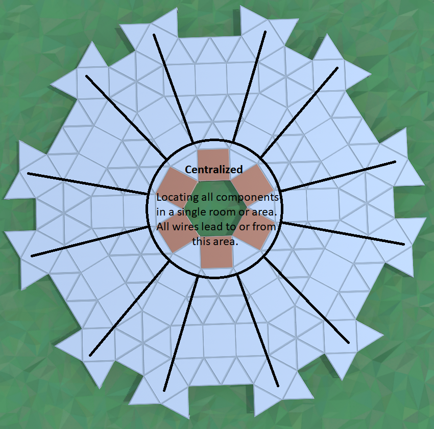
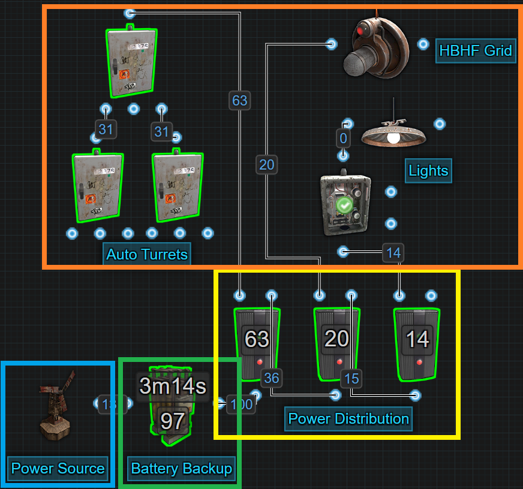
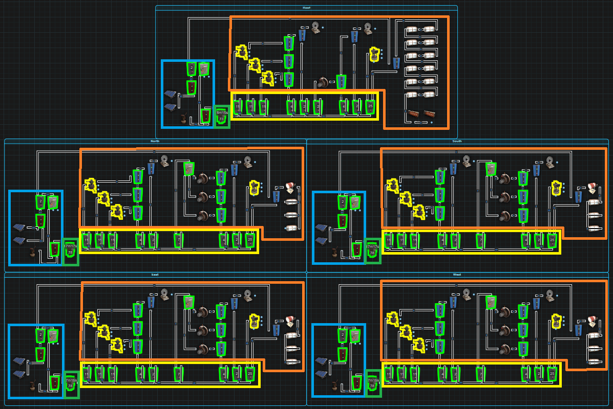
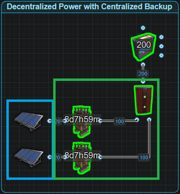
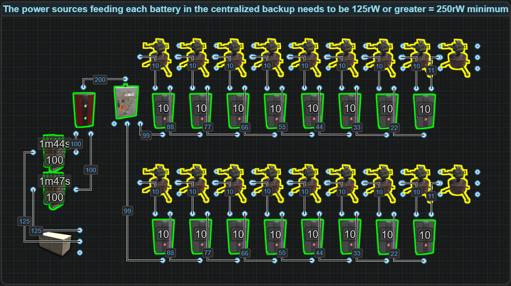
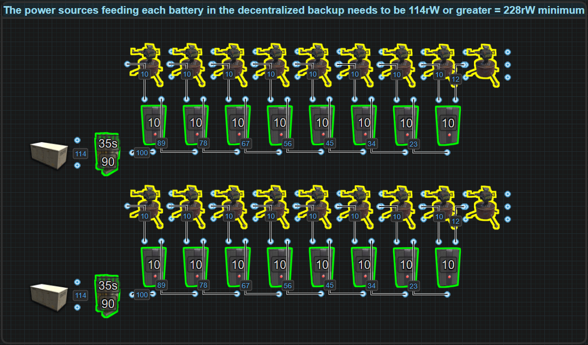
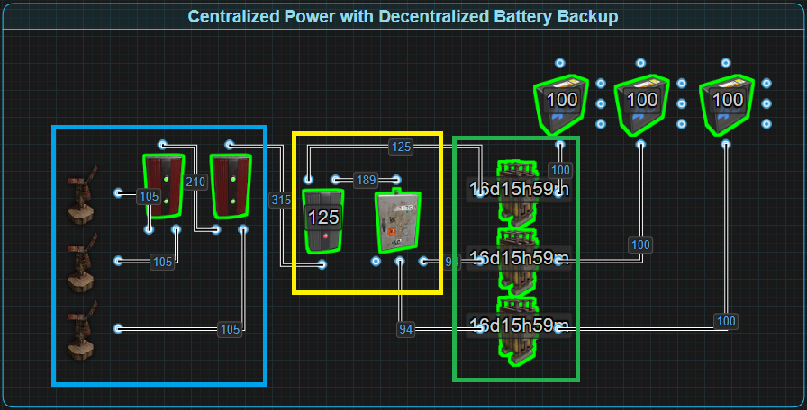
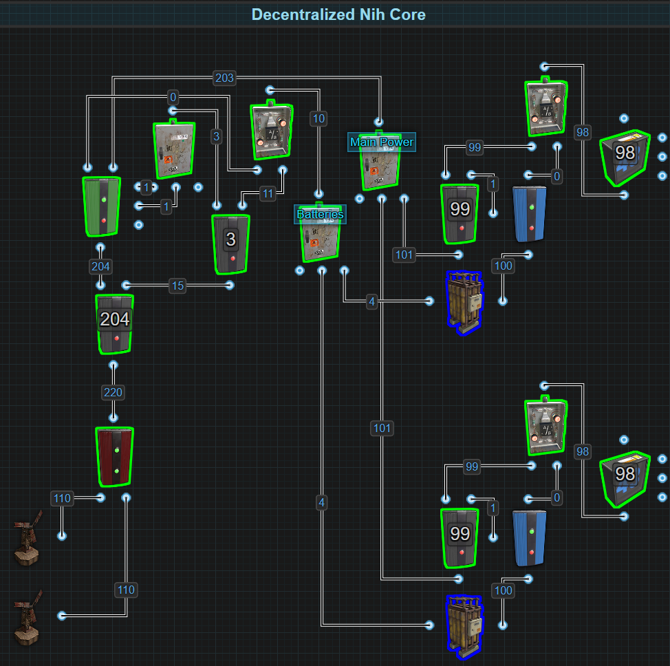
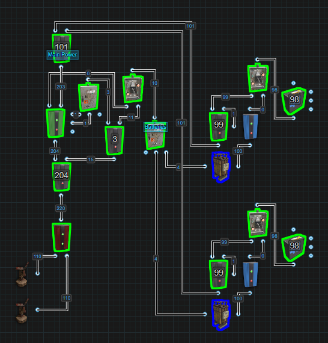

# Getting Started

# The Structure of a Base Circuit

All circuits for a base follow the same basic structure. It doesn't matter if the base has 1 circuit or more, they all contain 4 main parts with an optional 5th part that does not have a static location. We have the Power Source, Battery Backup, Distribution, End Devices/Circuits and the 5th, Destruction Detection. Using the following flow chart we can help illustrate this.

Moving top to bottom, every circuit needs a power source. You have 3 choices, Windmills, Solar Panels or Small Generators. 

We then take our source power and feed it to a Battery Backup. You have 2 choices, Inlines or Bypasses. Either way, you must ensure you are supplying enough power to keep your batteries charged. 

From the Battery Backup, we will then need to distribute the power to the different systems in the base. There are 3 options, a Fixed or Dynamic Bus or a Configure Siphon. 

The End Devices and Circuits are your turrets, lights, cameras, farms, door controllers, sensor grids, ect. It is these components that will consume the majority of power. Knowing what circuits you want to include will be important to know when deciding how much power you need to produce and how big your Battery Backup will be.

The Destruction Detection system should be included in most circuits and if limited to one, placing one after the Battery Backup is probably the best option.

Recommended reading:  
[Power Generation](powergeneration.md)  
[Power Storage](powerstorage.md)  
[Power Distribution](powerdistribution.md)  
[Useful Circuits](usefulcircuits.md)

# Centralized vs Decentralized Theory
When we talk about centralizing or decentralizing electricity, we are
talking about 1 of 2 things. We are either talking about the physical
placement of components or we are talking about power flow from a source
to the end component. In a 100% completely centralized system, the
electrical circuit would collect, store and distribute power all through
a single circuit and all of this would be located in a single electrical
room/area. A 100% completely decentralized system would have independent
circuits with their own power source, battery backup, and distribution
located in different rooms/areas for each system and section of a base.
These 2 concepts exist on the extreme ends of a spectrum. The best
circuit does not need to be one or the other, it can be located anywhere
in between.  

There are several variables including the server, wipe
length, group size, the base, server limits and electrical experience
that will influence the solution that works for your situation. This is
not a 1 size fits all. The best circuit is the one that does the job you
need it to do when you need it to do it.

First we will talk about the physical placement then we will get into
the electrical circuit(s).
# Locations

When talking about centralizing or decentralizing the physical location
of components, it should be understood that we are NOT talking about the
auto turrets on the roof for defense. We are NOT talking about the
quality of life improvements of having electric heaters everywhere
because the build location was in the arctic biome. We are NOT talking
about the components placed on walls for the purpose of destruction
detection. What we are talking about is the location of the core
components. We are talking about the circuits that power, control
and support the defensive systems, monitoring systems or quality of life
systems. We are talking about the location of collection points for
power sources, battery backups, the batteries, power buses and all the
logic circuits for everything electric in a base. We are talking about
the location a Windmill sends its power to or the place where the wire
that powers the auto turret comes from.  

## Centralized Location

Where you place these components is very important because you don’t
want to make it easy for raiders to destroy them. You want to protect
your circuits like you protect your TC. Centralizing the placement of
these components in a single room or area is very convenient. It's easy
to add layers of honeycomb, add lots of traps and doors to protect but
can come at the potential risk that if raiders get into this room/area,
with 1 rocket they can destroy and disable everything. You could place
it in a spot where raiders would not think to or want to raid. When
centralizing, the location should not be an afterthought. It should be
preplanned into the base.

No matter where the room is, hiding the wires that will need to lead to
and from this room is a must. They should be either hidden out of sight
or mislead the raiders as to the rooms location. Wires are limited in
length so in smaller bases, it is much easier to reach all the
components outside the room, like auto turrets, without requiring extra
components to extend the wire. In larger bases, this can become a
problem if you don't have a safe place to put components to extend the
wires. A safe place should not be easier to destroy than the end
component itself. As an example, if you are using a memory cell to
extend a wire to an auto turret. The memory cell should not be easier to
destroy than the auto turret it connects to. When it comes to wire
extensions, any component with a passthrough works but IMO, Industrial
Lights are the best because they are cheap to craft and easy to make
look like it is just base lighting giving it the perfect camouflage.

---

## Decentralized Locations

Decentralizing the physical locations of circuits is where there are 2
or more electrical rooms/areas. These locations should be hard to find
and harder to raid. These locations should be rooms that raiders would
not think is worth raiding. The more rooms there are, the less likely
raiders will disable every system when cutting the base in half with
rockets. The larger the base is, the easier it should be spreading out
the electrical rooms/areas. The more spread out these locations are the
more protected they are and has the added benefit of not needing wire
extensions to reach end devices in a given area.

Hiding your wires is very important. Any information a raider can
collect about the locations of your electrical rooms should be
minimized. With the limitation of wire length, decentralizing can be an
excellent way of distributing power closer to where it is actually
needed. Eliminating the need to use wire extensions makes things more
secure and builders won't need to build in extra rooms just for this.
These locations could be anywhere but it is recommended you plan them
into the build for more security. Electrical rooms should not be an
afterthought just like the disconnected TC was not an afterthought.

---

# Circuits

When we talk about centralizing or decentralizing circuits, we are
talking about how we are delivering power from the source to the
different systems and end components. It is crucial to understand the
structure of a base circuit because it makes it easier to visualize the
difference between Centralized and Decentralized circuits. To help
explain this, we will use 3 different end devices/circuits. First - Auto
Turrets, Second - A HBHF grid to know where enemies are and Third -
Lights.

Centralized is a single system with all power sources, destruction
detection, batteries, power distribution and end systems connected in a
single circuit. To be more specific, all power sources get combined and
run through a destruction detector into a battery backup system. From
the battery back up we provide all of the end devices and circuits with
a single distribution system.

Decentralized is when we provide all of our end systems with their own
power source, destruction detection(optional), battery and power
distribution. Decentralization is a concept that exists on a spectrum.
On one extreme it could be as simple as cutting the base in half and
using 1 circuit for the North and 1 for the South or putting the turrets
on 1 circuit and keeping the HBHF and lights on another. On the other
extreme end we break every end system down as far as we want. Let's
start with auto turrets and let's say we have 15 of them. 3 per side,
North, South, East and West as well as 3 on the roof. That could be 5
separate circuits. 5 separate power sources with 5 different detectors,
5 battery backups and 5 separate distributors. Then we could also do the
same with the HBHF grind. Separate that into 5 circuits. Destruction
detection could be included in all of those circuits and separate stand
alone systems could be added for all the walls on each of the 4 sides.
Even the lights if you wanted to could be decentralized.  

Knowing ahead of time what systems your base will use, how much power
they consume, the size of the base and the environment being played in
(competitive vs casual), will influence your design. For best results,
design the base build around your circuits so you never need to
sacrifice functionality or security.

---

## Centralized Circuits

Here we can look at some examples of a centralized circuit. Like we
stated before, the idea is to combine everything into a single circuit.
These have the advantage of being less complex but at the disadvantage
of having single points of failure. The first circuit we can look at in
the image below is pretty simple. We have a single source of power
feeding an inline battery backup supplying power to our end components
and circuits through a single distributor. We are starting with an
inline backup because it does not scale efficiently in a centralized
environment and it is easier to see points of failure. If the battery
gets destroyed or if the first Electrical Branch gets taken out, the
entire system goes offline.

The trick with an Inline system is to produce enough power to keep your
battery charged but not produce so much that power is wasted. A large
battery needs a constant input of 125 to not drain if its Active Usage
is maxed out at 100. With an input of 127, it will take that battery 34
days to fully charge from empty. Always try to precharge the batteries
above 3,000rWm before letting them power the circuit. Anything above
what's needed to maintain the battery will be a waste of power when the
battery is full.

When a circuit requires more than 100 power, and the goal is still to
centralize, switch to a bypass system like the Nih Core and max out your
batteries potential. If the amount of reliable power that can be
produced is limited, the goal should be to minimize the battery's Active
Usage to a state that is manageable. The lower it is, the less power
needed to maintain the battery and the longer it will last when main
power is gone. Refer to the section titled Battery Active Usage Vs
Actual Power Consumed for a better understanding of the 2 game
mechanics.

This next example uses the same end systems but has multiple power
sources and multiple batteries to support the same or more components.
It uses the Nih Core bypass battery backup and provides power to all the
different end systems through a single distributor. The number of end
systems you want to run and the amount of power they will consume will
dictate how much power you need to generate and the number of batteries
you need to support everything in the event of a power outage. If your
circuit needs 160rW, we will use 2 large batteries. If we need 470rw, we
will use 5 large batteries. DO NOT mix and match battery sizes.

 

Before it was said that the above example could support the same or more
components. The Nih Core really is meant to scale up to larger power
demands but let's say the demand is only 100, that means we have built
in some redundancy. 1 turbine or battery could be destroyed and the
circuit would still function as normal. This is an expensive way of
having redundancy but it does work. This is meant to be easily scalable
to any size power load but once we start to root combine batteries, we
should try to maximize the combined batteries potential by consuming as
much as possible. This means that if we have 2 large batteries, we
should try to use as much of the 200rW as possible. When batteries get
root combined, they do not share the load as one would expect.

For example, we have a circuit with 2 large batteries supporting a load
of 50. It would seem to make sense that 50 power divided by 2 batteries
equals 25 per battery, but rustricity doesn't work like that. That 50
power is taken from both batteries and is seen as Active Usage.

This means when we get to circuits that need more than 100 power, all
the batteries combined will show a max Active Usage. Active Usage is
used to calculate how fast a battery drains. If we are forcing batteries
to max drain then we might as well try to use as much as the combined
power the batteries will provide.

It is never good practice to mix and match different size batteries. A
large battery will last 4 hours, a medium battery will last 3 hours and
small batteries will last 15 minutes. If you mix and match, you can only
rely on maximum power for the amount of time the smallest battery will
last. For example, 2 large batteries and 1 medium for a total of 250rW.
For only 3 hours will you get 250, the last hour will only provide 200.
There are situations where mixing is useful, but not for the main
battery backup on a centralized circuit.

Centralized circuits are simple, easy to work with and scalable. On
paper, you can make a centralized circuit very large and consume a lot
of power. The reality is to produce a lot and store a lot of power, you
will need a lot of land to build it on. In this next example, on paper,
we have 9 turbines on the 10th floor with 9 backup batteries feeding 36
auto turrets divided by 9 per North, South, East and West sides. It also
has 3 HBHF Sensors per side, Search Lights on each side and a bunch of
lights. The circuit is only an example and is not using its full power
potential. It could include a grid of tesla coils, destruction
detection, a camera network, automatic doors, TC/Vending Machine and
storage monitoring, an indoor garden, a system that makes your base look
online when you are offline and much more. The point here is size, very
large.

It is not so easy to see, with a circuit this large, and the ability to
be much larger, how one would go abouts physically building this. It
would be possible to centralize the location of the battery backup and
distribution but the size of the base will probably call for multiple
wire extensions. Any component can be used to extend a wire. The idea is
to make that component as cheap as possible. Only consuming 1 power and
being the resource cheapest component is the Industrial Lights. They are
easy to integrate as base lighting giving them the perfect camouflage.
Decentralizing the locations of a centralized circuit is possible but
difficult especially on large bases. At a certain point, you may find it
easier to just decentralize the circuit itself along with the locations.
 

---

## Decentralized Circuits

Decentralizing circuits really comes down to how extreme you want to
take it. The idea behind decentralizing is adding security and
reliability by segmenting different systems and areas with their own
independent power supplies and backups. Keep in mind, the type of
battery backup you choose is up to you but for our examples, we will
stick with inlines because it takes up less room in the pictures.

The first example shows decentralizing by separating the different end
circuits with independent power supplies and battery backups. The Auto
Turrets get their own power supply and inline battery. Same for the SAM
sites, interior lights, exterior lights and HBHF grid, they all have
their own power supply and inline battery backup.

While decentralizing based on end circuits is an option, if the battery
powering that circuit gets destroyed, that entire circuit will become
disabled. Having all your auto turrets go offline during a raid is never
a good thing. A more secure option would be to decentralize by location.
To keep the idea simple for the next example, let's breakup a base into
5 sections, North, South, East, West and the roof. By giving each group
their own power supply and backup, it prevents the entire base from
going offline when raiders destroy both the power supply and battery
backup. Decentralizing the circuit makes it a lot easier to decentralize
the locations. Wire length is limited, so depending on the size of the
base, being able to put the power source, battery backup and
distribution in a location that minimizes the need to wire extensions is
very appealing. If the base is of a smaller size, putting the power
supply, battery backup and distribution on the North side that powers
the South side has the clear advantage that in the event raiders come
through the South side, when they hit the electrical room on the South
side, it only disables the North side of the base. It is recommended
that when needing to extend wires, if you can't put the extension
component in a protected area, use an industrial light and integrate it
into your base lighting.

## Hybrid Circuits

A hybrid circuit is one that both centralizes, for convenience, and
decentralizes, for security, different parts of the same circuit. While
it is more common to see hybridization between power sources and battery
backup, it can also be done with distribution. To help demonstrate this
concept, we have the following 3 examples. The first 2 are using Inline
Battery Backups because it's the easiest way to demonstrate the concept. In each example, a Counter is used to both show the
available amount of power but also represents an end circuit like lights
or turrets.

This first example demonstrates decentralizing the main power by having each power source charge its own battery, with a centralized Inline backup by combining the batteries before powering a circuit. This is a less than ideal way to set up your power production and battery backup. Keep in mind that Root Combiners do not share the load between batteries. This means that a circuit needing 100 power or more will force all the batteries to have a max Active Usage of 100. 
Read the section [Battery Active Usage vs Actual Power Consumed](concepts.html#battery-active-usage-vs-actual-power-consumed) for an in depth explanation into Active Usage.  

  

This kind of battery configuration is convenient to achieve a lot of power on 1 line but because in this example we are using Inline batteries, this becomes progressively more expensive to maintain as you need to be producing a significant amount more power than you need to. This also removes the ability to take advantage of game mechanics to minimize Active Usage on the batteries which should be a primary focus when using an Inline backup. 

Let's say you want to power 18 Auto Turrets. That is 180rW plus the cost of distribution so we are going to need 2 large batteries which give us 200 power, just like in the picture below. With no load sharing between the batteries, they both will have an Active Usage of 100. With the battery’s 80% efficiency, we need to give each battery 125rW. That’s a minimum of 250rW we need to produce all the time so the batteries do not drain.

If you have already read Battery Active Usage vs Actual Power Consumed, you will know it is possible to power 9 turrets from 1 battery. Pictured below, if we power 9 turrets from 1 battery and the other 9 from the other battery and each battery has its own power source, this allows each battery to only have an Active Usage of 90.  With the batteries 80%, we only need a power supply of 114rW per battery for a total of 228rW to not lose power. 

The larger this is scaled up, it is easy to see how much wasted power, time and materials there are when trying to centralize the batteries when each battery has its own power source. That is why it is seen as unsustainable for use in situations that are continuously online, however, if you have a circuit that spends most of its time offline and there are long enough periods of time between activity to let the batteries charge, then it becomes much more practical to just get a lot of power on a single line for a shorter period of time.  

In the next example we demonstrate centralizing power by combining it before the Inline batteries, while decentralizing the battery backup by letting each battery power its own circuit. This gives us the benefit of convenience by combining all the power sources into a single line then using Splitters to evenly divide that power between all batteries,

 
or, like in the above picture, use an
Electrical Branch to give priority to 1 battery while evenly dividing
the remaining power between the other 2. This gives us the ability to
prioritize batteries and also take advantage of minimizing Active Usage
per battery depending on the circuit it is powering. This leads to a
lower material and labor cost and wastes less power.

Decentralizing the batteries is almost always the better option when creating a hybrid circuit. While the above examples have used Inline battery backups, in our 3rd example, we use a bypass battery backup known as the Nih Core.

  

This battery backup is natively a centralized system but here, we have decentralized the batteries by dedicating them to specific systems. This is called the Decentralized Nih Core. We have combined the power sources before sending power into the Nih Core. Instead of having the batteries combined, which is traditional, we are instead separating the batteries so they each only backup a smaller portion of the circuit. It still gives us the benefit of powering our circuits the majority of the time with a centralized main power source but it is also providing security by decentralizing the battery backup. If the main power source or the core is destroyed, the batteries will take over. If the main power source or the core is not destroyed but a battery is, the circuit will remain powered by the main power source. Only once both are destroyed will a circuit go offline. If you want to build in some prioritization, what circuit is last to kick on to the battery, you can replace the Main Power Splitter with an Electrical Branch.

Replacing the Splitter with an Electrical Branch allows you more control over what circuit is the first to lose power and kick on to battery vs the last to kick over to battery. On the Electrical Branch, the output Branch Out lets you dedicate a specific amount of power to a circuit while the output Power Out sends out the remaining amount. As power falls, the circuit that is connected to Power Out will be the first to lose main power and switch over to battery backup before the circuit connected to Branch Out switches over to battery backup.

# Distribution

Needs explaining, but for now, it is the ability to supply an end device or circuit with power from more than 1 power source and/or battery backup. It is not recommended to do this with a battery backup, just use a proper secondary backup instead. 

Centralized distribution is how 99.9% of circuits are wires. All end devices or circuits are fed from a single source of power using a single path. 

Decentralized distribution at its simplest is using an OR Switch to send power to an end device or circuit from 2 or more power sources. 
