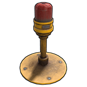
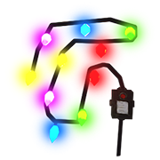
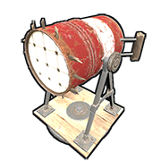
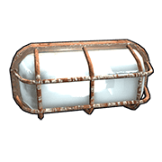

# Lights

---

# Flasher Light

| | |  
|-|---|  
Item ID             |  -939424778
Description         | A flashing blue light
Crafting Recipe     | 120 Metal Fragments
Recycles Into       | 60 Metal Fragments
Stack Size          | 5
Workbench Required  | Level 1
Research Table Cost | 20 Scrap
Hit Points          | 200
Where To Find       | Arctic Scientist, Cargo Ship Scientist, Crate, Excavator Scientist, Military Base Scientist, Oil Rig Scientist, Patrol Scientist, Sunken Chest, Tunnel Dweller, Underwater Dweller, Underwater Lab Blue Crate
Inputs/Outputs      | Power In / Passthrough
Active Usage        | 1
Power Consumption   | 1rW
Power Output        | Input power minus 1
Despawn Time        | 5 minutes

Notes:

- These blink a blue light. 3 fast pulses followed by a pause.
- These can be placed on any angled surfaces.

---

# Siren Light

| | |  
|-|---|  
Item ID             |  762289806
Description         | A spinning red light
Crafting Recipe     | 120 Metal Fragments
Recycles Into       | 60 Metal Fragments
Stack Size          | 5
Workbench Required  | Level 1
Research Table Cost | 20 Scrap
Hit Points          | 75
Where To Find       | Arctic Scientist, Cargo Ship Scientist, Crate, Excavator Scientist, Military Base Scientist, Oil Rig Scientist, Patrol Scientist, Treasure Box, Underwater Dweller, Underwater Lab Blue Crate
Inputs/Outputs      | Power In / Passthrough
Active Usage        | 1
Power Consumption   | 1rW
Power Output        | Input power minus 1
Despawn Time        | 5 minutes

Notes:

- These emit 2 red lights 180 degree from each other and spin in a
  circle.
- Can be placed on any angled surfaces.

---

# Ceiling Light

| | |  
|-|---|  
Item ID             | 1142993169
Description         | Overhead lighting and growing plants
Crafting Recipe     | 50 Metal Fragments
Recycles Into       | 25 Metal Fragments
Stack Size          | 10
Workbench Required  | Level 1
Research Table Cost | 20 Scrap
Hit Points          | 300
Where To Buy        | Bandit Camp for 30 Scrap
Where To Find       | Arctic Scientist, Cargo Ship Scientist, Crate, Excavator Scientist, Military Base Scientist, Oil Rig Scientist, Patrol Scientist, Sunken Chest, Tunnel Dweller, Underwater Dweller, Underwater Lab Blue Crate
Inputs/Outputs      | Power In / Passthrough
Active Usage        | 2
Power Consumption   | 2rW
Power Output        | Input power minus 2
Despawn Time        | 5 minutes

Notes:

- These hang from ceilings and focus light toward the ground.
- Hanging this at 1.5 floors allows the light to cover more area.
- They are the only light that can be used for farming.
- When given only 1 power, they will work until they don't. When they
  don't, turn them off and back on and they will work again.

---

# Simple Light

**(NON-CRAFTABLE)**

| | |  
|-|---|  
Item ID           |  -282113991
Description       |  Lighting an area placed on walls
Recycles Into     | 50 Wood, 13 Metal Fragments
Stack Size        | 1
Inputs/Outputs    |
Active Usage      | 1
Power Consumption | 1rW
Power Output      | Input power minus 1
Despawn Time      | 5 minutes

Notes:

- These can only be spawned in by an admin or using plugins.
- They take no damage.
- They can only be placed on vertical surfaces.

---

# Deluxe Christmas Lights

| | |  
|-|---|  
Item ID           |  -151387974
Description       | Christmas themed lights
Crafting Recipe   | 50 Metal Fragments for 10ft
Recycles Into     | 3 Metal Fragments per 1ft
Stack Size        | 150
Hit Points        | 100
Where To Find     | Requires a Steam item purchased from the market
Inputs/Outputs    | Power In / Passthrough
Active Usage      | 5
Power Consumption | 5rW
Power Output      | Input power minus 5
Despawn Time      | 5 minutes

Notes:

- This item can only be crafted if you have the item in your Steam
  Inventory. It must be purchased from the community market.
- 1 foundation is supposed to be 3 meters. 3 meters is 9.8ft. 1
  foundation length worth of these lights is only 8ft.
- Left click to place the first piece. Run the lights anywhere you want
  and right click to end placement.
- They have 5 different modes, Steady, Flashing, Chasing, Fade and Slow
  Glow.
- Can be placed underwater.
- Length of light strand does not affect the amount of power consumed.  

---

# Search Light

| | |  
|-|---|  
Item ID             |  2087678962
Description         | Lighting up a large area
Crafting Recipe     | 500 Wood, 200 Metal Fragments
Recycles Into       | 250 Wood, 100 Metal Fragments
Stack Size          | 1
Workbench Required  | Level 2
Research Table Cost | 75 Scrap
Hit Points          | 150
Where To Find       | Arctic Scientist, Cargo Ship Scientist, Elite Tier Crate, Excavator Scientist, Heavy Scientist, Locked Crate, Military Base Scientist, Military Crate, Oil Rig Scientist, Patrol Scientist, Treasure Box, Underwater Lab Elite Crate, Underwater Lab Yellow Crate
Inputs/Outputs      | Power In / Passthrough
Active Usage        | 10
Power Consumption   | 10rW
Power Output        | Input power minus 10
Despawn Time        | 20 minutes
Decay Time          | 8 hours

Notes:

- Use the light by looking at it and pressing Use(`E`). Adjust where the light is shining. Once in position, if you can see ‘Stop Using’, press Use(`E`) or walk far enough away to stop using.
- Has 360 degree rotation.
- Maximum distance light can travel is 96m or 32 foundations. 1 square
  foundation is 3m.
- Can be used through ceilings and walls.
- The light can be seen through walls if placed close enough. The flash
  from the light turning on can be seen as far away as 1 grid square.

---

# Small Neon Sign

| | |  
|-|---|  
Item ID           |  1305578813
Description       | A small neon sign!
Crafting Recipe   | 150 Metal Fragments
Recycles Into     | 75 Metal Fragments
Stack Size        | 5
Hit Points        | 300
Where To Find     | Requires a Steam item purchased from the market
Inputs/Outputs    | Electric Input / Passthrough
Active Usage      | 4
Power Consumption | 4rW
Power Output      | Input power minus 4
Despawn Time      | 5 minutes

Notes:

- This item can only be crafted if you have the item in your Steam
  Inventory. It must be purchased from the community market.
- Maximum image size is 128x128.
- Can be placed on vertical and angled surfaces.
- Can be placed underwater.

---

# Medium Neon Sign

| | |  
|-|---|  
Item ID            |  -1423304443
Description        |  A medium neon sign!
Crafting Recipe    | 200 Metal Fragments
Recycles Into      | 100 Metal Fragments
Stack Size         | 5
Workbench Required | Level 1
Hit Points         | 300
Where To Find      | Requires a Steam item purchased from the market
Inputs/Outputs     | Electric Input / Passthrough
Active Usage       | 6
Power Consumption  | 6rW
Power Output       | Input power minus 6
Despawn Time       | 5 minutes

Notes:

- This item can only be crafted if you have the item in your Steam
  Inventory. It must be purchased from the community market.
- Maximum image size is 256x128.
- Can be placed on vertical and angled surfaces.
- Can be placed underwater.

---

# Medium Animated Neon Sign

| | |  
|-|---|  
Item ID            |  42535890
Description        |  An animated neon sign!
Crafting Recipe    | 2 High Quality Metal, 300 Metal Fragments
Recycles Into      | 1 High Quality Metal, 150 Metal Fragments
Stack Size         | 1
Workbench Required | Level 2
Hit Points         | 300
Where To Find      | Requires a Steam item purchased from the market
Inputs/Outputs     | Electric Input / Passthrough
Active Usage       | 10
Power Consumption  | 10rW
Power Output       | Input power minus 10
Despawn Time       | 5 minutes

Notes:

- This item can only be crafted if you have the item in your Steam
  Inventory. It must be purchased from the community market.
- There are 5 pages you can paint and the sign will automatically flip between them.
- You can choose between 3 flipping speeds, Slow, Medium and Fast.
- Maximum image size is 256x128.
- Can be placed on vertical and angled surfaces.
- Can be placed underwater.

---

# Large Neon Sign

| | |  
|-|---|  
Item ID            |  866332017
Description        |  A large neon sign!
Crafting Recipe    | 250 Metal Fragments
Recycles Into      | 125 Metal Fragments
Stack Size         | 1
Workbench Required | Level 1
Hit Points         | 300
Where To Find      | Requires a Steam item purchased from the market
Inputs/Outputs     | Electric Input / Passthrough
Active Usage       | 8
Power Consumption  | 8rW
Power Output       | Input power minus 8
Despawn Time       | 5 minutes

Notes:

- This item can only be crafted if you have the item in your Steam
  Inventory. It must be purchased from the community market.
- Can be placed on vertical and angled surfaces.
- Maximum image size is 256x256.
- Using a low or half wall above a window with bars or glass, you can
  pull one of these down over the window to cover it. When the sign is
  painted, you can't see through the front but can through the back.
- Can be placed underwater.

---

# Large Animated Neon Sign

| | |  
|-|---|  
Item ID            |  1643667218
Description        |  A large, animated neon sign!
Crafting Recipe    | 5 High Quality Metal, 350 Metal Fragments
Recycles Into      | 125 Metal Fragments
Stack Size         | 5
Workbench Required | Level 2
Hit Points         | 300
Where To Find      | Requires a Steam item purchased from the market
Inputs/Outputs     | Electric Input / Passthrough
Active Usage       | 15
Power Consumption  | 15rW
Power Output       | Input power minus 15
Despawn Time       | 5 minutes

Notes:

- This item can only be crafted if you have the item in your Steam
  Inventory. It must be purchased from the community market.
- Can be placed on vertical and angled surfaces.
- There are 5 pages you can paint and the sign will automatically flip between them.
- You can choose between 3 flipping speeds, Slow, Medium and Fast.
- Maximum image size is 256x256.
- Using a low or half wall above a window with bars or glass, you can
  pull one of these down over the window to cover it. When the sign is
  painted, you can't see through the front but can through the back.
- Can be placed underwater.

---

# Industrial Wall Light

| | |  
|-|---|  
Item ID            |  1643667218
Description        |  A mountable white light
Crafting Recipe    | 30 Metal Fragments
Recycles Into      | 15 Metal Fragments
Stack Size         | 10
Workbench Required | Level 1
Hit Points         | 200
Where To Find      | Requires a Steam item purchased from the Item Store
Inputs/Outputs     | Power In / Passthrough
Active Usage       | 1
Power Consumption  | 1rW
Power Output       | Input power minus 1
Despawn Time       | 5 minutes

Notes:

- This item can only be crafted if you have the item in your Steam
  Inventory. It must be purchased from the in game Item Store.
- These are the cheapest components to build and only consume 1rW.
- Can be placed on all angled surfaces.

---

# Green Industrial Light

| | |  
|-|---|  
Item ID            |  1268178466
Description        |  A mountable green light
Crafting Recipe    | 30 Metal Fragments
Recycles Into      | 15 Metal Fragments
Stack Size         | 10
Workbench Required | Level 1
Hit Points         | 200
Where To Find      | Requires a Steam item purchased from the Item Store
Inputs/Outputs     | Power In / Passthrough
Active Usage       | 1
Power Consumption  | 1rW
Power Output       | Input power minus 1
Despawn Time       | 5 minutes

Notes:

- This item can only be crafted if you have the item in your Steam
  Inventory. It must be purchased from the in game Item Store.
- These are the cheapest component to build and only consume 1rW.
- Can be placed on all angled surfaces.

---

# Red Industrial Light

| | |  
|-|---|  
Item ID            | -1160621614
Description        |  A mountable red light
Crafting Recipe    | 30 Metal Fragments
Recycles Into      | 15 Metal Fragments
Stack Size         | 10
Workbench Required | Level 1
Hit Points         | 200
Where To Find      | Requires a Steam item purchased from the Item Store
Inputs/Outputs     | Power In / Passthrough
Active Usage       | 1
Power Consumption  | 1rW
Power Output       | Input power minus 1
Despawn Time       | 5 minutes

Notes:

- This item can only be crafted if you have the item in your Steam
  Inventory. It must be purchased from the in game Item Store.
- These are the cheapest components to build and only consume 1rW.
- Can be placed on all angled surfaces.

---

# Strobe Light

| | |  
|-|---|  
Item ID           |  2104517339
Description       | A flashing light with 3 speeds
Crafting Recipe   | 2 High Quality Metal, 100 Metal Fragments
Recycles Into     | 1 High Quality Metal, 50 Metal Fragments
Stack Size        | 1
Hit Points        | 100
Where To Find     | Requires a Steam item purchased from the market
Inputs/Outputs    | Toggle, Turn On, Turn Off
Active Usage      | 1
Power Consumption | 1rW per input but none for itself
Despawn Time      | 5 minutes

Notes:

- This item can only be crafted if you have the item in your Steam
  Inventory. It must be purchased from the community market.
- Requires TC authorization to change strobe settings. Look at the light
  and hold USE(`E`) to change the frequency of the strobe between 10hz,
  20hz and 40hz or to manually turn it on.
- Whichever input is the last to be activated is the input that dictates the state of the light. For example, if power is constantly sent to TURN ON, the light turns on. Then send power to TURN OFF, the light will turn off. When power is removed from TURN OFF, the light will not turn back on even with power still going to TURN ON. Power will need to be removed then reapplied power to TURN ON for the light to turn back on.
- The TOGGLE input will turn the light on when it receives power and turn off when power is removed. This does not change the previous bullet point. If power is applied to TOGGLE, the light will turn on. While the light is on, if power is sent to TURN OFF, the light will turn off. When power is removed from TURN OFF with power still going to TOGGLE, the light will not turn back on. On the other hand if power is sent to TURN ON, the light will turn on. Then send power to TOGGLE and the light will stay on. With power still going to TURN ON, if power is removed from TOGGLE and the light will turn off. This is because when power is removed from TOGGLE, it tells the light to turn off. 
- They take damage when active at a rate of 1hp/3min42sec.
- They can be placed on flat and angled surfaces as well as the ground.
- Can be picked up with a hammer but loses 10hp.

---

