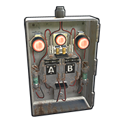
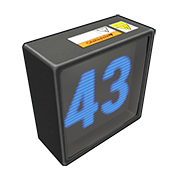

# Logic
These components allow for programming of intelligent systems that will perform and respond to sequences of operations. Systems that use these components will often, but not limited to, follow the rules of Boolean logic.

---

# Blocker

| | |  
|-|---|  
Item ID             |  -690968985
Description         | Blocking power passthrough when power is applied to its side input
Crafting Recipe     | 75 Metal Fragments
Recycles Into       | 38 Metal Fragments
Stack Size          | 5
Workbench Required  | Level 1
Research Table Cost | 20 Scrap
Hit Points          | 200
Where To Find       | Arctic Scientist, Cargo Ship Scientist, Crate, Excavator Scientist, Military Base Scientist, Oil Rig Scientist, Patrol Scientist, Sunken Chest, Underwater Dweller, Underwater Lab Blue Crate
Inputs/Outputs      | Power In, Block Passthrough / Power Out
Active Usage        | 1
Power Consumption   | 1rW
Power Output        | Power input minus 1
Despawn Time        | 5 minutes

Notes:

- When power is applied to the Block Passthrough input on the side, power will be prevented from passing though.
- When passthrough is blocked, it will also block any components [Active Usage](powerstorage.html#battery-active-usage-vs-actual-power-consumed), effectively hiding them from batteries when offline.
- Is a NOT logic gate.

---

# Memory Cell

| | |  
|-|---|  
Item ID             |  -746647361
Description         | Sending power through 1 of 2 outputs based on side inputs
Crafting Recipe     | 75 Metal Frags
Recycles Into       | 38 Metal Frags
Stack Size          | 5
Workbench Required  | Level 2
Research Table Cost | 75 Scrap
Hit Points          | 200
Where To Find       | Arctic Scientist, Cargo Ship Scientist, Crate, Elite Tier Crate, Excavator Scientist, Heavy Scientist, Locked Crate, Military Base Scientist, Military Crate, Oil Rig Scientist, Patrol Scientist, Treasure Box, Underwater Lab Blue Crate, Underwater Lab Elite Crate, Underwater Lab Yellow Crate
Inputs/Outputs      | Power In, Set, Reset, Toggle / Output, Inverted Output
Active Usage        | 1
Power Consumption   | 1rW
Power Output        | Power input minus 1
Despawn Time        | 20 minutes

Notes:

- Aka, a Flip Flop but has a Set, Reset and Toggle.
- The Reset input will cause the Memory Cell to send power through Inverted Output.
- The Set input will cause the Memory Cell to send power through Output.
- The Toggle input will cause the Memory Cell to flip which output power is going through.
- The side inputs are prioritized from top to bottom. This means if power is applied to Set then power is applied to Reset or Toggle, nothing will happen. If power is applied to Reset then power is applied to Toggle, nothing will happen. If power is applied to Reset then power is applied to Set, it will force the Memory Cell to send power through Output.
- When switching from one output to the other, Output will always react before Inverted Output. 
- The 2 outputs are currently bugged. When you try to see the power info by pointing at the outputs with a Wire Tool, it will show the incoming power being evenly split between both outputs. This is a visual bug. 100% of the power is only coming out of 1 of the outputs.
- Here is a [ rustrician.io](https://www.rustrician.io/?circuit=7329b23650674902a215f43e5015d563) BP explaining the Memory Cell.

---

# Timer

| | |  
|-|---|  
Item ID             |  665332906
Description         | Passing power through for a period of time
Crafting Recipe     | 75 Metal Fragments
Recycles Into       | 38 Metal Fragments
Stack Size          | 5
Workbench Required  | Level 1
Research Table Cost | 20 Scrap
Hit Points          | 200
Where To Find       | Arctic Scientist, Cargo Ship Scientist, Crate, Excavator Scientist, Military Base Scientist, Oil Rig Scientist, Patrol Scientist, Sunken Chest, Tunnel Dweller, Underwater Dweller, Underwater Lab Blue Crate
Inputs/Outputs      | Electric Input, Toggle On / Output
Active Usage        | 1
Power Consumption   | 1rW
Power Output        | Input power minus 1
Despawn Time        | 5 minutes

Notes:

- Everyone can activate the timer but only TC authorized people can set the timer.
- Timer must be powered to set the duration.
- It must also be powered first before it can be triggered as per [Power Flow](powerdistribution.html##power-flow).
- Has a default time of 10 seconds.
- Minimum time duration is 0.25 seconds. This might be too fast for some servers and must be increased.
- Maximum time duration has been tested to at least a 2 weeks IRL.
- Can only be placed on vertical walls.
- When it is not active, it will block all the components past it from registering [Active Usage](powerstorage.html#battery-active-usage-vs-actual-power-consumed) on batteries.

---

# RAND Switch

| | |  
|-|---|  
Item ID             |  492357192
Description         | Achieving a 50% passthrough rate when Set
Crafting Recipe     | 75 Metal Fragments
Recycles Into       | 38 Metal Fragments
Stack Size          | 5
Workbench Required  | Level 2
Research Table Cost | 20 Scrap
Hit Points          | 200
Where To Find       | Arctic Scientist, Cargo Ship Scientist, Crate, Elite Tier Crate, Excavator Scientist, Heavy Scientist, Locked Crate, Military Base Scientist, Military Crate, Oil Rig Scientist, Patrol Scientist, Treasure Box, Underwater Lab Blue Crate, Underwater Lab Elite Crate, Underwater Lab Yellow Crate
Inputs/Outputs      | Power In, Set, Reset / Power Out
Active Usage        | 1
Power Consumption   | 1rW
Power Output        | Input power minus 1
Despawn Time        | 5 minutes

Notes:

- When power is applied to Set, there is a 50% chance the switch will change states. From passing power through to not passing power through or vice versa.
- When power is applied to Reset, the switch will pass power through.
- While not passing power through, it will block any components [Active Usage](powerstorage.html#battery-active-usage-vs-actual-power-consumed), effectively hiding them from batteries when offline.
- Can be placed on all angled surfaces including the ground.

---

# OR Switch

| | |  
|-|---|  
Item ID             | -1286302544
Description         | Passing power through from 1 input OR the other
Crafting Recipe     | 100 Metal Fragments
Recycles Into       | 50 Metal Fragments
Stack Size          | 5
Workbench Required  | Level 1
Research Table Cost | 20 Scrap
Hit Points          | 200
Where To Find       | Arctic Scientist, Cargo Ship Scientist, Crate, Excavator Scientist, Military Base Scientist, Oil Rig Scientist, Patrol Scientist, Tunnel Dweller, Underwater Dweller, Underwater Lab Blue Crate
Inputs/Outputs      | Input A, Input B / Power Out
Active Usage        | 1
Power Consumption   | 1rW
Power Output        | It will pass through whichever input has more power, minus 1
Despawn Time        | 5 minutes

Notes:

- The switch will pass power through from Input A OR Input B but only
  the one that has more power avaliable.
- Can only be placed on vertical walls.

---

# AND Switch

| | |  
|-|---|  
Item ID             |  1171735914
Description         | Passing power through when both inputs have power
Crafting Recipe     | 100 Metal Fragments
Recycles Into       | 50 Metal Fragments
Stack Size          | 5
Workbench Required  | Level 2
Research Table Cost | 20 Scrap
Hit Points          | 200
Where To Find       | Arctic Scientist, Cargo Ship Scientist, Crate, Elite Tier Crate, Excavator Scientist, Heavy Scientist, Locked Crate, Military Base Scientist, Military Crate, Oil Rig Scientist, Patrol Scientist, Treasure Box, Underwater Lab Blue Crate, Underwater Lab Elite Crate, Underwater Lab Yellow Crate
Inputs/Outputs      | Input A, Input B / Power Out
Active Usage        | 1
Power Consumption   | 0rW
Power Output        |  It will pass through whichever input has more power.
Despawn Time        | 5 minutes

Notes:

- Input A and Input B both require power to pass power through but only
  the input with more power will be the one to pass through.
- Great for amplifying power.
- Can only be placed on vertical walls.

---

# XOR Switch

| | |  
|-|---|  
Item ID             |  1293102274
Description         | Passing power through from only 1 input
Crafting Recipe     | 100 Metal Fragments
Recycles Into       | 50 Metal Fragments
Stack Size          | 5
Workbench Required  | Level 1
Research Table Cost | 20 Scrap
Hit Points          | 200
Where To Find       | Arctic Scientist, Cargo Ship Scientist, Crate, Elite Tier Crate, Excavator Scientist, Heavy Scientist, Locked Crate, Military Base Scientist, Military Crate, Oil Rig Scientist, Patrol Scientist, Treasure Box, Underwater Lab Blue Crate, Underwater Lab Elite Crate, Underwater Lab Yellow Crate
Inputs/Outputs      | Input A, Input B / Power Out
Active Usage        | 1
Power Consumption   | 1rW
Power Output        | Power input minus 1
Despawn Time        | 5 minutes

Notes:

- It will pass power through from either Input A or Input B but if power
  is applied to both inputs, it will block power pass through.
- Can only be placed on vertical walls.

---

# Counter

| | |  
|-|---|  
Item ID             | -216999575
Description         | Counting or monitoring power levels
Crafting Recipe     | 75 Metal Fragments
Recycles Into       | 38 Metal Fragments
Stack Size          | 5
Workbench Required  | Level 2
Research Table Cost | 75 Scrap
Hit Points          | 100
Where To Find       | Arctic Scientist, Cargo Ship Scientist, Crate, Elite Tier Crate, Excavator Scientist, Heavy Scientist, Locked Crate, Military Base Scientist, Military Crate, Oil Rig Scientist, Patrol Scientist, Treasure Box, Underwater Lab Blue Crate, Underwater Lab Elite Crate, Underwater Lab Yellow Crate
Inputs/Outputs      | Power In, Increment Counter, Decrement Counter, Clear Counter / Passthrough
Active Usage        | 1
Power Consumption   | 1rW
Power Output        | Input power minus 1
Despawn Time        | 20 minutes
Decay Time          | 96 hours

Notes:

- To configure the Counter, with a Wire Tool in hand, look at it and hold Use(E). The options are Set Target and Show Passthrough.
- Set Target allows for programming a number between 1 and 100. When the Counter is equal to the target number, or greater, the Counter will pass power through.
- Show Passthrough will show the amount of incoming power.
- When power is applied to Increment Counter, the Counter will count up
  by 1.
- When power is applied to Decrement Counter, the Counter will count
  down by 1.
- When power is applied to Clear Counter, the Counter will reset back to 0.
- The Counter does not need power to count up, down or be cleared.
- When set to Show Passthrough, if it only shows 1, connect the output (Passthrough) to any input on any component. This will cause the counter to actually pass power through so it can show the amount.
- Using a Counter on the floor on its thin side, within a 1 meter
  radius, if an item like a furnace or sleeping bag is removed, the
  Counter will also disappear. When placing or removing building
  structures, the Counter will also disappear.
- The following items can be placed on top of a counter that is placed
  down on its thin side: Lantern, Jackolanterns, carvable pumpkins,
  sandbag and concrete barricades, pookie bear, twitch trophy, eggs and
  the small candle. Placing multiple counters together to create a
  larger pad, you can put larger things like a small battery on top.

---
