# Power Generation

# Wind Power
Generating power from the wind with Wind Turbines is the most common way to generate rustricity.  They are very reliable and can produce anywhere from 0rW up to 150rW. Wind Turbine power is greatly influenced by tower height to buildable ground and surrounding structures.

How close to a Wind Turbine is too close? That answer is 15 meters or 5 square foundations. Wind Turbines are large deployables and need a lot of room. If something is blocking the path of the wind, the turbine will produce zero power until the wind shifts direction. The picture below shows an area called ‘Restricted Build Zone’. Building outside of this area is completely safe. Building within the restricted zone could lead to blocking the wind but if some precautions are taken.
 
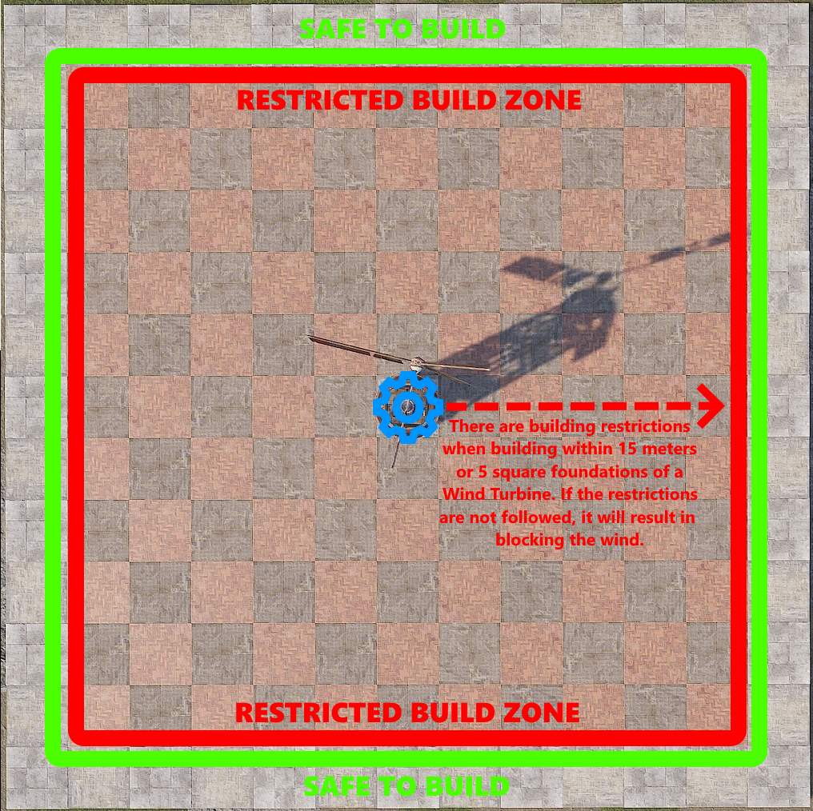

Building within the restricted zone is possible and it’s easier than people think. There is an invisible beam that sticks out the front of the turbine, at the intersection of the blades. It is inline with the horizontal drive shaft and sticks out 15 meters, or 5 square foundations. If this beam gets blocked by something a player deploys or builds, the turbine will stop spinning and stop producing power.

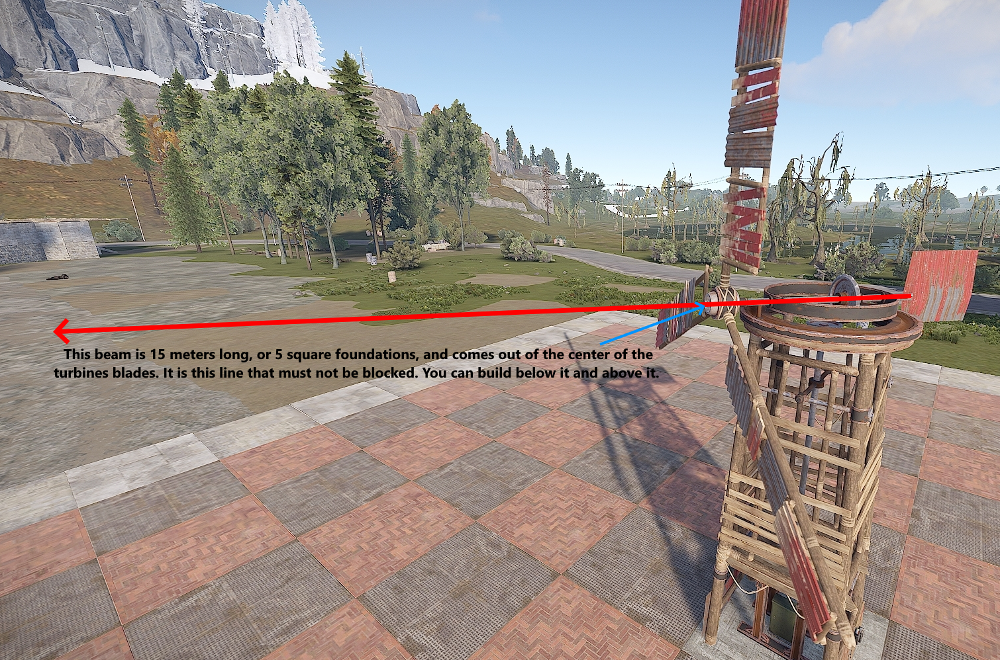

This beam is not very thick and its height is just over 2 floors high. As long as there are no obstructions out to 15 meters, the turbine will continue to produce power. Obstructions are anything from building structures to deployable items.This next picture shows where walls and floors can be placed below the beam without interfering with power production.

It is technically possible that something could be built in the area that would be the 3rd floor, but floors can’t be suspended. Angled roofs on the 2nd floor will block the wind because they stick up just enough into the 3rd floor to block the beam.

The frame of double door frames will block the wind. The following items can be placed into the double door frame and not block the wind.
- Chainlink Fence
- Netting
- Open Garage Door

This next picture shows a way to fully enclose the turbine inside a building. The 2 requirements to do this are:  
1 - The 3rd floor needs to be free of obstructions out to 5 square foundations.  
2 - Directly above the turbine needs to be 7 floors high. 

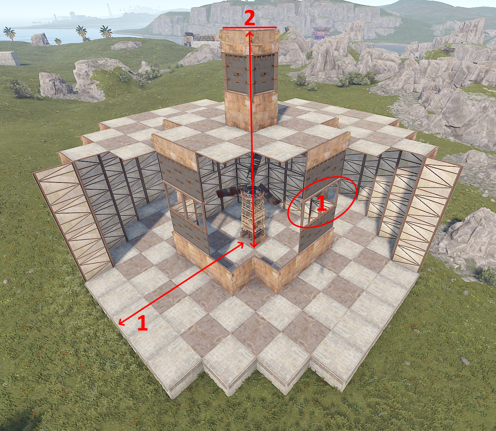

`Fun fact`, the turbine always rotates clockwise and it takes 1 hour to complete a full 360 degrees.

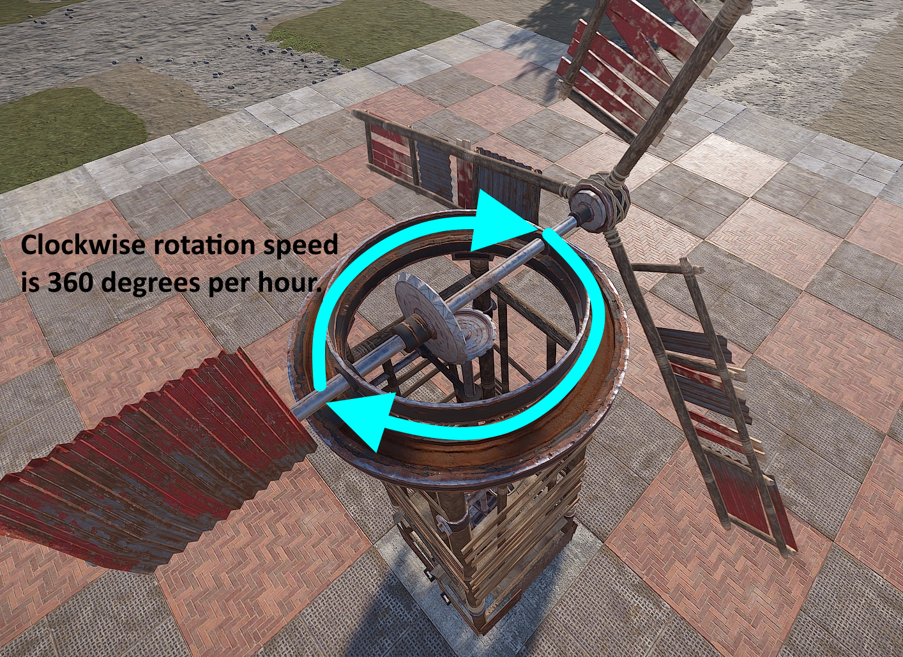

Knowing how close to the Wind Turbine structures and deployables can be placed is the first step. The next part is knowing how high they need to be built. The higher a turbine is placed, the more power it will produce on average. Height is referring to the distance between the turbine and the buildable ground below it. This means there is no difference between a turbine built on ground level at the beach or on the top of a mountain. If they are built at the same height off the ground, they will both produce the same amount of power. The next image is showing us how much average power can be expected when it is built above ground level.

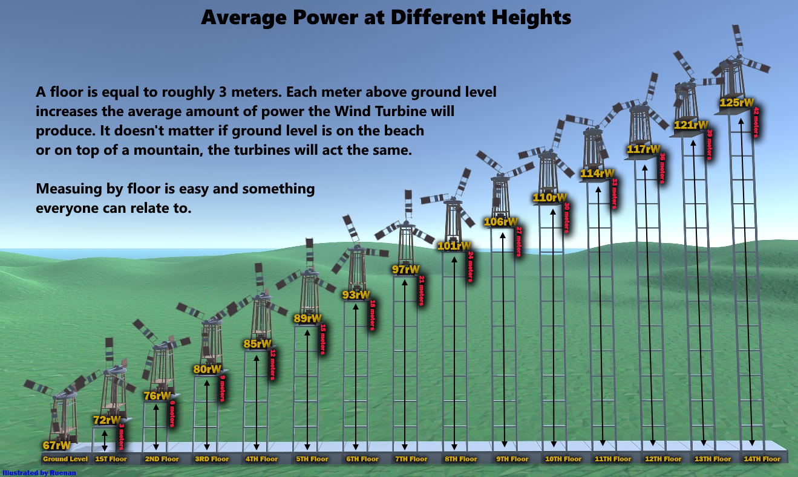

When measuring height, people will regularly refer to how tall or high their Wind Turbines are by counting the number of floors down to the foundations. This is a very easy way to relay information to everyone that plays Rust but if it was necessary to be more accurate, the height of the foundation could be taken into account.

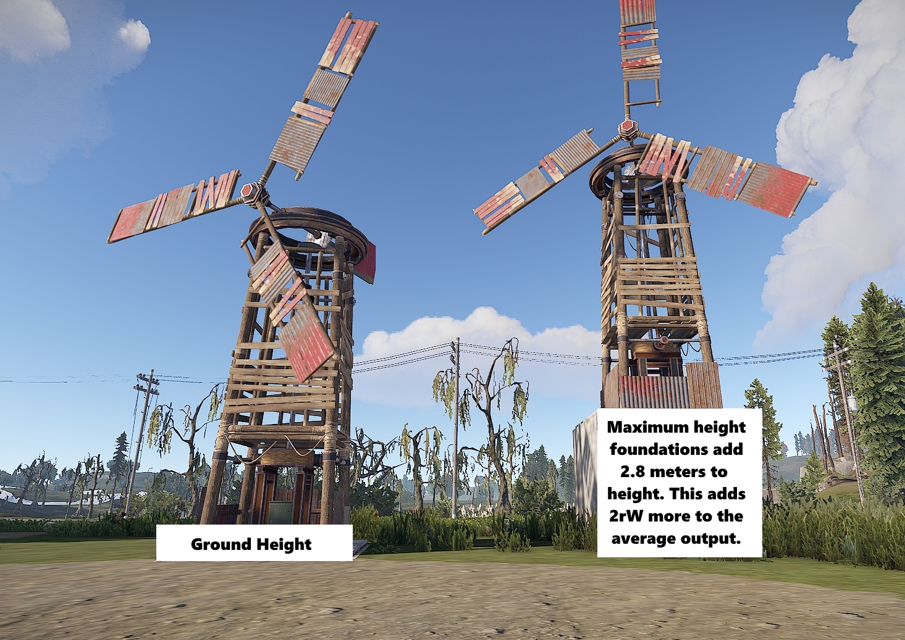

The strength of the wind varies over time. This means the amount of power a Wind Turbine produces fluctuates up and down. It is the reason why an average is used when talking about how much power a Wind Turbine produces. To help illustrate this, in the picture below, the blue line shows the amount of power a turbine at ground level was producing over the period of an hour. It consists of approximately 180 data points. The red line is what is said to be the average output for a turbine at ground level.  

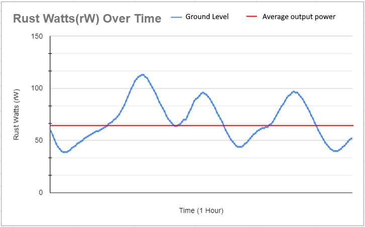

The picture above is from a random hour and its purpose is to show the randomness of wind. During this hour, the turbine's max output was only 113rW and its lowest output was 39rW. If this graph was stretched out to 100+ hours, it would show that the most common fluctuations are about 50rW + or - the average output. However, at some point, if the graph was stretched out long enough, we would see the turbine max out and produce 150rW. Likewise, we would also see its production drop to 0rW. The higher the turbine is, the more often it will max out at 150rW. The lower the turbine is, the less often it will max out at 150rW. At all heights, they have an equal chance to hit 0rW though it is very rare. Due to this fluctuation, the most reliable thing to do was find the average over a long period of time and that is how 93rW on the 6th floor became the number that is used today. 

If average output means that 50% of the time the turbine is producing more or less power, then with the same data points, it's also possible to find out the amount of time a turbine will be producing a specific amount of power or more for. For example, let’s say there was a need for a turbine to produce 30rW but it had to produce that much 99.9% of the time. How high would this turbine need to be? In this next picture, there are examples of the 2nd, 6th and 9th floors. Using this data, a turbine built 6 floors or more high, would be able to supply 30rW, 99.9% of the time. If anyone would like to collect the data for the remaining floors, I'd happily add it.

.png>)

Knowing this detailed information is not a necessity but if it is understood, it will help prevent running out of power, or better yet, being more efficient. Knowing how much power a circuit needs will help determine how many turbines need to be built and at what height they should be placed. The inverse of that is also true. If the number of turbines and their height is limited, knowing how much power that can be reliably produced will determine how big the circuit can be.

This next image is a very nice breakdown specifically for the Inline battery backup. It shows the turbines average power per floor and the usable amount of power from a battery. It also shows how many Auto Turrets a single Wind Turbine and Large Battery combo could support. It even shows how much stone each Rust Watt costs when building dedicated Wind Turbine towers. The stone calculations are now a little low. There was an update to the game that prevents turbines from being built on the tops of double door frames. Now a floor is needed under them which adds to the stone cost.  

---

# Solar Power

On Console:
Point the panels South.

On PC:
Depending on the time of year, the Sun will take a different path through the sky. Most Rust players live in the northern hemisphere. Places like Europe and North America. It is normal to have summers in June and winters in December. Rust island is located in the southern hemisphere, like Australia. This means winters are in June and summers are in December. 

- The winter solstice is the shortest day of the year. The Sun will travel its most Northern path. On this day, the sunrise is the latest and sunset is the earliest. During the winter months, solar panels capture less power.
- The summer solstice is the longest day of the year. The Sun will travel its most Southern path. On this day, the sunrise is the earliest and the sunset is the latest. During the summer months, solar panels capture more power.

In the picture below, it shows how the Sun will traverse the sky over 6 Rust months or 7ish real days. A day in the game is an hour of real time. This means it takes about 15ish days for a full Rust Year. 

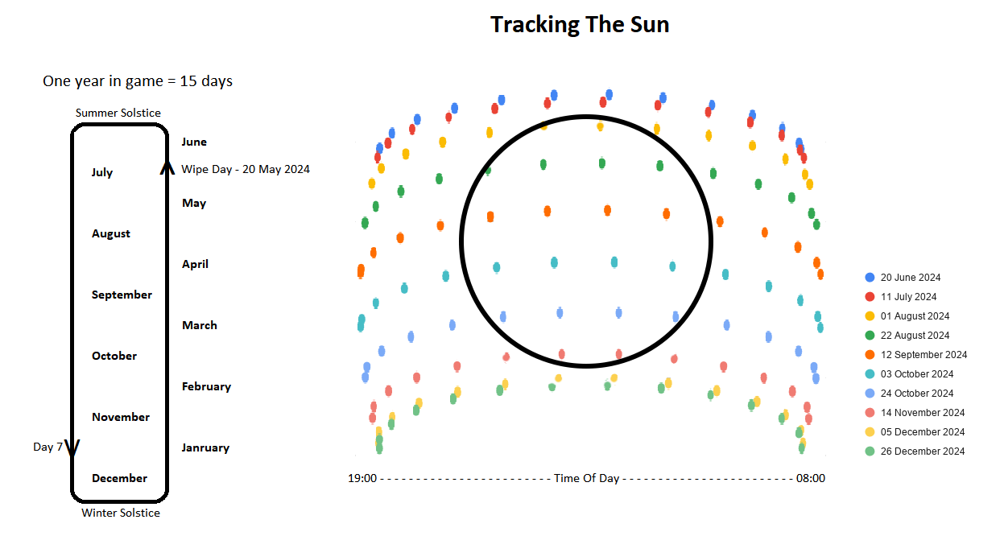

Wipe day is always May 20th 2024. Depending how long or short the wipe is, and where on the map a Solar Panel is located, might determine the direction the Solar Panel is placed. If the wipe is 5 days or less and the panel is located on the southern tip of the island, facing it North would be acceptable. However, if the wipe is any longer than that, the idea of having to pick up the panels to reangle them does not sound like fun. Placing a panel facing East and a panel facing West is the best way to set it and forget it. 

Solar Panels will produce power when the face of the panel can see the Sun. The Sun rises in the East and sets in the West. To take full advantage of a Solar Panel, try to capture the Sun in the morning the moment it rises above the horizon, and all the way to the moment the Sun drops below the horizon at night. In order to accomplish this, line of sight to each horizon is required. 

Things like the ground, cliffs, trees and building structures can all block the Sun. Avoid placing solar panels in their shadows. Solar Panels need an unobstructed view of the Sun as much as possible. Deployables do not appear to block the Sun.  

The best chance of achieving line of sight to both horizons is by building on top of the highest mountain.
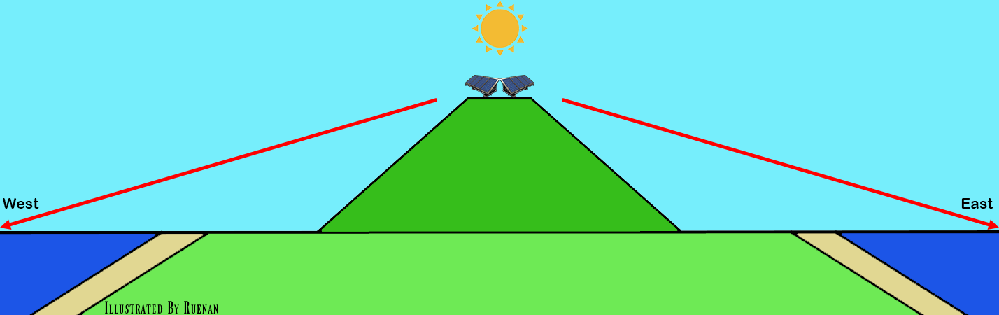
Otherwise, in the mornings, Eastward facing panels on the West side of the map will need to wait for the Sun to get high enough in the sky to clear the hills and mountains. The panels on the East side could catch the sun the moment it peaks above the horizon.

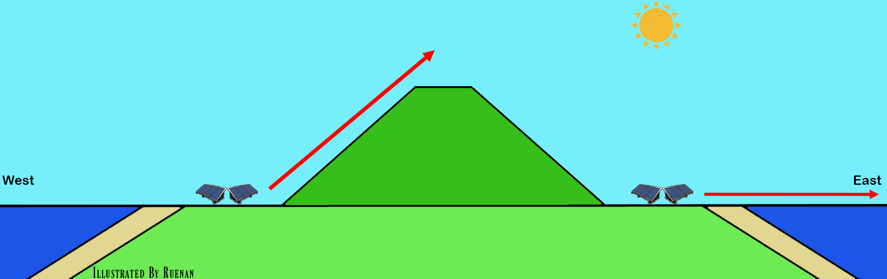
In the evenings, Westward facinging panels on the East side of the map will have the amount of time they could produce power cut short as the Sun moves behind the hills and mountains. The panels on the West side could catch the sun up to the moment it drops below the horizon.

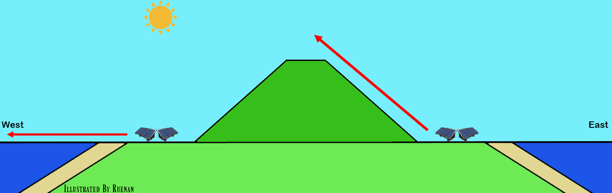

Only an admin can get the exact date and time. This is what players cannot see.  

  

Watching where the Sun rises and sets on the horizon can give a player an idea of the time of year. Some modded servers will have a plugin that gives players a clock and might show the sun up and down times. Some might even show the date.

If a pair of panels are placed so each could see either the East or West horizons, the following could reasonably be expected, within a reasonable margin or error.

**The Winter Solstice (June 20 2024):**   
- Solar Panels facing East can start to capture the Sun around 7:10am. Power levels will slowly increase until around 9:05am when they will be producing a full 20rW. This lasts until about 1:30pm. Around this time, it will slowly start decreasing power production until around 3:45pm when it stops.  
- The panel facing West can start to capture the Sun around 11:40am. A few minutes later at around 1:45pm, it will start producing a full 20rW. Around 6:15pm the panel will start decreasing the amount of power produced until about 8:15pm when it stops.  
- During the winter solstice, 2 combined panels, 1 facing East and 1 facing West, can collect around 940rWm of power.

**The Summer Solstice (December 21 2024):**  
- Solar Panels facing East can start to capture the Sun around 6:30am. Power levels will slowly increase until around 8:20am when they will be producing a full 20rW. This lasts until about 2:30pm. Around this time, it will slowly start decreasing power production until around 4:15pm when it stops.
- The panel facing West can start to capture the Sun around 11am. A few minutes later at around 1pm, it will start producing a full 20rW. Around 7pm the panel will start decreasing the amount of power produced until about 9pm when it stops.
- During the summer solstice, 2 combined panels, 1 facing East and 1 facing West, can collect around 1075rWm of power.

When working with solar panels for a primary source of power, it is very helpful to know how to calculate how much capacity a circuit needs to last 1 in game day. Knowing the capacity will dictate how many panels are needed. Base the number of panels used on the lowest amount of power they will produce on the shortest day of the year.

**The Maths:**  
`rWm`: rust watt minutes (capacity)  
`rW`: Rust Watt (aka power)  
`S`: Seconds  
`τ`: 60 (The number of seconds in a minute, and minutes in an hour)  
`M`: Minutes  
`O`: The amount of power(rW) you want to output  
`H`: Hours  

To figure out how much capacity is needed to support a circuit of a specific load, use the following equation:  
`O × τ = rWm`

To figure out how many pairs of panels are needed to support a specific amount to power, use the following equation:  
`rWm ÷ 940rWm = Solar Panel pairs`

> Example: A circuit with an active load of 64rW.  
`O × τ = rWm`  
`64 × 60 = 3840rWm`  
Therefore a circuit needing a constant 64rW over the course of 1 hour will consume 3840rWm worth of power.   
`rWm ÷ 940rW = Solar Panel pairs`  
`3840rWm ÷ 940rW = 4.08`  
Therefore 5 pairs of panels are needed to capture enough rWm to cover the power cost of a 64rW circuit. 2 solar panels make a pair, so 10 panels total.

To figure out how much time a given capacity will run for, outputting a specific amount of power, we use the following equations:  
`Seconds: (rWm ÷ O = M) × τ = S`  
`Minutes: rWm ÷ O = M`  
`Hours: (rWm ÷ O = M) ÷ τ = H`

---

That wraps up this section. I hope I have explained things in a way that makes sense. Please comment on the [Google Document](https://docs.google.com/document/d/19hr2dKtooN_YDF7TUsTdpLGadEEy9iyEFp12wbPnIas/edit?usp=sharing) if you have any suggestions or questions.