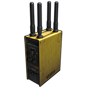
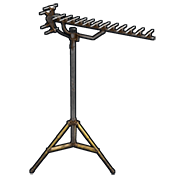
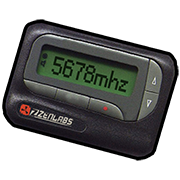

# Radio Frequency (RF)

## Common Traits

Radio Frequency or RF for short, is a signal that can be sent or
received to or from anywhere on the map.  

Small Oil Rig: 4765 / Large Oil Rig: 4768 / Giant Excavator: 4777

Transmitters cannot be set to frequencies between 4960 and 4990

Receivers can be set to frequencies between 4960 and 4990

---

# RF Broadcaster

| | |  
|-|---|  
Item ID             |  -1044468317
Description         | Sending an RF signal
Crafting Recipe     | 100 Metal Fragments, 1 Tech Trash
Recycles Into       | 50 Metal Fragments, 50% 1 Tech Trash
Stack Size          | 1
Workbench Required  | Level 2
Research Table Cost | 20 Scrap
Hit Points          | 50
Where To Find       | Arctic Scientist, Cargo Ship Scientist, Crate, Elite Tier Crate, Excavator Scientist, Heavy Scientist, Locked Crate, Military Base Scientist, Military Crate, Oil Rig Scientist, Patrol Scientist, Treasure Box, Underwater Lab Blue Crate, Underwater Lab Elite Crate, Underwater Lab Yellow Crate
Inputs/Outputs      | Power In
Active Usage        | 1
Power Consumption   | 1rW
Despawn Time        | 5 minutes
Decay Time          | 48 Hours

Notes:

- Will send an RF signal as long as it receives power.
- They can be placed on most flat surfaces including Workbenches and the
  top of TC.
- Takes 0.5 damage when changing frequencies.

---

# RF Receiver

| | |  
|-|---|  
Item ID             |  888415708
Description         |  Receiving an RF signal to output power
Crafting Recipe     | 100 Metal Fragments, 1 Tech Trash
Recycles Into       | 50 Metal Fragments, 50% 1 Tech Trash
Stack Size          | 1
Workbench Required  | Level 2
Research Table Cost | 20 Scrap
Hit Points          | 50
Where To Find       | Arctic Scientist, Cargo Ship Scientist, Crate, Elite Tier Crate, Excavator Scientist, Heavy Scientist, Locked Crate, Military Base Scientist, Military Crate, Oil Rig Scientist, Patrol Scientist, Treasure Box, Underwater Lab Blue Crate, Underwater Lab Elite Crate, Underwater Lab Yellow Crate
Inputs/Outputs      | Power In / Power Out
Active Usage        | 1
Power Consumption   | 1rW
Power Output        | Input power minus 1
Despawn Time        | 5 minutes
Decay Time          | 48 Hours

Notes:

- When it receives a signal, it will output power and continue to do so
  until it stops receiving a signal.
- They can be placed on most flat surfaces including Workbenches and the
  top of TC.
- While not passing power through, it will block any components [Active Usage](powerstorage.html#Battery-Active-Usage-VS-Actual-Power-Consumed) connected to it, effectively hiding them from batteries when offline.

---

# RF Transmitter

| | |  
|-|---|  
Item ID             |  596469572
Description         | Transmitting a RF signal from your hand
Crafting Recipe     | 5 High Quality Metal, 1 Tech Trash
Recycles Into       | 3 High Quality Metal, 50% 1 Tech Trash
Stack Size          | 1
Workbench Required  | Level 2
Research Table Cost | 20 Scrap
Where To Buy        | Outpost for 75 Scrap
Where To Find       | Arctic Scientist, Cargo Ship Scientist, Crate, Elite Tier Crate, Excavator Scientist, Heavy Scientist, Locked Crate, Military Base Scientist, Military Crate, Oil Rig Scientist, Patrol Scientist, Treasure Box, Underwater Lab Blue Crate, Underwater Lab Elite Crate, Underwater Lab Yellow Crate
Despawn Time        | 5 minutes

Notes:

- This is a hand held tool and will send a RF signal as long as the
  button is pressed.
- This tool takes 0.5 damage when changing frequencies.
- Frequency can be changed by holding Right Click while holding it.

---

# RF Pager

| | |  
|-|---|  
Item ID             | -566907190
Description         | Receiving a RF signal in your pocket
Crafting Recipe     | 50 Metal Fragments, 1 Tech Trash
Recycles Into       | 5 Scrap, 25 Metal Fragments, 50% 1 Tech Trash
Stack Size          | 1
Workbench Required  | Level 2
Research Table Cost | 20 Scrap
Where To Buy        | Outpost for 75 Scrap
Where To Find       | Arctic Scientist, Cargo Ship Scientist, Crate, Elite Tier Crate, Excavator Scientist, Heavy Scientist, Locked Crate, Military Base Scientist, Military Crate, Oil Rig Scientist, Patrol Scientist, Treasure Box, Underwater Lab Blue Crate, Underwater Lab Elite Crate, Underwater Lab Yellow Crate
Despawn Time        | 5 minutes

Notes:

- When the Pager receives a signal, it will start to beep and vibrate. It can be placed in Silent Mode.
- It can be carried in a person's inventory or placed in a storage box.

---

# Timed Explosive Charge

| | |  
|-|---|  
Item ID             | 1248356124
Description         | C4, used to destroy whatever it is attached to. 2 modes, delay and RF detonation
Crafting Recipe     | 20 Explosives, 5 Cloth, 2 Tech Trash
Recycles Into       | 10 Explosives, 3 Cloth, 1 Tech Trash
Stack Size          | 10
Workbench Required  | Level 3
Research Table Cost | 500 Scrap
Damage              | 550
Explosion Radius    | 4m
Explosion Delay     | 10 Seconds
Explosion Control   | Delay or RF
Where To Buy        | Outpost for 75 Scrap
Where To Find       | APC Crate, Elite Crate, Elite Tier Crate, Heavy Scientist, Helicopter Crate, Locked Crate, Supply Drop, Underwater Lab Elite Crate
Despawn Time        | 1 hour
Decay Time          | 24 hours

Notes:

- To use it in delay mode, just throw the explosive charge with a left click. It will beep for 10 seconds before exploding. The red light will be on.
- To use in RF mode, enter your inventory and select the charge. Click on ‘Enable RF’ then ‘Set Frequency’. Use left click to throw the explosive charge onto something and wait 10 seconds for the beeping to stop. The green light will be on. Set a RF Broadcaster or RF Transmitter to the same frequency and transmit when you want the charge to detonate.
- Due to the introduction of RF mode, RF Broadcasters and Transmitters now take 0.5 damage when changing frequencies.
- Anyone can pick up the charge after the beeping stops by looking at it and holding Use(`E`).
- Will survive a server restart.
- Decays after 24 hours when outside the TC range of the person that threw it.

---

