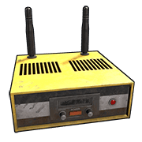
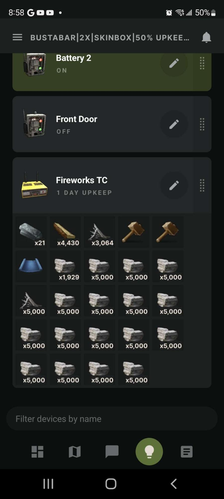
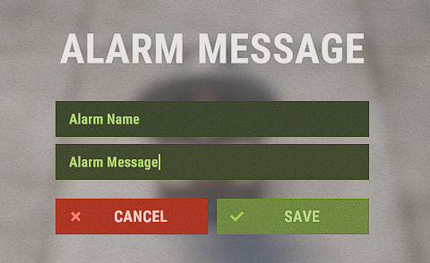

# Smart

These components can be paired with the Rust+ app and adds a way to interact with Rust from outside the game. Also see Auto Turret, PTZ CCTV Camera and CCTV Camera. They can also be assigned an ID and be paired with Rust+.

- To connect the smart component with the Rust+ app, start by installing the app from your app store on a tablet or smartphone. 
- Launch the app and sign into Steam. 
- In game, join a server that has Rust+ enabled. 
- Once on the server, hit ESC to enter the main menu. 
- Click on Rust+. 
- Select ‘Pair With Server’ and in the app the server's info should pop up. 
- In the app, select ‘Pair Server’ and you're done. 
- Look at the smart component in game and hold Use(`E`) to get the option to pair.

---

# Storage Monitor

| | |  
|-|---|  
Item ID             |  1149964039
Description         | Monitoring Tool Cupboards, Large Storage Boxes and Vending Machines
Crafting Recipe     | 3 High Quality Metal, 1 Tech Trash
Recycles Into       | 2 High Quality Metal, 50% 1 Tech Trash
Stack Size          | 1
Workbench Required  | Level 2
Research Table Cost | 75 Scrap
Hit Points          | Has no hit points
Where To Find       | Arctic Scientist, Cargo Ship Scientist, Elite Tier Crate, Excavator Scientist, Heavy Scientist, Locked Crate, Military Base Scientist, Military Crate, Oil Rig Scientist, Patrol Scientist, Treasure Box, Underwater Lab Elite Crate, Underwater Lab Yellow Crate
Inputs/Outputs      | Power In / Output
Active Usage        | 1
Power Consumption   | 1rW
Power Output        | 1rW
Despawn Time        | 20 minutes

Notes:

- Will pulse 1rW when an inventory slot changes state. An inventory slot will either need to be filled or emptied for the Storage Monitor to notice a change. It will not notice partial stacksize changes.
- Can be paired with Rust+ to allow monitoring of Tool Cupboards, Large Boxes and Vending Machines.

---

# Smart Alarm

| | |  
|-|---|  
Item ID             |  -695978112
Description         | Sends a notification to your phone
Crafting Recipe     | 3 High Quality Metal, 1 Tech Trash
Recycles Into       | 2 High Quality Metal, 50% 1 Tech Trash
Stack Size          | 5
Workbench Required  | Level 2
Research Table Cost | 75 Scrap
Hit Points          | 50
Where To Find       | Arctic Scientist, Cargo Ship Scientist, Elite Tier Crate, Excavator Scientist, Heavy Scientist, Locked Crate, Military Base Scientist, Military Crate, Oil Rig Scientist, Patrol Scientist, Treasure Box, Underwater Lab Elite Crate, Underwater Lab Yellow Crate
Inputs/Outputs      | Power In / Power Out
Active Usage        | 1
Power Consumption   | 1rW
Power Output        | Input power minus 1
Despawn Time        | 20 minutes
Decay Time          | 48 hours

Notes:

- Must be placed on flat surfaces.
- Can be paired with Rust+ to receive pre-programmed messages from in-game when activated.
- With TC authorization, look at the alarm with a Wire Tool in hand and press Use(`E`) to set the alarms message.

---

# Smart Switch

| | |  
|-|---|  
Item ID             |  988652725
Description         | A switch requiring TC authorization
Crafting Recipe     | 3 High Quality Metal, 1 Tech Trash
Recycles Into       | 2 High Quality Metal, 50% 1 Tech Trash
Stack Size          | 5
Workbench Required  | Level 2
Research Table Cost | 20 Scrap
Hit Points          | 200
Where To Find       | Arctic Scientist, Cargo Ship Scientist, Elite Tier Crate, Excavator Scientist, Heavy Scientist, Locked Crate, Military Base Scientist, Military Crate, Oil Rig Scientist, Patrol Scientist, Treasure Box, Underwater Lab Elite Crate, Underwater Lab Yellow Crate
Inputs/Outputs      | Electric Input, Switch On, Switch Off / Output
Active Usage        | 1
Power Consumption   | 1rW
Power Output        | Input power minus 1
Despawn Time        | 5 minutes
Decay Time          |

Notes:

- Only people with TC authorization can operate the Switch.
- Can be paired with Rust+ enabling the ability to turn it on and off from outside the game.
- The [Side Inputs](uncategorizedconcepts.html#side-inputs) block the [Component Destruction Detectors](https://www.rustrician.io/?circuit=e8a5b617b7d37c08f784b4566110c1e1) ability to see downstream.

---

