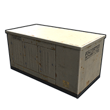
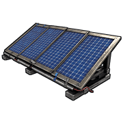
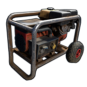

# Power Sources

There is no way around this. If electrical circuits are going to function, power must be generated somehow. These are the components that produce power. For a more in depth explanation, have a look at [Power Generation]( powergeneration.html ) in the Concepts section.

---

# Test Generator 

**(NOT CRAFTABLE)**

| | |
|-|--|
Item ID           |  -295829489
Description       | Providing a constant 100rW per Power Output
Crafting Recipe   | Cannot be crafted
Recycles Into     | 13 High Quality Metal, 2 Gears, 1 Metal Pipe, 2 Fuse
Stack Size        | 1
Hit Points        | 1000
Outputs           | Power Output 1, Power Output 2, Power Output 3
Power Consumption | 0rW
Power Output      | 100rW per output
Despawn Time      | 20 minutes

Notes:

- This item can only be spawned in by an admin.
- It supplies a constant 100rW per output for free.
- It has 3 outputs.
- Excellent for testing.

---

# Wind Turbine

| | |
|-|--|
Item ID             | -1819763926
Description         | Generating electricity from the wind
Crafting Recipe     | 500 Wood, 10 High Quality Metal, 3 Gears, 3 Sheet Meta, 
Recycles Into       | 250 Wood, 5 High Quality Metal, 2 Gears, 2 Sheet Meta, 
Stack Size          | 1
Workbench Required  | Level 2
Research Table Cost | 125 Scrap
Hit Points          | 250
Where To Buy        | Bandit Camp for 500 Scrap
Where To Find       | Arctic Scientist, Cargo Ship Scientist, Elite Tier Crate, Excavator Scientist, Heavy Scientist, Locked Crate, Military Base Scientist, Military Crate, Oil Rig Scientist, Patrol Scientist, Treasure Box, Underwater Lab Elite Crate, Underwater Lab Yellow Crate
Outputs             | Power Out
Power Consumption   | 0rW
Power Output        | 0-150rW
Active Usage        | 0
Despawn Time        | 40 minutes
Decay Time          | 8 hours

Notes:

- Wind Turbines operate in both day and night.
- The amount of power they output is heavily influenced by the number of
  floors above the ground they are, not sea level.
- They will produce more power, more often the more floors above ground they are placed.
- There is a small area at the base of the turbine, on some sheet metal where you can place components.
- A turbine made on an iceberg, will calculate its output based on sea level down to the ocean bottom. This means no additional height above sea level will increase its height calculation.
- There needs to be a minimum of 15 meters or 5 foundations distance between turbines. This will prevent 1 turbine blocking the wind for another.
- Requires a single square or 2 triangles to be placed on. 
- Cannot be picked up with a hammer.
- Check out **Wind Power** in the Concepts section under [Power Generation](powergeneration.html#wind-power).

---

# Large Solar Panel

| | |  
|-|---|  
Item ID             | 2090395347
Description         | Generating electricity from the Sun
Crafting Recipe     | 5 High Quality Metal, 1 Tech Trash
Recycles Into       | 3 High Quality Metal, 50% 1 Tech Trash
Sack Size          | 3
Workbench Required  | Level 1
Research Table Cost | 75 Scrap
Hit Points          | 100
Where To Buy        | Outpost for 75 Scrap
Where To Find       | Arctic Scientist, Cargo Ship Scientist, Crate, Excavator Scientist, Military Base Scientist, Oil Rig Scientist, Patrol Scientist, Sunken Chest, Tunnel Dweller, Underwater Dweller, Underwater Lab Blue Crate
Outputs             | Power Out
Power Consumption   | 0rW
Power Output        | 0-20rW
Active Usage        | 0
Despawn Time        | 20 minutes
Decay Time          | 8 hours

Notes:

- Large Solar Panels output electricity only during the day.
- They will produce less power if they are damaged or the Sun is not
  making it to the entire front face.
- They can be placed on the ground or flat building structure.
- They can be picked up with a hammer but will lose 25% health.
- 24 hours in game is 1 irl hour.
- Check out **Solar Power** in the Concepts section under [Power Generation](powergeneration.html#solar-power).

---

# Small Generator

| | |  
|-|---|  
Item ID             | 1849887541
Description         | Generating electricity from Low Grade Fuel
Crafting Recipe     | 5 High Quality Metal, 2 Gears
Recycles Into       | 3 High Quality Metal, 1 Gear
Stack Size          | 1
Workbench Required  | Level 2
Research Table Cost | 75 Scrap
Hit Points          | 100
Where To Buy        | Outpost for 125 Scrap
Where To Find       | Arctic Scientist, Cargo Ship Scientist, Crate, Elite Tier Crate, Excavator Scientist, Heavy Scientist, Locked Crate, Military Base Scientist, Military Crate, Oil Rig Scientist, Patrol Scientist, Treasure Box, Underwater Lab Blue Crate, Underwater Lab Elite Crate, Underwater Lab Yellow Crate
Inputs/Outputs      | Force Start, Force Stop / Power Out
Power Consumption   | 0rW
Fuel Consumption    | 500 Low Grade Fuel/2hr
Power Output        | 40rW
Active Usage        | 0
Despawn Time        | 20 minutes

Notes:

- Small Generators will output electricity when they are turned on.
- You can Start and Stop them manually or use one of the electrical
  inputs.
- The last input to receive power is the function that is activated,
  even if power is still being applied to the opposite.
- They must be placed on floors, foundations or the ground.
- They still produce max power when damaged.
- They can be picked up with a hammer but lose 20% health.
- If a battery is feeding power to either of the inputs, components
  connected to Power Out will register an active usage on the battery.

---
