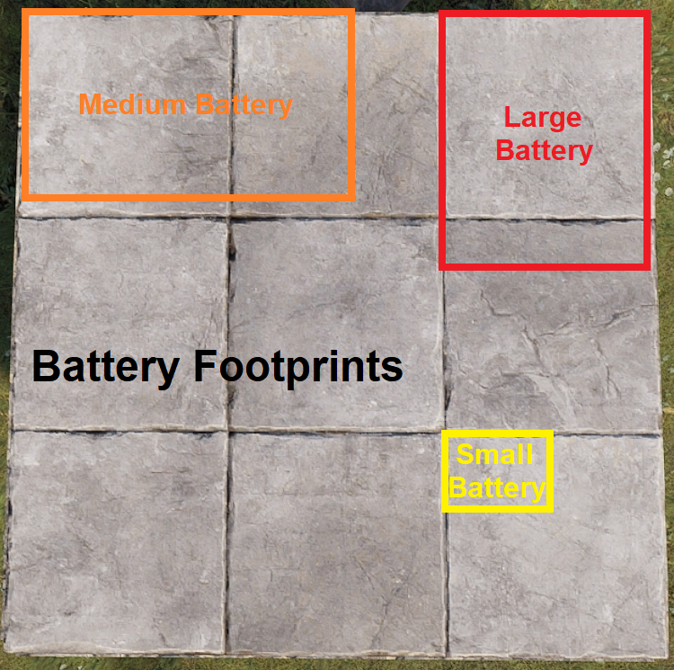
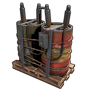
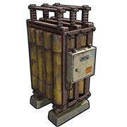

# Power Storage

---

- Batteries can accept incoming power at the same time they are sending power out.  
- Charging rate is dependent on the amount of power coming in, with an efficiency of 80%.  

> *Example:* 20rW from a Solar Panel × 0.8 = 16rW usable through a battery.  

> *Example:* If your Medium Battery is supplying 16rW to a circuit, 16 ÷ 0.8 = 20rW is the minimum you want to give the battery so it doesn’t lose any charge.

- It is recommended to supply slightly more than you need if you want to charge the battery.  
- When you combine batteries with Root Combiners, they do not split the load as one would expect. They cannot see each other, so each battery tries to power the whole circuit.  

> For example, in a circuit with 2 root combined batteries supporting a load of 50, it would seem to make sense that 50 power divided by 2 batteries equals 25 per battery.  
Rustricity doesn't work like that and 50 power is taken from each battery and seen as Active Usage on both batteries. This means both batteries are draining at a rate of 50.  

This means when we get to circuits that need more than 100 power,
all the batteries combined will show a max Active Usage,
which is used to calculate how fast a battery drains.
So if we are forcing batteries to max drain,
then we might as well try to use as much as the combined power the batteries will provide.

When using a bypass battery backup like the [ Nih core ]( backup.html#nih-core ),
Active Usage does not matter because the circuits are power from the main power source most of the time.

- Rustricity has its own version of [Parallel and Series](concepts.html#parallel-vs-series) battery configurations.
- 1rw will charge a Large Battery in 34 IRL days.
- When a battery is depleted because it is not receiving enough power, no power is outputed until it charges up for a couple seconds before
outputting to the connected circuit. The battery still not receiving
enough power will deplete in a second and the process repeats.  
- If the circuit after a battery is turning on and off,
you do not have enough power charging your batteries.
- When they get picked up, they lose 25% HP but retain their current
capacity. This means if a large battery has a full charge, when you pick
it up and place it back down, it will still have a full charge.
- Batteries have something called Active Usage and components have
something called Power Consumption. Read about it in [Battery Active Usage vs Actual Power Consumed
](concepts.html#battery-active-usage-vs-actual-power-consumed).

---

# Small Rechargeable Battery

| | |  
|-|---|  
Item ID             | -692338819
Description         | Storing electricity
Crafting Recipe     | 5 HQM
Recycles Into       | 3 HQM
Stack Size          | 1
Workbench Required  | Level 1
Research Table Cost | 20 Scrap
Hit Points          | 100
Where To Find       | Arctic Scientist, Cargo Ship Scientist, Crate, Excavator Scientist, Military Base Scientist, Oil Rig Scientist, Patrol Scientist, Sunken Chest, Tunnel Dweller, Underwater Lab Blue Crate
Inputs/Outputs      | Power In / Power Output
Power Consumption   | 40rW
Power Capacity      | 150rW
Power Output/Time   | 10rW/15min
Active Usage        | 40
Despawn Time        | 5 minutes
Decay Time          |

Notes:

- Small Batteries are very compact and can be placed on some deployables
  like work/repair benches and boxes
- Maximum power input is 40rW
- Comes with a default charge of 20rWM

---

# Medium Rechargeable Battery

| | |  
|-|---|  
Item ID             | 2023888403
Description         | Storing electricity
Crafting Recipe     | 5 HQM/1 Tech Trash
Recycles Into       | 3 HQM
Stack Size          | 1
Workbench Required  | Level 2
Research Table Cost | 75 Scrap
Hit Points          | 100
Where To Buy        | Bandit Camp for 75 Scrap
Where To Find       | Arctic Scientist, Cargo Ship Scientist, Crate, Elite Tier Crate, Excavator Scientist, Heavy Scientist, Locked Crate, Military Base Scientist, Military Crate, Oil Rig Scientist, Patrol Scientist, Treasure Box, Underwater Lab Blue Crate, Underwater Lab Elite Crate, Underwater Lab Yellow Crate
Inputs/Outputs      | Power In / Power Output
Power Consumption   | 200rW
Power Capacity      | 9000rWM
Power Output/Time   | 50rW/3hrs
Active Usage        | 200
Despawn Time        | 20 minutes
Decay Time          |

Notes:

- These batteries are significantly larger than the small battery and
  take up 2sq meters or 2 squares on a stone foundation
- Maximum power input is 200rW
- Comes with a default charge of 100rWM

---

# Large Battery

| | |  
|-|---|  
Item ID             | 553270375
Description         | Storing electricity
Crafting Recipe     | 10 HQM/2 Tech Trash
Recycles Into       | 5 HQM/1 Tech Trash
Stack Size          | 1
Workbench Required  | Level 2
Research Table Cost | 75 Scrap
Hit Points          | 100
Where To Find       | Arctic Scientist, Cargo Ship Scientist, Crate, Elite Tier Crate, Excavator Scientist, Heavy Scientist, Locked Crate, Military Base Scientist, Military Crate, Oil Rig Scientist, Patrol Scientist, Treasure Box, Underwater Lab Blue Crate, Underwater Lab Elite Crate, Underwater Lab Yellow Crate
Inputs/Outputs      | Power In / Power Output
Power Consumption   | 400rW
Power Capacity      | 24000rWM
Power Output/Time   | 100rW/4hrs
Active Usage        | 400
Despawn Time        | 20 minutes
Decay Time          |

Notes:

- They need 2sq meters or 2 squares on a stone foundation of floorspace
- Maximum power input is 400
- They come with a default charge of 200rWM

---

# Nih Capacitor *(unfinished)*

**( will probably be fixed and wont work anymore soon )**

The Nih Capacitor was first established by Nih, with assistance from SwiftCoyote, on September 11, 2022.
A Capacitor is a set of components that accumulate power, much like rechargeable batteries.
However, the method for assessing the amount of stored power differs. 

For batteries, the stored power is represented as `Capacity`,  
measured in Rust Watt Minutes (rWm).

Contrarily, in a Capacitor, we gauge the power storage by examining an Input/Output (IO) connection
and observing a figure that is typically associated with `power` or the amount of power available for use.  
But within the Capacitor, this figure **DOES NOT indicate the amount of power that can be utilized**.
Rather, this figure is what we call `Wire Capacity`, symbolized as `Np`.
For instance, in the image below, the displayed `6,492,076` is **NOT** the amount of power available.
Instead, it represents `6,492,076Np` of Wire Capacity. 

Before going into the construction and operation of a Capacitor,
it’s essential to understand the math conversions between Rust Watt Minutes (rWm) and Wire Capacity (Np).  

Both represent capacity, but they use different units of measurement depending on the energy storage container, be it a battery or a capacitor. 

The Maths :  
`rWm`: rust watt minute  
`rW`: rust watts (commonly referred to as "power")  
`Np`: Wire Capacity  
`∅`: 7.5 (Trust Me Bro)  
`S`: Seconds  
`τ`: 60 (The number of seconds in a minute)  
`M`: Minutes  
`P`: Max power output for 1 second  
`O`: The amount of power you want to output  
`H`: Hours  

To convert rWm into Wire Capacity(Np) we use the following equation:  
`(rWm × τ = P) × ∅ = Np`

To convert Wire Capacity(Np) into rWm we use the following equation:  
`(Np ÷ ∅ = P) ÷ τ = rWm`

To figure out how much time a given capacity will run for outputting a specific amount of power, we use the following equations:  
`Seconds: (rWm ÷ O = M) × τ = S`  
`Minutes: rWm ÷ O = M`  
`Hours: (rWm ÷ O = M) ÷ τ = H`  

Examples
Using Capacity from the battery in the first picture,
we can figure out the number we would see if we were looking at an IO connection in a Capacitor to view Wire Capacity(Np).  
`(rWm × τ = P) × ∅ = Np`  
`(271 × 60 = 16,260) × 7.5 = 121,950Np`  

Therefore a capacity of 271rWm when viewed on an IO connection is equal to 121,950Np.
We can also see that if the Large Battery did not have an output limit of 100,
it would be able to output 16,260 power for 1 second. 

Using the IO connection to view Wire Capacity(Np) from the second picture,
we can figure out how much rWm of Capacity we would have if this was viewed on a battery.  
`(Np ÷ ∅ = P) ÷ τ = rWm`  
`(6,492,076 ÷ 7.5 = 865,610.1333) ÷ 60 = 14,426rWm`  

Therefore a Wire Capacity of 6,492,076Np when viewed on a battery represented as Capacity, it is equal to 14,426rWm.  
Without a limited output, the Capacitor is capable of delivering 865,610 power for 1 second. 

Using both of these examples, we can calculate the length of time both the Battery and Capacitor would power a circuit for,
given a set output.
> For our example, let's say the circuit needs 100 power.  
>
Battery :  
  `(rWm ÷ O = M) × τ = S`  
  `(271÷ 100 = 2.71 Minutes) × 60 = 162 Seconds`  
>
Capacitor : *(you will need to convert from Np to rWm first)*  
  `(rWm ÷ O = M) × τ = S`  
  `(14,426 ÷ 100 = 144.26 Minutes) × 60 = 8,655 Seconds`  
>
OR :  
  `(rWm ÷ O = M) ÷ τ = H`  
  `(14,426 ÷ 100 = 144.26 Minutes) ÷ 60 = 2.40 Hours`  

Prior to constructing a capacitor, it’s crucial to understand its limitations and potential issues.
This will clarify misconceptions such as the notion of ‘infinite power’ and help identify the appropriate contexts for its use.  

- It doesn’t survive server restarts. evrytime the server restarts, all of the stored power will vanish, poof gone.  
- When automating energy extraction, it is possible that a flicker will be created or worse, all the power vanishes, poof gone.
- It consumes power even when nothing is connected to it, unlike a battery that doesn’t lose power if nothing is connected to it.
- It is not portable.

Now, some of the advantages and benefits of the Capacitor

---

