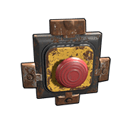
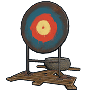

# Switches

Switches are components that, for the most part, require a player to Use(`E`). They can only be operated voluntarily and never by accident. They connect or disconnect the electrical path to a circuit, i.e. turn things on and off.

---

# Switch

| | |  
|-|---|  
Item ID             |  1951603367
Description         | Allowing power to pass through or not
Crafting Recipe     | 100 Metal Fragments
Recycles Into       | 50 Metal Fragments
Stack Size          | 5
Workbench Required  | Level 1
Research Table Cost | 20 Scrap
Hit Points          | 200
Where To Find       | Arctic Scientist, Cargo Ship Scientist, Crate, Excavator Scientist, Military Base Scientist, Oil Rig Scientist, Patrol Scientist, Sunken Chest, Tunnel Dweller, Underwater Dweller, Underwater Lab Blue Crate
Inputs/Outputs      | Electric Input, Switch On, Switch Off  / Output
Active Usage        | 1
Power Consumption   | 1rW
Power Output        | Power input minus 1
Despawn Time        | 5 minutes
Decay Time          |

Notes:

- To operate the Switch, look at it and press Use(`E`).
- Does not need TC auth to operate it. 
- Can only be placed on vertical surfaces.
- When the Switch is off, it will block all the components past it from registering [Active Usage](powerstorage.html##-Battery-Active-Usage-VS-Actual-Power-Consumed) on batteries.
- [Side Inputs](uncatagorizedconcepts.html##-Side-Inputs) are inputs, not toggles and are explained in their own section, currently in Uncategorized under Concepts.
- The side inputs block the [Component Destruction Detectors](https://www.rustrician.io/?circuit%3Dbf38168f0834f7d84fb837ac41d1818e) ability to see downstream.

---

# Button

| | |  
|-|---|  
Item ID             |  -1778897469
Description         | Allowing power to pass through when pressed
Crafting Recipe     | 75 Metal Fragments
Recycles Into       | 38 Metal Fragments
Stack Size          | 5
Workbench Required  | Level 1
Research Table Cost | 20 Scrap
Hit Points          | 200
Where To Find       | Arctic Scientist, Cargo Ship Scientist, Crate, Excavator Scientist, Military Base Scientist, Oil Rig Scientist, Patrol Scientist, Sunken Chest, Tunnel Dweller, Underwater Dweller, Underwater Lab Blue Crate
Inputs/Outputs      | Electric Input  / Output
Active Usage        | 1
Power Consumption   | 1rW
Power Output        | Power input minus 1
Despawn Time        | 5 minutes
Decay Time          |

Notes:

- Can only be placed on vertical surfaces.
- Will generate 2rW for 0.25 seconds when pressed.
- When the button is supplied with power, it will pulse 2rW first then output the incoming power.
- Stays pressed for 5 seconds and cannot be changed.

---

# Reactive Target

| | |  
|-|---|  
Item ID             |  -1736356576
Description         | Target practice and fun
Crafting Recipe     | 100 Wood, 150 Metal Fragments, 1 Gear
Recycles Into       | 50 Wood, 75 Metal Fragments 50% 1 Gear
Stack Size          | 1
Workbench Required  | Level 1
Research Table Cost | 20 Scrap
Hit Points          | 250
Where To Find       | Arctic Scientist, Cargo Ship Scientist, Crate, Excavator Scientist, Military Base Scientist, Oil Rig Scientist, Patrol Scientist, Sunken Chest, Tunnel Dweller, Underwater Dweller, Underwater Lab Blue Crate
Inputs/Outputs      | Power In, Reset, Lower / Power Out
Active Usage        | 1
Power Consumption   | 1rW
Power Output        | 1rW
Despawn Time        | 5 minutes
Decay Time          | 48 hours

Notes:

- Can be placed on floors, foundations or the ground.
- When the target is lowered for any reason, it will pulse out 1rW.
- When the target is supplied with power, when lowered for any reason,
  it will pulse 1rW first then output the incoming power constantly
  until it stands back up.
- There is no priority between Reset and Lower. Whichever input is given
  power last is the function that will take place.
- Can be connected to Root Combiners.

---

