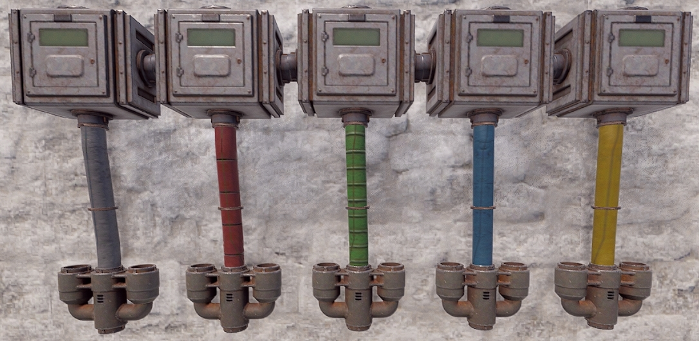
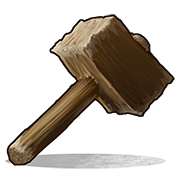

# Tools

---

## Common Traits

These tools take no damage, have a stack size of 1, are default BPs and
can only be crafted.

To change the colour of a wire/hose/pipe in place, with Wire/Hose/Pipe Tool in
hand, hold Reload `R` to select the colour then look at an IO connection
and press Reload `R`.

Wire/Hose/Pipe length is limited to 30 meters with 16 anchor points using the left
mouse button.

If a hose/wire/pipe is accidentally attached to the wall in the wrong spot, look away and right click once. It will remove the last anchor point. Holding the right mouse button down will clear the wire/hose/pipe.

To remove a hose/wire from a component, look at the connection point and
hold down the right mouse button.

Holding ‘Left Shift’ allows the placement of anchor points on deployed entities like boxes or chairs (Only Pipes ATM).

When hoses or wires are placed on walls and the wall is destroyed, the hoses and wires will remain in place, but pipes will break! They can also break when doing anything that changes the hitbox of the thing they are placed on, ie: upgrading walls can break pipes!

Wear Diving Fins to get cleaner and straighter hose/wire/pipe placement. They force the player to move slower allowing for better accuracy when strafing left and right.

Wire Tracing: Left click a pre wired connection, only that
connection will have the wire animation making it easier to follow its path.

To increase or decrease the range of the auto snap when getting close to
an IO connection, in the F1 console, change `client.lookatradius` from `0.2`
to `0.05`. This lets anchor points be placed closer to IO connections.

If the server has it enabled, turn on Wire Slack by holding the Wire Tool  and press `USE`, default is `E`. Hold Sprint, shift, to increase and Duck, ctrl, to decrease. This will give wires some slack rather than being straight between 2 points.

---

# Wire Tool

| | |  
|-|---|  
Item ID            | -144417939
Description        | Connecting electrical components
Crafting Recipe    | 2 High Quality Metal
Workbench Required | Level 1
Despawn Time       | 5 minutes

Notes:

- This tool's primary function is to establish connections between
  electrical components.
- To trace an existing wire, left-click the connection point. This
  action will prompt a wire animation for the selected connection only.
- It can be stored in a Tool Cupboard.
- Customize the wire colour by holding Reload `R`.  
	Colour options are :  
  *Yellow, Red, Light Blue, Blue, Green, Orange, Pink, Purple, White and
  Default (Black)*

---

# Hose Tool

| | |  
|-|---|  
Item ID            | 363163265
Description        | Connecting fluid components
Crafting Recipe    | 2 High Quality Metal
Workbench Required | Level 1
Despawn Time       | 5 minutes

Notes:

- This tool is specifically designed to connect fluid components.
- Can be stored in a Tool Cupboard.
- Hose colour can be changed by holding Reload `R`.  
	Colour options are :  
  *Red, Blue, Yellow, Light Blue, Orange, Pink, Purple, White and
  Default(Green)*

---

# Pipe Tool 

| | |  
|-|---|  
Item ID            | -144513264
Description        | Connecting industrial components
Crafting Recipe    | 2 High Quality Metal
Workbench Required | Level 1
Despawn Time       | 5 minutes

Notes:

- This tool is specifically designed to connect industrial connections.  
- Can be stored in a Tool Cupboard.  
- The color of the pipe can be customized by holding down the 'Reload' button `R`.  
    Colour options are :  
  *Red, green, Blue, Yellow and Default(Grey)*

---

# Hammer

| | |  
|-|---|  
Item ID         |  200773292
Description     | Used to pick up or repair components
Crafting Recipe | 100 Wood
Despawn Time    | 5 minutes

Notes :

- For electrical, this is used to pick up and repair components.
- Can be stored in a Tool Cupboard.
- All components can be picked up with the exception of the Windmill
  and Modular Car Lift.
- To pick up components, with TC authorization and a hammer in hand,
  look at the component then press and hold Use `E`.
- Most components take no damage when picked up. Exceptions are the
  Laser Light, Sound Light, Door Controller, Igniter, Auto Turret and
  Tesla Coil. Batteries and Power Sources also take damage when picked
  up.
- Careful when wielding this powerful tool as it can create problems if you accidently start picking up items.

---

# Garry's Mod Tool Gun 

| | |  
|-|---|  
Item ID            | 1803831286
Description        | An enhanced hammer to pick up or repair components
Crafting Recipe    | 100 Wood, 20 Metal Fragments
Despawn Time       | 5 minutes

Notes:

- This tool requires owning and have played Garry’s Mod for 30 minutes.  
- It is an upgraded hammer. It has a small LCD screen on it and will display the name of the item it is pointed at.  
- It also has a longer range up to about 2 meters.  
- For electrical, this is used to pick up and repair components.  
- The F1 console command `toolgun.classiceffects true` or `toolgun.classiceffects false` will change the color of the beam. False is the default orange color but True is blue like it is in Gmod.  
- Can be stored in a Tool Cupboard.  
- All components can be picked up with the exception of the Windmill and Modular Car Lift.  
- To pick up components, with TC authorization and a hammer in hand, look at the component then press and hold Use `E`.  
- Most components take no damage when picked up. Exceptions are the Laser Light, Sound Light, Door Controller, Igniter, Auto Turret and Tesla Coil. Batteries and Power Sources also take damage when picked up.  
- Careful when wielding this powerful tool as it can create problems if you accidently start picking up items.  
