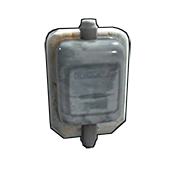
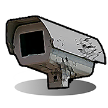
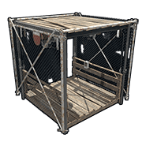
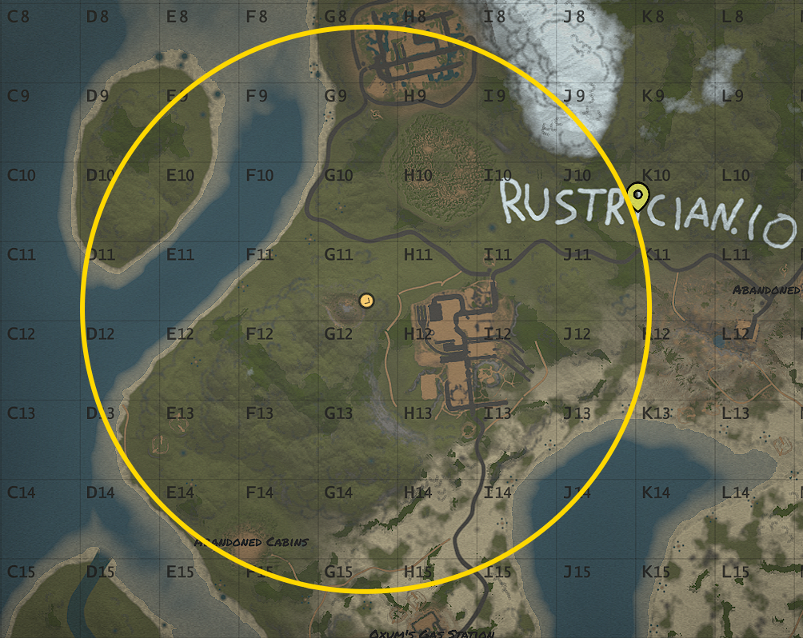
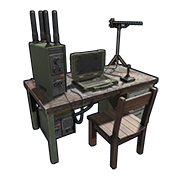

# Utilities

These are components that can enhance a player’s quality of life and Rust experience. They will also have a wide variety of applications.

---

# Door Controller

| | |  
|-|---|  
Item ID             |  -502177121
Description         | Manipulates the state of the door
Crafting Recipe     | 75 Metal Fragments
Recycles Into       | 38 Metal Fragments
Stack Size          | 5
Workbench Required  | Level 1
Research Table Cost | 75 Scrap
Hit Points          | 200
Where To Find       | Arctic Scientist, Cargo Ship Scientist, Crate, Excavator Scientist, Military Base Scientist, Oil Rig Scientist, Patrol Scientist, Sunken Chest, Tunnel Dweller, Underwater Dweller, Underwater Lab Blue Crate
Inputs/Outputs      | Power In / Passthrough
Active Usage        | 1
Power Consumption   | 1rW
Power Output        | Input power minus 1
Despawn Time        | 20 minutes

Notes:

- They can be used to open and close single and double doors, garage doors, window
  shutters, wooden shop front, prison cell gates, chainlink fence gate,
  ladder hatches and high external gates.
- Place the controller within 1 meter of the door model to be able
  to pair them.
- After placing the door and controller, pair them together by looking
  at the controller and press Use(`E`). If successful, the bottom green light
  will turn on.
- The door must be unlocked to pair with the controller.

---

# Igniter

| | |  
|-|---|  
Item ID             | -44876289
Description         | Ignites anything that burns
Crafting Recipe     | 75 Metal Fragments
Recycles Into       | 38 Metal Fragments
Stack Size          | 3
Workbench Required  | Level 1
Research Table Cost | 20
Hit Points          | 250
Where To Buy        | Outpost for 50 Scrap
Where To Find       | Barrel, Crate, Primitive Crate, Tunnel Dweller, Underwater Dweller, Underwater Lab Blue Crate
Inputs/Outputs      | Power In
Active Usage        | 2
Power Consumption   | 2rW
Despawn Time        | 5 minutes

Notes:

- 2rW is only required for the visual sparking effect. They will ignite things with only 1rW.
- They can be used to ignite the camp fire, carvable pumpkin, chinese
  lantern, hobo barrel, jack o lanterns, lanterns, large
  furnace, small furnace, electrical furnace, small oil refinery, fireplace, tuna can lamp, fireworks, sky lanterns,candles, beancan grenade and satchel charge.
- They take damage when they are on. They have enough health to last for
  16 to 17 minutes.
- Can be placed on any angled surface and the ground.

---

# PTZ CCTV Camera

| | |  
|-|---|  
Item ID             | 140006625
Description         | A camera with Pan, Tilt, Zoom function
Crafting Recipe     | 1 CCTV Camera, 150 Metal Fragments
Recycles Into       | 50% CCTV Camera, 75 Metal Fragments
Stack Size          | 5
Workbench Required  | Level 2
Research Table Cost | 75 Scrap
Hit Points          | 150
Where To Find       | Arctic Scientist, Cargo Ship Scientist, Elite Tier Crate, Excavator Scientist, Heavy Scientist, Locked Crate, Military Base Scientist, Military Crate, Oil Rig Scientist, Patrol Scientist, Treasure Box, Underwater Lab Elite Crate, Underwater Lab Yellow Crate, Wagon Military Crate
Inputs/Outputs      | Power In
Active Usage        | 3
Power Consumption   | 3rW
Despawn Time        | 20 minutes
Decay Time          | 48 hours

Notes:

- To use cameras, start by placing one on a flat ceiling. With TC authorization, look at the camera and press Use(E) to ‘Set ID’.
- Aim the camera by standing in the direction you want the camera to
  look. Holding a Hammer, press Use(`E`) to change its position. Hold Use(`E`) to pick them up.
- View cameras by mounting a Computer Station and in the bottom left,
  add the ID for the camera. Select the camera from the list on the left
  and begin viewing.
- To control the camera when viewing, use your mouse to pan and tilt.
  Left click will zoom.
- Anyone can add any camera to any computer station.
- The game has pre-placed cameras at some of the monuments, check the
  current [Camera List](uncategorizedconcepts.html##-Monuments-Camera-Codes).

---

# CCTV Camera

| | |  
|-|---|  
Item ID           | 634478325
Description       | A camera to view from a Computer Station
Recycles Into     | 2 High Quality Metal, 2 Tech Trash
Stack Size        | 64
Hit Points        | 150
Where To Find     | APC Crate, Arctic Scientist, Cargo Ship Scientist, Elite Tier Crate, Excavator Scientist, Heavy Scientist, Helicopter Crate, Locked Crate, Military Base Scientist, Military Crate, Oil Rig Scientist, Patrol Scientist, Sunken Crate, Tool Box, Treasure Box, Tunnel Dweller, Underwater Dweller, Underwater Lab Elite Crate, Underwater Lab Tech Crate, Underwater Lab Tool Box, Underwater Lab Yellow Crate
Inputs/Outputs    | Unnamed Input
Active Usage      | 3
Power Consumption | 3rW
Despawn Time      | 60 minutes
Decay Time        | 48 hours

Notes:

- To use cameras, start by placing one on any vertical surface. With TC
  authorization, look at the camera and press Use(`E`) to ‘Set ID’.
- Aim the camera by standing in the direction you want the camera to
  look. Holding a Hammer, press Use(`E`) to change its position. Hold Use(`E`) to pick them up.
- View cameras by mounting a Computer Station and in the bottom left,
  add the ID for the camera. Select the camera from the list on the left
  and begin viewing.
- Anyone can add any camera to any computer station.
- The game has pre-placed cameras at some of the monuments, check the
  current [Camera List](uncategorizedconcepts.html##-Monuments-Camera-Codes).

---

# Electric Heater

| | |  
|-|---|  
Item ID             |  -784870360
Description         | A source of heat
Crafting Recipe     | 200 Metal Fragments
Recycles Into       | 100 Metal Fragments
Stack Size          | 5
Workbench Required  | Level 1
Research Table Cost | 75 Scrap
Hit Points          | 200
Where To Buy        | Outpost for 75 Scrap
Where To Find       | Arctic Scientist, Cargo Ship Scientist, Crate, Excavator Scientist, Military Base Scientist, Oil Rig Scientist, Patrol Scientist, Sunken Chest, Tunnel Dweller, Underwater Dweller, Underwater Lab Blue Crate
Inputs/Outputs      | Power In / Passthrough
Active Usage        | 3
Power Consumption   | 3rW
Power Output        | Input power minus 3
Despawn Time        | 20 minutes

Notes:

- Heaters will dry you off if you are wet.
- They can be used to help regulate the temperature of crops, be careful
  not to overheat your plants.
- They emit an orange light
- Can only be placed on vertical surfaces
- It provides up to 50% comfort in a sphere that starts about 1m in front of the heater. This sphere has a diameter of roughly 4 meters or 1 1/3rd square foundations.
- his item provides heat in the shape of a sphere that at its largest diameter covers a 2x2, pictured below.

Heat Sphere :  

  

 --- 

# Modular Car Lift

| | |  
|-|---|  
Item ID             |  1696050067
Description         | A work platform for modular cars
Crafting Recipe     | 5 High Quality Metal, 200 Metal Fragments, 1 Gear
Recycles Into       | 3 High Quality Metal, 100 Metal Fragments, 50% 1 Gear
Stack Size          | 1
Workbench Required  | Level 2
Research Table Cost | 125 Scrap
Hit Points          | 250
Where To Buy        | Bandit Camp for 150 Scrap
Where To Find       | Arctic Scientist, Cargo Ship Scientist, Elite Tier Crate, Excavator Scientist, Heavy Scientist, Locked Crate, Military Base Scientist, Military Crate, Oil Rig Scientist, Patrol Scientist, Treasure Box, Underwater Lab Elite Crate, Underwater Lab Yellow Crate
Inputs/Outputs      | Power In
Active Usage        | 5
Power Consumption   | 5rW
Despawn Time        | 40 minutes
Decay Time          | 16 hours

Notes:

- To access the user interface, look at the control stand and press Use(E). TC access is not required to access UI.
- These allow for modification of modular cars by adding or removing modules. 
- Lets anyone add or remove code locks.
- Store cars on a powered lift to prevent decay.
- Cannot be picked up with a Hammer.

---

# Elevator

| | |  
|-|---|  
Item ID             |  1177596584
Description         | A powered lift
Crafting Recipe     | 3 High Quality Metal, 200 Metal Fragments, 1 Gear
Recycles Into       | 2 High Quality Metal, 100 Metal Fragments, 50% 1 Gear
Stack Size          | 5
Workbench Required  | Level 2
Research Table Cost | 125 Scrap
Hit Points          | 600
Where To Find       | Arctic Scientist, Cargo Ship Scientist, Elite Tier Crate, Excavator Scientist, Heavy Scientist, Locked Crate, Military Base Scientist, Military Crate, Oil Rig Scientist, Patrol Scientist, Treasure Box, Underwater Lab Elite Crate, Underwater Lab Yellow Crate
Inputs/Outputs      | Power, Call Elevator
Active Usage        | 5
Power Consumption   | Carriage = 5rW, Call Elevator = 1rW
Despawn Time        | 40 minutes
Decay Time          | 8 hours

Notes:

- The elevator consists of 2 parts, the shaft and the carriage.
- At the top of the shaft there is a light and the motor for the carriage. This motor requires 5rW in order for the carriage to move.
- The carriage has a control panel that allows a user to press a button and move all the way to the top or bottom floors. Hold Use(E) to move up or down 1 floor at a time.
- Each floor has 2 inputs, on the right side of each entrance, to call the elevator to that floor. 
- The Maximum height of a single elevator shaft is 6 floors.
- The elevator has an upkeep cost. For the first floor, it costs 1 High Quality Metal and 20 Metal Fragments. It costs an extra 20 Metal Fragments per floor but at the 4th floor, it costs an extra 1 High Quality Metal. A max height elevator shaft will have an upkeep cost 2 High Quality Metal and 120 Metal Fragments.
- If someone is standing under the carriage as it descends, they will die.
- The Elevator has a travel time of 1.6 seconds per floor.
- Elevators cannot be placed next to each other or in a way that would have them touching the same intersection.

---

# Audio Alarm

| | |  
|-|---|  
Item ID             |  2100007442
Description         | A loud warning alarm speaker
Crafting Recipe     | 75 Metal Fragments
Recycles Into       | 38 Metal Fragments
Stack Size          | 5
Workbench Required  | Level 1
Research Table Cost | 20 Scrap
Hit Points          | 100
Where To Find       | Arctic Scientist, Cargo Ship Scientist, Crate, Excavator Scientist, Military Base Scientist, Oil Rig Scientist, Patrol Scientist, Sunken Chest, Tunnel Dweller, Underwater Dweller, Underwater Lab Blue Crate
Inputs/Outputs      | Unnamed Input
Active Usage        | 1
Power Consumption   | 1rW
Despawn Time        | 5 minutes
Decay Time          | 96 hours

Notes:

- The sound will travel approximately 14 foundations or 42ish meters.
  Behind 1 wall the distance is reduced to approximately 11 foundations
  or 33ish meters. Adding more walls does not reduce the distance the
  sound will travel.

---

# Drone
| | |  
|-|---|  
Item ID             | 1588492232
Description         | A remote controlled drone
Crafting Recipe     | 200 Metal Fragments, 2 Tech Trash, 1 CCTV Camera
Recycles Into       | 100 Metal Fragments, 1 Tech Trash, 50% 1 CCTV Camera
Stack Size          | 1
Workbench Required  | Level 2
Research Table Cost | 125 Scrap
Hit Points          | 100
Where To Buy        | Outpost for 300 Scrap
Where To Find       | Arctic Scientist, Cargo Ship Scientist, Elite Tier Crate, Excavator Scientist, Heavy Scientist, Locked Crate, Military Base Scientist, Military Crate, NVG Scientist, Oil Rig Scientist, Patrol Scientist, Treasure Box, Underwater Lab Elite Crate, Underwater Lab Yellow Crate, Wagon Military Crate
Power Consumption   | Requires zero electricity
Despawn Time        | 40 minutes

Notes:
- Using a Computer Station, a player is able to remotely fly the drone.
- Assign an ID to the drone by deploying it on the ground, looking at it and pressing Use(`E`). Hold Use(`E`) to pick up a drone.
- Mount a Computer Station and in the bottom left, add the ID for the Drone.
- Select the ID from the list and start flying.
- Use W, A, S, D to move. Use the mouse to look around. Shift and Ctrl to go up and down.
- It is damaged easily from impacts.
- Logging out of the drone mid flight will cause it to fall to the ground.
- It has a limited range of around 500 meters or 3.33 grid squares.

---

# Computer Station

| | |  
|-|---|  
Item ID             |  -1588628467
Description         | A place to view CCTV cameras
Crafting Recipe     | 5 High Quality Metal, 1 Targeting Computer, 1 RF Broadcaster, 1 RF Receiver
Recycles Into       | 3 High Quality Metal, 50% 1 Targeting Computer, 50% 1 RF Broadcaster, 50% 1 RF Receiver
Stack Size          | 1
Workbench Required  | Level 2
Research Table Cost | 75 Scrap
Hit Points          | 500
Where To Buy        | Outpost for 300 Scrap
Where To Find       | Arctic Scientist, Cargo Ship Scientist, Elite Tier Crate, Excavator Scientist, Heavy Scientist, Locked Crate, Military Base Scientist, Military Crate, Oil Rig Scientist, Patrol Scientist, Treasure Box, Underwater Lab Elite Crate, Underwater Lab Yellow Crate
Power Consumption   | Requires zero electricity
Despawn Time        | 20 minutes

Notes:

- Use the Computer Station to view CCTV Camera, control the PTZ Camera or fly the Drone.
- Mount a Computer Station and in the bottom left, add an ID for a camera or drone. Select the ID from the list on the left and begin viewing or operating.
- Anyone can add any camera to any computer station.
- The maximum number of cameras you can add to a computer is 20.
- The game has pre-placed cameras at some of the monuments, here is the
  current list.
- The game has pre-placed cameras at some of the monuments, check the
  current [Camera List](uncategorizedconcepts.html##-Monuments-Camera-Codes).

---

# Fogger-3000

| | |  
|-|---|  
Item ID                    | -1973785141
Description                | A fog machine that runs on low grade fuel
Crafting Recipe            | 100 Metal Fragments, 30 Low Grade Fuel, 1 Metal Pipe
Recycles Into              | 50 Metal Fragments, 15 Low Grade Fuel, 50% 1 Metal Pipe
Stack Size                 | 1
Hit Points                 | 100
Where To Find              | Requires a Steam item purchased from the market
Inputs/Outputs             | Turn On, Toggle, Turn Off
Active Usage               | 1
Power Consumption          | 1rW per input but none for itself
Low Grade Fuel Capacity    | 500
Low Grade Fuel Consumption | 1/min when active or 10/min when set to Motion
Despawn Time               | 5 minutes
Decay Time                 | 96 hours

Notes:

- This item can only be crafted if you have the item in your Steam
  Inventory. It must be purchased from the community market.
- When Active, it creates a fog cloud in front of it that covers an area
  equal to a 2x2 and is thickest below half height walls. Consumes low
  grade fuel at 1 per minute.
- When set to Motion, it only gets set off by non authorized players and
  will emit fog every couple seconds creating a thicker cloud directly
  in front of it. Setting the fogger at a half wall height, the constant
  emission of the fogger creates a thick cloud at eye level. Consumes
  low grade fuel at 10 per minute.
- The fogger only emits a cloud as long as the non authorized player is
  moving. If the player stops moving, the fogger turns off.
- A cloud takes 5 seconds to form and 40 seconds to disappear.
- Increasing the number of foggers increases the density of the cloud. 4
  foggers is enough to block the light from fire and 5 will block light
  from electrical lighting.
- Fog will fall toward the ground and accumulate on any horizontal
  surface. The higher the fogger the thinner the cloud.
- Requires TC authorization to change settings. Look at the light and
  hold Use(`E`) to Activate, Open or turn on Motion.
- Whichever input is the last to be activated is the input that dictates the state of the fogger. For example, if  constant power is sent to TURN ON, the fogger turns on. Then send power to TURN OFF, the fogger will turn off. When power is removed from TURN OFF, the fogger will not turn back on, even with power still going to TURN ON. Power will need to be removed and reapplied to TURN ON for the fogger to turn back on.
- The TOGGLE input will turn the fogger on when it receives power and turn off when power is removed. This does not change the previous bullet point. If power is applied to TOGGLE, the fogger will turn on. While the fogger is on, if power is sent to TURN OFF, the fogger will turn off. When power is removed from TURN OFF with power still going to TOGGLE, the fogger will not turn back on. On the other hand if power is sent to TURN ON, the fogger will turn on. Then send power to TOGGLE and the fogger will stay on. With power still going to TURN ON, when power is removed from TOGGLE, the fogger will turn off. This is because when power is removed from TOGGLE, it tells the fogger to turn off.
- They can be placed on flat and angled surfaces as well as the ground.
- Can be picked up with a hammer but loses 10hp.

---

# Snow Machine

| | |  
|-|---|  
Item ID                    | 1358643074
Description                | A machine which will blanket the surrounding terrain in snow.
Crafting Recipe            | 125 Metal Fragments, 30 Low Grade Fuel, 1 Metal Pipe
Recycles Into              | 63 Metal Fragments, 15 Low Grade Fuel, 50% 1 Metal Pipe
Stack Size                 | 1
Workbench Required         | Level 1
Hit Points                 | 100
Where To Find              | Requires a Steam item purchased from the market
Inputs/Outputs             | Toggle, Turn On, Turn Off
Active Usage               | 1
Power Consumption          | 1rW per input but none for itself
Low Grade Fuel Capacity    | 500
Low Grade Fuel Consumption | 1/min when active
Despawn Time               | 5 minutes

Notes:

- This item can only be crafted if you have the item in your Steam
  Inventory. It must be purchased from the community market.
- When Active, it creates a patch of snow in front of the machine with a
  radius of 3.5 square foundations.
- The snow pile takes 1 second to form and 2 minutes 45 seconds to
  disappear.
- The snow at its deepest goes halfway up a character's chin.
- Increasing the number of machines does not increase the depth of the
  snow.
- Snowfall is 3.5 floors high.
- Requires TC authorization to change settings. Look at the light and
  hold Use(`E`) to Activate, Open or Stop.
- The TOGGLE input will turn the machine on when it receives power and
  turn off when power is removed. When TURN ON receives power, the
  machine will turn on and stay on when TURN ON loses power. When TURN
  OFF receives power, it will always turn the machine off. If power is
  currently going to TURN OFF, sending power to the other inputs will
  turn the machine on.
- When the machine turns on, there is a 10 second window where it cannot
  be turned off.
- They can only be placed on the ground.
- Can be picked up with a hammer but loses 75hp.

---

