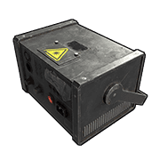
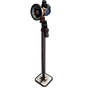
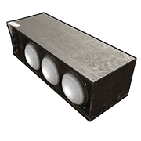
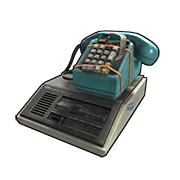

# Voice Props Pack DLC

The audio generated by devices like the Boom Box or Mic Stand is assigned an Audio ID by the game. This ID is what components like the Sound Light, Disco Floor and Laser Light bind to in order to react to the sound. These components can only bind to 1 ID. This means that if the Audio Out from 2 Boom Box’s were connected to an OR Switch then to a Disco Floor, the Disco Floor will bind to the ID of whichever Boom Box is the first to send some audio. The only way to remove this bind is to disconnect the Boom Box.  

---

# Boom Box

| | |  
|-|---|  
Item ID            | -1113501606
Description        | A large speaker to play recorded cassette tapes and also stream audio from the internet
Crafting Recipe    | 100 Metal Fragments, 200 Wood, 20 Cloth
Recycles Into      | 50 Metal Fragments, 100 Wood, 10 Cloth
Stack Size         | 1
Workbench Required | Level 1
Hit Points         | 100
Where To Find      | Requires a DLC purchase
Inputs/Outputs     | Power, Toggle Play / Audio Out
Active Usage       | 10 only when turned on \*
Power Consumption  | 1rW or 10rW when using the Audio Out connection
Power Output       | Input power minus 10rW
Despawn Time       | 5 minutes
Decay Time         | 96 hours

Notes:

- Requires TC Authorization to change settings. Look at the speaker and
  hold USE(`E`). You can access Radio Settings or Open. Open allows you to
  insert a cassette. Radio Settings lets you select a Radio Station.
- The Audio Out connection lets you send an audio signal to other
  components in the DLC that can interact with sound.
- The Toggle Play input needs constant power to the BoomBox to play. When power   is removed, it will stop playing.  
- Can be picked up with a hammer, but not with a cassette. Will not take
  damage when picked up.
- Can be placed in horizontal surfaces, the ground and some deployable
  items like Work Benches and Tables.
- They block the destruction detectors ability to see downstream.

---

# Connected Speaker

| | |  
|-|---|  
Item ID            | 968421290
Description        | A small speaker that will play any audio from a connected Boom Box
Crafting Recipe    | 75 Metal Fragments
Recycles Into      | 38 Metal Fragments
Stack Size         | 5
Workbench Required | Level 1
Hit Points         | 50
Where To Find      | Requires a DLC purchase
Inputs/Outputs     | Power/Audio In / Audio Passthrough
Active Usage       | 1
Power Consumption  | 1rW
Power Output       | Input power minus 1
Despawn Time       | 5 minutes
Decay Time         | 96 hours

Notes:

- This speaker will play audio from Boom Boxs and Microphone Stands
- The audio quality is not as good at the Boom Box

---

# Disco Ball

| | |  
|-|---|  
Item ID            | 1895235349
Description        | Get groovy with this stunning disco ball.
Crafting Recipe    | 50 Metal Fragments
Recycles Into      | 25 Metal Fragments
Stack Size         | 5
Workbench Required | Level 1
Hit Points         | 25
Where To Find      | Requires a DLC purchase
Inputs/Outputs     | Power / Passthrough
Active Usage       | 1
Power Consumption  | 1rW
Power Output       | Input power minus 1
Despawn Time       | 5 minutes

Notes:

- Acts like a light, does not need to be connected to a component from
  the DLC.
- The lighting effect it creates will go through walls.

---

# Disco Floor

| | |  
|-|---|  
Item ID            | First Picture - 286648290 - Default  Second Picture - 1735402444 - Disco Floor
Description        | A vibrant flashing floor that pulses in time to music
Crafting Recipe    | 75 Metal Fragments
Recycles Into      | 38 Metal Fragments
Stack Size         | 5
Workbench Required | Level 1
Hit Points         | 50
Where To Find      | Requires a DLC purchase
Inputs/Outputs     | Audio In / Audio Passthrough
Active Usage       | 1
Power Consumption  | 1rW
Power Output       | Input power minus 1
Despawn Time       | 5 minutes
Decay Time         | 8 hours

Notes:

- There are 2 versions. The difference between the 2 is the size of
  light tiles.  
- To change the floor settings, with TC Authorization, look at the
  floor and press Use(`E`).
- Settings you can change are the Pattern, the Volume Sensitivity, Speed
  and Gradient.
- Can only be placed on floors and nothing can be placed on top of them.
- If receiving connection from a Boom Box or an Microphone Stand, the
  lights will move, flash and pulse to the audio.
- They block the destruction detectors ability to see downstream
- Like all lights, placing a lot of these will cause lag.

---

# Laser Light

| | |  
|-|---|  
Item ID            | 853471967
Description        | A small device that shoots out visible lasers in time to music
Crafting Recipe    | 100 Metal Fragments
Recycles Into      | 50 Metal Fragments
Stack Size         | 5
Workbench Required | Level 1
Hit Points         | 50
Where To Find      | Requires a DLC purchase
Inputs/Outputs     | Power/Audio In / Audio Passthrough
Active Usage       | 1
Power Consumption  | 1rW
Power Output       | Input power minus 1
Despawn Time       | 5 minutes
Decay Time         | 96 hours

Notes:

- Can be placed on all angled surfaces including the ground.
- It shoots out 3 lasers.
- If receiving a connection from a Boom Box, the lasers will move to the
  audio.
- It will only bind to 1 Boom Box. You cannot connect 2 Boom Boxes to 1
  Laser Light.
- Can be picked up with a hammer but loses 25% hit points.

---

# Microphone Stand

| | |  
|-|---|  
Item ID            |  39600618
Description        | A powered microphone that lets you broadcast your voice.
Crafting Recipe    | 75 Metal Fragments
Recycles Into      | 38 Metal Fragments
Stack Size         | 5
Workbench Required | Level 1
Hit Points         | 25
Where To Find      | Requires a DLC purchase
Inputs/Outputs     | Power / Audio Out
Active Usage       | 5
Power Consumption  | 1rW
Power Output       | Input power minus 1
Despawn Time       | 5 minutes

Notes:

- Anyone can use the microphone by looking at it and pressing USE(E).
  Hold the right mouse button to change voice modes between Normal, High
  and Low pitch.
- Can be placed on flat surfaces or the ground.
- Attach to a Connected Speaker to broadcast your voice over a larger
  area.
- They block the destruction detectors ability to see downstream.

---

# Sound Light

| | |  
|-|---|  
Item ID            | -343857907
Description        | A light that will pulse in time to music
Crafting Recipe    | 100 Metal Fragments
Recycles Into      | 50 Metal Fragments
Stack Size         | 5
Workbench Required | Level 1
Hit Points         | 50
Where To Find      | Requires a DLC purchase
Inputs/Outputs     | Power/Audio In / Audio Passthrough
Active Usage       | 1
Power Consumption  | 1rW
Power Output       | Input power minus 1
Despawn Time       | 5 minutes
Decay Time         | 96 hours

Notes:

- If receiving a connection from a Boom Box the light will flash and
  pulse to the music.
- It will only bind to 1 Boom Box. You cannot connect 2 Boom Boxes to 1
  Sound Light.
- Can be picked up with a hammer but loses 25% hit points.
- Can be placed on vertical and underside of angled surfaces.

---

# Telephone

| | |  
|-|---|  
Item ID             |  1234878710
Description         | A telephone for making and receiving calls
Crafting Recipe     | 50 Wood, 100 Metal Fragments, 1 Tech Trash
Recycles Into       | 25 Wood, 100 Metal Fragments, 50% 1 Tech Trash
Stack Size          | 1
Workbench Required  | Level 1
Research Table Cost | 75 Scrap
Hit Points          | 150
Where To Find       | Arctic Scientist, Cargo Ship Scientist, Crate, Excavator Scientist, Military Base Scientist, Oil Rig Scientist, Patrol Scientist, Sunken Chest, Tunnel Dweller, Underwater Dweller, Underwater Lab Blue Crate
Inputs/Outputs      | Power / Call Passthrough
Active Usage        | 1
Power Consumption   | 1rW
Power Output        | 1rW
Despawn Time        | 20 minutes
Decay Time          | 8 hours

Notes:

- This is actually a telephone sitting on top of a tape cassette
  answering machine.
- The answering machine needs a cassette to work. You will require the
  Voice Props DLC to craft cassettes.
- TC Auth is not required to change the name or access the cassette in
  the answering machine.
- There are 3 types of cassettes, Short(10sec), Medium(20sec) and
  Long(30sec). Use a Cassette Recorder to record a message then place
  the cassette in the answering machine. When someone calls and you
  don't answer, the caller will hear your message and leave a message of
  their own for you to play back later.
- After 3 rings the answering machine message will begin to play. To
  leave a voicemail, press the spacebar when you hear the answering
  machine's message. To listen to your voicemail, use the phone and at
  the bottom of the screen select voicemail.
- To use the phone, look at it and when you see MAKE CALL, press Use(`E`) to
  use.
- You can give your phone a name and it will appear in the Directory.
  All phones are automatically assigned a number.
- You can add phones to your contacts list by adding the phone number
  or name.
- Use the Directory to find the phones at monuments or random peoples
  phones.
- When a call comes in, the phone will output the incoming power and
  will continue to for as long as the call is active.

---
