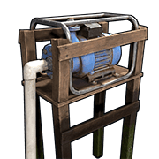
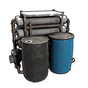
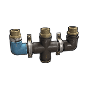
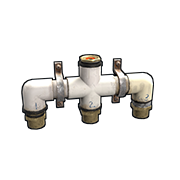

# Water

# What is the water system?

It is a system that lets you collect, store, transport and distribute
water in game. It functions similarly to the electrical system in that
it has its own hand tool and you connect components in the same way.

Its primary use is for farming plants like hemp, berries and other
foods.

Gravity is something you will need to be aware of. When sending water
down towards the ground, gravity will assist you. If at any point you
need to route water up away from the ground, you will require a
component that can pump and that component will need electricity to
function.

---

# Common Traits

Tool Cupboard authorization is required to make IO connections with the
Hose tool.

There is a max depth of 9 components and a max of 6 sprinklers in a
chain.

---

# Large Water Catcher

| | |  
|-|---|  
Item ID              |  -1100168350
Description          | A large deployable that passively collects water
Crafting Recipe      | 200 Metal Fragments, 500 Wood, 2 Tarp
Recycles Into        | 100 Metal Fragments, 250 Wood, 1 Tarp
Stack Size           | 1
Workbench Required   | Level 2
Research Table Cost  | 75 Scrap
Hit Points           | 300
Where To Find        | Arctic Scientist, Cargo Ship Scientist, Elite Tier Crate, Excavator Scientist, Heavy Scientist, Locked Crate, Military Base Scientist, Military Crate, Oil Rig Scientist, Patrol Scientist, Treasure Box, Underwater Lab Elite Crate, Underwater Lab Yellow Crate
Water Inputs/Outputs | Water In / Water Out
Collection Rate      | 8mL/1min
Water Output         | Up to 12mL/second
Capacity             | 50,000 mL
Despawn Time         | 20 minutes
Decay Time           | 8 hours

Notes: There was a buff added on the 2nd of November 2023 that has not been tested

- When placing them down, they will have a default of 1ml.
- The base level collection rate is 8ml per minute but depending on the weather and biome, collection rates will change. There are 2 weather conditions that contribute to the collection rate, they are **Fog Level** and **Rain Level**. The closer to 0 they are, the closer the collection rate will be to the default of 8ml per minute.
- For every 0.1 increase of **Rain Level**, the collection rate increases by:
    - Desert - 15ml per minute
    - Temperate - 30ml per minute 
    - Arctic - 0ml per minute
- For every 0.1 increase in the **Fog Level**, the collection rate increases by:
    - Desert - 6ml per minute
    - Temperate - 6ml per minute 
    - Arctic - 6ml per minute
- The math:
    - **Biome**: Temperate = 1, Desert = 0.5, Arctic = 0
    - `Collection Rate = 8ml + (Rain Level × (300ml × Biome)) + (Fog Level × 60ml)`
- Requires an area on the ground roughly equal to a 2x2
- Can be built inside, but on the ground, with a ceiling at 1.5 floors.
- It will passively collect water from the air
- Cannot be placed on Icebergs.
- To transfer water automatically, press and hold Give or Take. This way
  you don't have to keep clicking.

---

# Small Water Catcher

| | |  
|-|---|  
Item ID              | -132247350
Description          | A small deployable that passively collects water
Crafting Recipe      | 50 Metal Fragments, 100 Wood, 1 Tarp
Recycles Into        | 25 Metal Fragments, 50 Wood, 50% 1 Tarp
Stack Size           | 1
Workbench Required   | Level 1
Research Table Cost  | 20 Scrap
Hit Points           | 200
Where To Find        | Arctic Scientist, Cargo Ship Scientist, Crate, Excavator Scientist, Military Base Scientist, Oil Rig Scientist, Patrol Scientist, Sunken Chest, Tunnel Dweller, Underwater Dweller, Underwater Lab Blue Crate
Water Inputs/Outputs | Water In / Water Out
Collection Rate      | 3mL/1min
Water Output         | Up to 6mL/second
Capacity             | 10,000 mL
Despawn Time         | 5 minutes
Decay Time           | 8 hours

Notes: There was a buff added on the 2nd of November 2023 that has not been tested

- When placing them down, they will have a default of 1ml.
- The base level collection rate is 3ml per minute but depending on the weather and biome, collection rates will change. There are 2 weather conditions that contribute to the collection rate, they are **Fog Level** and **Rain Level**. The closer to 0 they are, the closer the collection rate will be to the default of 3ml per minute.
- For every 0.1 increase of **Rain Level**, the collection rate increases by:
    - Desert - 5ml per minute
    - Temperate - 10ml per minute 
    - Arctic - 0ml per minute
- For every 0.1 increase in the **Fog Level**, the collection rate increases by:
    - Desert - 2ml per minute
    - Temperate - 2ml per minute 
    - Arctic - 2ml per minute
- The math:
    - **Biome**: Temperate = 1, Desert = 0.5, Arctic = 0
    - `Collection Rate = 2ml + (Rain Level × (100ml × Biome)) + (Fog Level × 20ml)`
- Can be placed on the ground and floors.
- You can place them inside and use floor frames with floor grills above
  them but requires 3.5 floors above before you can place a ceiling.
- To transfer water automatically, press and hold Give or Take. This way
  you don't have to keep clicking.

---

# Water Barrel

| | |  
|-|---|  
Item ID              | -1863559151
Description          | A barrel to store water
Crafting Recipe      | 250 Wood, 1 Tarp
Recycles Into        | 125 Wood, 50% 1 Tarp
Stack Size           | 1
Workbench Required   | Level 1
Research Table Cost  | 20 Scrap
Hit Points           | 250
Where To Buy         | Bandit Camp for 30 Scrap
Where To Find        | Primitive Crate, Underwater Dweller, Tunnel Dweller, Barrel
Water Inputs/Outputs | Water In / Water Out
Water Output         | Up to 12mL/second
Capacity             | 20,000 mL
Despawn Time         | 5 minutes
Decay Time           | 8 hours

Notes:

- Can be placed on floors or the ground.
- Can place a small box under it.
- To transfer water in or out automatically, press and hold Give or
  Take. This way you don't have to keep clicking.

---

# Water Pump

| | |  
|-|---|  
Item ID             | -1284169891
Description         | Pumps and stores water from rivers or the ocean
Crafting Recipe     | 200 Metal Fragments, 250 Wood, 1 Gear
Recycles Into       | 100 Metal Fragments, 125 Wood, 50% 1 Gear
Stack Size          | 3
Workbench Required  | Level 2
Research Table Cost | 75 Scrap
Hit Points          | 250
Where To Buy        | Outpost for 200 Scrap
Where To Find       | Arctic Scientist, Cargo Ship Scientist, Elite Tier Crate, Excavator Scientist, Heavy Scientist, Locked Crate, Military Base Scientist, Military Crate, Oil Rig Scientist, Patrol Scientist, Treasure Box, Underwater Lab Elite Crate, Underwater Lab Yellow Crate
Inputs/Outputs      | Power In / Water Output
Active Usage        | 5
Power Consumption   | 5rW
Collection Rate     | 8.5ml/second
Water Output        | 12mL/second
Capacity            | 2000mL
Despawn Time        | 20 minutes
Decay Time          | 8 hours

Notes:

- Can only be placed in water sources like rivers, swamps or the ocean.
- It will pump water out of itself to water a barrel, against gravity
  with no power required.
- It is a pump so it will counter gravity and pump water to an upper
  floor.
- Can be placed under wooden foundations.

---

# Powered Water Purifier

| | |  
|-|---|  
Item ID             | -365097295
Description         | Converts salt water to fresh water when powered
Crafting Recipe     | 300 Metal Fragments, 100 Wood, 20 Cloth
Recycles Into       | 150 Metal Fragments, 50 Wood, 10 Cloth
Stack Size          | 3
Workbench Required  | Level 2
Research Table Cost | 75 Scrap
Hit Points          | 300
Where To Buy        | Outpost for 150 Scrap
Where To Find       | Arctic Scientist, Cargo Ship Scientist, Elite Tier Crate, Excavator Scientist, Heavy Scientist, Locked Crate, Military Base Scientist, Military Crate, Oil Rig Scientist, Patrol Scientist, Treasure Box, Underwater Lab Elite Crate, Underwater Lab Yellow Crate
Inputs/Outputs      | Power In / Water In, Water Out
Active Usage        | 5
Power Consumption   | 5rW
Conversion Rate     | 62.5ml/second @ 2 | 1 ratio of saltwater to freshwater
Fresh Water Output  | 12mL/second
Capacity            | 10,000ml total, 5000ml per tank. Black for saltwater and blue for freshwater.  
Despawn Time        | 20 minutes
Decay Time          | 8 hours

Notes:

- Must be placed on a floor/foundation or the ground.
- Blocks water components Active Usage downstream.
- The smallest perfect salt pump to purifier ratio is 125:17, 1 purifier
can handle over 7 pumps but can't handle 8.

---

# Fuel Tank Vehicle Module

| | |  
|-|---|  
Item ID             | 1186655046
Description         | A large water tank for car chassis
Crafting Recipe     | 175 Metal Fragments, 100 Wood
Recycles Into       | 88 Metal Fragments, 50 Wood
Stack Size          | 1
Workbench Required  | Level 2
Research Table Cost | 125 Scrap
Hit Points          | 325
Chassis Sockets     | 2
Inputs/Outputs      | 2x Fluid In / 2x Fluid Out
Water Output        | 500mL/sec
Capacity            | 200,000mL
Despawn Time        | 40 minutes

Notes:

- Requires a car chassis and takes up 2 slots.
- It is recommended you store the car on a Modular Car Lift to avoid
  decay.

---

# Fluid Switch & Pump

| | |  
|-|---|  
Item ID             | 443432036
Description         | A switch that lets water through, either manually or with electricity for the pump to send water to a higher floor.
Crafting Recipe     | 150 Metal Fragments
Recycles Into       | 75 Metal Fragments
Stack Size          | 5
Workbench Required  | Level 1
Research Table Cost | 20 Scrap
Hit Points          | 200
Where To Buy        | Outpost or Bandit Camp for 30 Scrap
Where To Find       | Arctic Scientist, Cargo Ship Scientist, Crate, Excavator Scientist, Military Base Scientist, Oil Rig Scientist, Patrol Scientist, Sunken Chest, Tunnel Dweller, Underwater Dweller, Underwater Lab Blue Crate
Inputs/Outputs      | Fluid Input, Pump Power, Toggle / Fluid Output
Power Consumption   | 1rW
Water Output        | ??mL/sec
Despawn Time        | 20 minutes

Notes:

- Can be placed on all angled surfaces and the ground.
- Does not need electricity if you are using gravity to bring water down
  floors but will require electricity to push water up floors.
- You do not need TC auth to manually operate.
- As long as electricity is applied to Toggle, the switch will turn on.
  When power is removed, the switch turns off. No power needs to be
  applied to Pump Power for this action.

---

# Fluid Combiner

| | |  
|-|---|  
Item ID             | -265292885
Description         | Combines 3 separate fluid connections into 1
Crafting Recipe     | 75 Metal Fragments
Recycles Into       | 35 Metal Fragments
Stack Size          | 5
Workbench Required  | Level 1
Research Table Cost | 20 Scrap
Hit Points          | 200
Where To Buy        | Outpost for 30 Scrap
Where To Find       | Arctic Scientist, Cargo Ship Scientist, Crate, Excavator Scientist, Military Base Scientist, Oil Rig Scientist, Patrol Scientist, Sunken Chest, Tunnel Dweller, Underwater Dweller, Underwater Lab Blue Crate
Inputs/Outputs      | Water In 1, Water In 2, Water In 3 / Water Out
Water Output        | The sum of all inputs
Despawn Time        | 5 minutes

Notes:

- If we give each input 12, the output will be 36.
- Can be placed on all angled surfaces and the ground.

---

# Fluid Splitter

| | |  
|-|---|  
Item ID             | -1166712463
Description         | Splits 1 water connection evenly into 3
Crafting Recipe     | 75 Metal Fragments
Recycles Into       | 38 Metal Fragments
Stack Size          | 5
Workbench Required  | Level 1
Research Table Cost | 20 Scrap
Hit Points          | 200
Where To Buy        | Outpost or Bandit Camp for 30 Scrap
Where To Find       | Arctic Scientist, Cargo Ship Scientist, Crate, Excavator Scientist, Military Base Scientist, Oil Rig Scientist, Patrol Scientist, Sunken Chest, Tunnel Dweller, Underwater Dweller, Underwater Lab Blue Crate
Inputs/Outputs      | Water In / Water Out 1, Water Out 2, Water Out 3
Water Output        | Water In divided by up to 3
Despawn Time        | 5 minutes

Notes:

- The water input is evenly divided between all connected outputs. 100 ÷ 2 = 50 per output. 100 ÷ 3 = 33 for each output.
- Can be placed on all surfaces including the ground.
- Each connected output shows it consumes 1 water from the input amount.
  If we give the splitter 12 and have a connection on each output, each
  output only gets 3. This is a visual bug. If we create the
  below picture in game, we can see there is no water loss.

---

# Sprinkler

| | |  
|-|---|  
Item ID             | -781014061
Description         | A small sprinkler that sprays water around it.
Crafting Recipe     | 75 Metal Fragments
Recycles Into       | 38 Metal Fragments
Stack Size          | 10
Workbench Required  | Level 1
Research Table Cost | 20 Scrap
Hit Points          | 200
Where To Buy        | Bandit Camp for 15 Scrap
Where To Find       | Arctic Scientist, Cargo Ship Scientist, Crate, Excavator Scientist, HMilitary Base Scientist, Oil Rig Scientist, Patrol Scientist, Sunken Chest, Tunnel Dweller, Underwater Dweller, Underwater Lab Blue Crate
Inputs/Outputs      | Water In / Passthrough
Water Consumption   | 2ml/sec
Water Output        | 3ml/sec
Despawn Time        | 5 minutes
Decay Time          | 8 hours

Notes:

- Sprinklers have a radius of 1 foundation or 3 meters. Anything that
  water can affect within this range will be affected.
- Primarily used for indoor plant farms using planter boxes.
- Will get people wet if they are in range.
- Will extinguish campfires, lanterns, furnaces and other similar items.
- Will not extinguish fire from the flamethrower or molotov cocktail.

---
